# DeviceController（设备管理）

- 源码：`real-controlcenter/src/main/java/cn/testin/mvc/controller/DeviceController.java`
- 职责：面向前端/其他微服务的 App 设备管理接口——设备列表、在线统计、历史统计导出、截图/关机/重启、设备释放与任务级设备锁。
- 基础路径 `/v3/ControlCenter/device`
- 全局异常：由 `cn.testin.mvc.exception.GlobalExceptionHandler`（@RestControllerAdvice）统一捕获 `GeneralException` / `@Valid` 校验异常 / 未知异常，包装为 `ResponseResult`。

## 接口一览

| # | 方法 | 路径 | 说明 |
|---|------|------|------|
| 1 | GET | /v3/ControlCenter/device/online_count | App 设备在线统计 |
| 2 | GET | /v3/ControlCenter/device/history_count | 设备天统计分页查询 |
| 3 | GET | /v3/ControlCenter/device/list | 设备列表（GET，下划线转驼峰） |
| 4 | POST | /v3/ControlCenter/device/list | 设备列表（POST） |
| 5 | GET | /v3/ControlCenter/device/view_device_info | 设备调试信息 |
| 6 | GET | /v3/ControlCenter/device/task_list | 设备上的任务列表 |
| 7 | GET | /v3/ControlCenter/device/capture_screen | 设备截图 |
| 8 | PUT | /v3/ControlCenter/device/shutdown | 设备关机 |
| 9 | PUT | /v3/ControlCenter/device/batch_update_screen_mode | 批量修改投屏模式 |
| 10 | PUT | /v3/ControlCenter/device/reboot_device | 重启设备 |
| 11 | POST | /v3/ControlCenter/device/device_list | 按 id 批量查设备状态（内部） |
| 12 | GET | /v3/ControlCenter/device/export | 设备天统计 CSV 导出 |
| 13 | GET | /v3/ControlCenter/device/error_log_info | 子任务设备错误日志 |
| 14 | PUT | /v3/ControlCenter/device/release | 设备释放（服务端主动） |
| 15 | POST | /v3/ControlCenter/device/lock_device_by_taskid | 任务锁设备 |
| 16 | POST | /v3/ControlCenter/device/unlock_device_by_taskid | 任务解锁设备 |
| 17 | GET | /v3/ControlCenter/device/get_lock_device_taskid | 查设备被哪个任务锁定 |
| 18 | GET | /v3/ControlCenter/device/get_lock_devices_by_taskid | 查任务锁定的设备列表 |

---

### App 设备在线统计 (`GET /v3/ControlCenter/device/online_count`)

- **实现意图**：统计全部 App 真机（android / ios / HarmonyOS / HarmonyOSNext）在 free / runScript / disconnect 三种状态下的数量，供控制台大盘展示。
- **请求参数**：无。
- **返回参数**

| 字段 | 类型 | 说明 |
| --- | --- | --- |
| code | int | 状态码，0 成功 |
| msg | String | 提示信息 |
| data | Object | DeviceOnlineCountResultDTO 返回数据对象 |
| data.android | Object | Android 设备计数 DeviceOnlineCountDTO{free, runScript, disconnect} |
| data.ios | Object | iOS 设备计数（同上结构） |
| data.harmonyOS | Object | HarmonyOS 设备计数（同上结构） |
| data.harmonyOSNext | Object | HarmonyOSNext 设备计数（同上结构） |
| data.device | Object | 全部设备合计（同上结构） |
- **处理流程**：

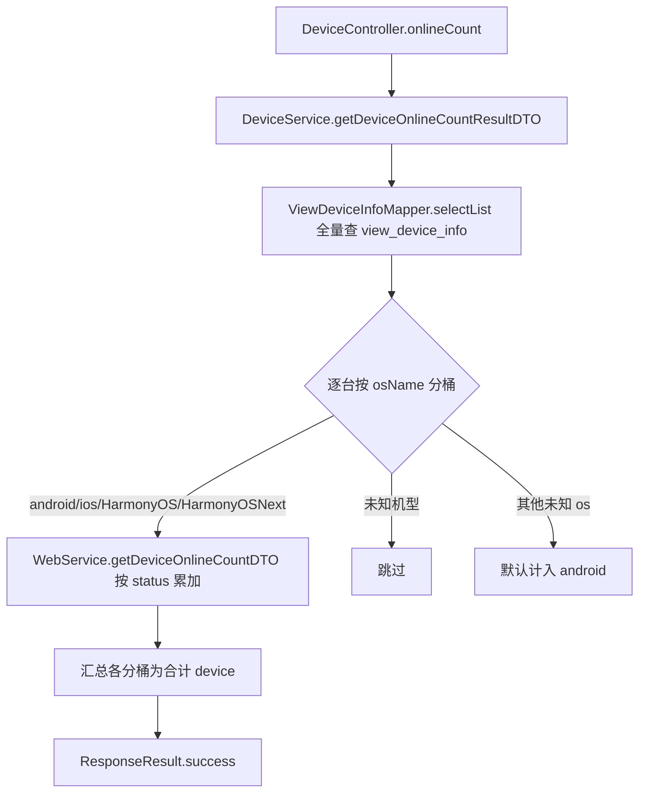
```mermaid
flowchart TD
    A[DeviceController.onlineCount] --> B[DeviceService.getDeviceOnlineCountResultDTO]
    B --> C[ViewDeviceInfoMapper.selectList 全量查 view_device_info]
    C --> D{逐台按 osName 分桶}
    D -->|android/ios/HarmonyOS/HarmonyOSNext| E[WebService.getDeviceOnlineCountDTO 按 status 累加]
    D -->|未知机型| F[跳过]
    D -->|其他未知 os| G[默认计入 android]
    E --> H[汇总各分桶为合计 device]
    H --> I[ResponseResult.success]
```

- **调用链**：无外部服务调用（仅本模块 DB）。
- **涉及表与 SQL**：`view_device_info`（视图，SELECT 全量；ViewDeviceInfoMapper.selectList）。
- **异常与校验**：无入参校验；`DeviceConfig.DeviceOs.valueOf` 返回 null 的未匹配机型直接跳过。
- **关键代码摘录**：

```java
// mvc/controller/DeviceController.java
@GetMapping("/online_count")
public ResponseResult<DeviceOnlineCountResultDTO> onlineCount() {
    DeviceOnlineCountResultDTO result = deviceService.getDeviceOnlineCountResultDTO();
    return ResponseResult.success(result);
}
```

---

### 设备天统计分页查询 (`GET /v3/ControlCenter/device/history_count`)

- **实现意图**：分页查询 App 设备按天统计的在线率/利用率/各时长（由每日凌晨 1 点定时任务落库）。
- **请求参数**：

| 参数名 | 类型 | 必填 | 说明 |
|--------|------|------|------|
| page | Integer | 是 | 页码，>0 |
| page_size | Integer | 是 | 每页大小，>0 |
| device_id | String | 否 | 设备 id |
| model_alias | String | 否 | 型号别名 |
| os_name | Integer | 否 | 系统类型 |
| start_time | Long | 否 | 开始时间戳（内部 +1 天对齐） |
| end_time | Long | 否 | 结束时间戳 |

- **返回参数**

| 字段 | 类型 | 说明 |
| --- | --- | --- |
| code | int | 状态码，0 成功 |
| msg | String | 提示信息 |
| data | Object | 分页对象 PageInfoList&lt;DeviceHistoryCountDTO&gt; |
| data.totalRow | Long | 总记录数 |
| data.totalPage | Integer | 总页数 |
| data.pageSize | Integer | 每页条数 |
| data.page | Integer | 当前页 |
| data.list | JSONArray&lt;DeviceHistoryCountDTO&gt; | 设备天统计列表 |
- **处理流程**：

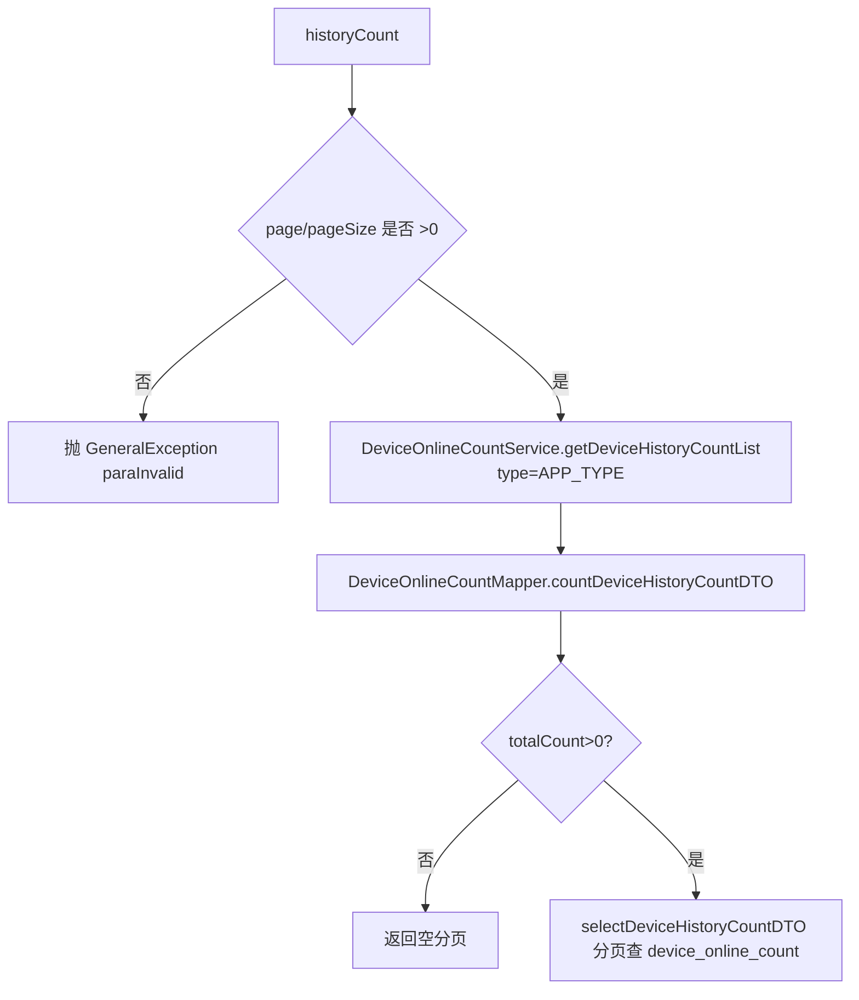
```mermaid
flowchart TD
    A[historyCount] --> B{page/pageSize 是否 >0}
    B -->|否| C[抛 GeneralException paraInvalid]
    B -->|是| D[DeviceOnlineCountService.getDeviceHistoryCountList<br/>type=APP_TYPE]
    D --> E[DeviceOnlineCountMapper.countDeviceHistoryCountDTO]
    E --> F{totalCount>0?}
    F -->|否| G[返回空分页]
    F -->|是| H[selectDeviceHistoryCountDTO 分页查 device_online_count]
```

- **调用链**：无。
- **涉及表与 SQL**：`device_online_count`（SELECT count / 分页 SELECT；DeviceOnlineCountMapper）。
- **异常与校验**：page/pageSize 非正抛 `paraInvalid`。
- **关键代码摘录**：

```java
// mvc/controller/DeviceController.java
PageInfoList<DeviceHistoryCountDTO> result = deviceOnlineCountService.getDeviceHistoryCountList(
        startPage, pageSize, deviceId, null, modelAlias, osName,
        startTime, endTime, DeviceOnlineCount.APP_TYPE);
```

---

### 设备列表-GET (`GET /v3/ControlCenter/device/list`)

- **实现意图**：多条件分页查询设备列表，支持 App / Web / PC 三类设备统一入口；`@UnderlineToCamel` 注解将下划线参数自动绑定到驼峰 DTO。
- **请求参数**（`DeviceListRequestDTO extends BaseQueryRequestDTO`）：

| 参数名 | 类型 | 必填 | 说明 |
|--------|------|------|------|
| page / page_size | Integer | 否 | 缺省补默认值 Constant.DEFAULT_PAGE / DEFAULT_PAGE_SIZE |
| eid | Integer | 否 | 企业 id（私有云恒为 1） |
| project_id | Integer | 是* | 来自 BaseQueryRequestDTO @NotNull |
| user_id | Integer | 是* | 同上 |
| ucom_ip / device_id / brand_name / model_name | String | 否 | 过滤条件 |
| device_ids / not_in_device_ids | List<String> | 否 | 包含/排除设备 |
| os_name / os_names | Integer / String | 否 | 系统类型（osNames 逗号分隔多个） |
| status / statuses | Integer / String | 否 | 状态（statuses 逗号分隔） |
| action | Integer | 否 | 设备动作（空闲/调试等） |
| remark | String | 否 | 备注模糊 |
| device_type | Integer | 否 | 1=App 3=Web 5=Pc（缺省按 App） |
| type | Integer | 否 | 1=企业级查询，否则项目级 |
| model_alias | String | 否 | 型号别名 |
| from_manage_center | Integer | 否 | 1=管理中心请求（忽略分组） |

- **返回参数**

| 字段 | 类型 | 说明 |
| --- | --- | --- |
| code | int | 状态码，0 成功 |
| msg | String | 提示信息 |
| data | Object | 分页对象 PageInfoList&lt;DeviceDTO&gt; |
| data.totalRow | Long | 总记录数 |
| data.totalPage | Integer | 总页数 |
| data.pageSize | Integer | 每页条数 |
| data.page | Integer | 当前页 |
| data.list | JSONArray&lt;DeviceDTO&gt; | 设备列表 |
- **处理流程**：

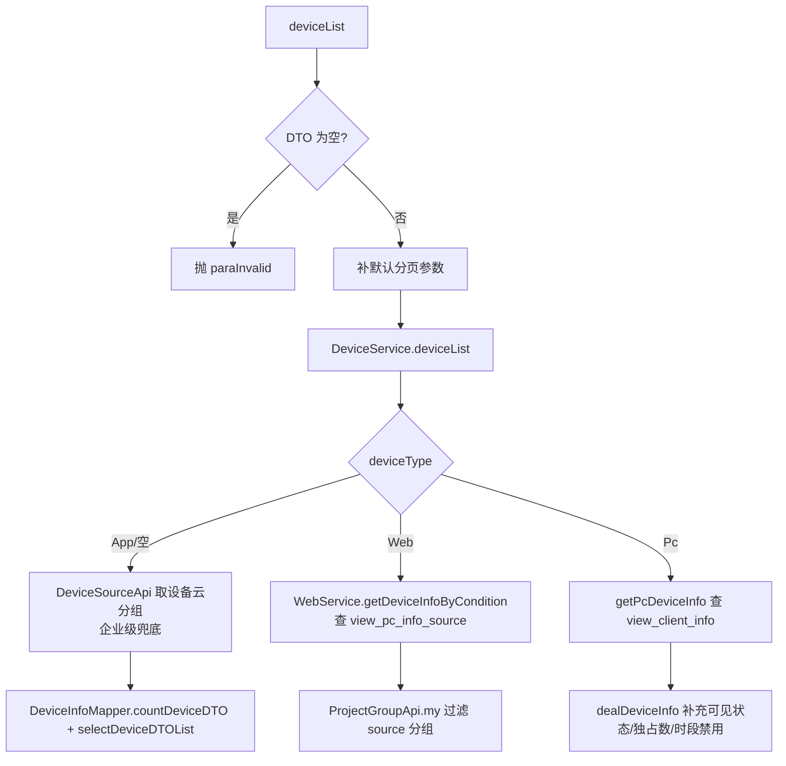
```mermaid
flowchart TD
    A[deviceList] --> B{DTO 为空?}
    B -->|是| C[抛 paraInvalid]
    B -->|否| D[补默认分页参数]
    D --> E[DeviceService.deviceList]
    E --> F{deviceType}
    F -->|App/空| G[DeviceSourceApi 取设备云分组<br/>企业级兜底]
    G --> H[DeviceInfoMapper.countDeviceDTO + selectDeviceDTOList]
    F -->|Web| I[WebService.getDeviceInfoByCondition<br/>查 view_pc_info_source]
    F -->|Pc| J[getPcDeviceInfo 查 view_client_info]
    J --> K[dealDeviceInfo 补充可见状态/独占数/时段禁用]
    I --> L[ProjectGroupApi.my 过滤 source 分组]
```

- **调用链**：[平台配置](../../../平台配置（real-cfg）/07-开放接口文档/00-模块索引.md)（DeviceSourceApi.getDeviceSourceByProjectIdOrEid、ProjectGroupApi.my）。
- **涉及表与 SQL**：`device_info`（自定义 SQL countDeviceDTO / selectDeviceDTOList）、`view_pc_info_source`、`view_client_info`（MyBatis-Plus 分页）、`device_detail`、`device_project_exclusive`、`device_time_cfg`。
- **异常与校验**：DTO 为 null 抛 `paraInvalid`；项目无设备云配置时回退企业级。
- **关键代码摘录**：

```java
// mvc/controller/DeviceController.java
@GetMapping("/list")
@UnderlineToCamel
public ResponseResult<PageInfoList<DeviceDTO>> deviceList(DeviceListRequestDTO deviceListRequestDTO) throws GeneralException {
    if (deviceListRequestDTO == null) {
        throw new GeneralException(CommonCode.paraInvalid.getValue(), "请求参数不正确");
    }
    ...
    PageInfoList<DeviceDTO> result = deviceService.deviceList(deviceListRequestDTO);
    return ResponseResult.success(result);
}
```

---

### 设备列表-POST (`POST /v3/ControlCenter/device/list`)

- **实现意图**：同 GET /v3/list，请求体方式传参（复杂条件/长列表场景）。
- **请求参数**：`@RequestBody DeviceListRequestDTO`，字段同上表。
- **返回参数**：同「设备列表-GET」——`ResponseResult<PageInfoList<DeviceDTO>>`（code/msg/data，data 含 totalRow/totalPage/pageSize/page/list）。
- **处理流程 / 调用链 / 表**：与「设备列表-GET」完全一致，复用 `DeviceService.deviceList`。
- **异常与校验**：同 GET。
- **关键代码摘录**：

```java
// mvc/controller/DeviceController.java
@PostMapping("/list")
public ResponseResult<PageInfoList<DeviceDTO>> deviceListPost(@RequestBody DeviceListRequestDTO deviceListRequestDTO) throws GeneralException {
    ...
    PageInfoList<DeviceDTO> result = deviceService.deviceList(deviceListRequestDTO);
    return ResponseResult.success(result);
}
```

---

### 设备调试信息 (`GET /v3/ControlCenter/device/view_device_info`)

- **实现意图**：按设备类型查询设备当前调试占用信息（调试人、上位机、IP、动作），用于前端"进入调试"前展示。
- **请求参数**：

| 参数名 | 类型 | 必填 | 说明 |
|--------|------|------|------|
| device_id | String | 否 | App 设备 id |
| device_type | Integer | 否 | TaskTypeEnum：APP / WEB / DESKTOP |
| ucom_id | String | 否 | 上位机账号（Web/Pc 用） |

- **返回参数**

| 字段 | 类型 | 说明 |
| --- | --- | --- |
| code | int | 状态码，0 成功 |
| msg | String | 提示信息 |
| data | Object | DeviceDebugInfoDTO 返回数据对象 |
| data.debugOwner | String | 调试占用人 |
| data.ucomid | String | 上位机账号 |
| data.ip | String | 设备 IP |
| data.action | Integer | 设备动作 |
- **处理流程**：

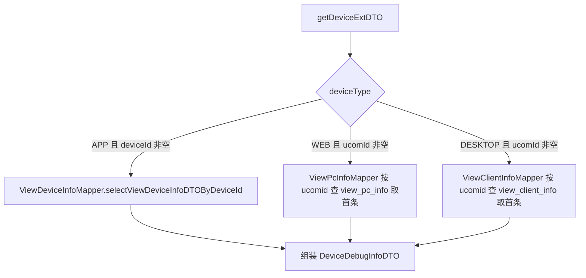
```mermaid
flowchart TD
    A[getDeviceExtDTO] --> B{deviceType}
    B -->|APP 且 deviceId 非空| C[ViewDeviceInfoMapper.selectViewDeviceInfoDTOByDeviceId]
    B -->|WEB 且 ucomId 非空| D[ViewPcInfoMapper 按 ucomid 查 view_pc_info 取首条]
    B -->|DESKTOP 且 ucomId 非空| E[ViewClientInfoMapper 按 ucomid 查 view_client_info 取首条]
    C & D & E --> F[组装 DeviceDebugInfoDTO]
```

- **调用链**：无。
- **涉及表与 SQL**：`view_device_info`、`view_pc_info`、`view_client_info`（SELECT）。
- **异常与校验**：条件不匹配时返回空 DTO，不抛错。
- **关键代码摘录**：

```java
// mvc/service/DeviceService.java
if (TaskTypeEnum.APP.getType().equals(deviceType) && StringUtils.isNotBlank(deviceId)) {
    return viewDeviceInfoMapper.selectViewDeviceInfoDTOByDeviceId(deviceId);
}
```

---

### 设备任务列表 (`GET /v3/ControlCenter/device/task_list`)

- **实现意图**：查询某台设备（App/Web/Pc）上待执行/执行中/已完成的任务列表；对"执行中"还会补充锁池中被用例任务锁定的占用记录。
- **请求参数**：

| 参数名 | 类型 | 必填 | 说明 |
|--------|------|------|------|
| device_id | String | 否 | App 设备 id |
| exec_status | Integer | 是 | 执行状态（1=执行中 等，见 ExecStatusEnum） |
| page / page_size | Integer | 是 | 分页 |
| device_type | Integer | 否 | TaskTypeEnum APP/WEB/DESKTOP |
| ucom_id | String | 否 | Web/Pc 上位机账号 |

- **返回参数**

| 字段 | 类型 | 说明 |
| --- | --- | --- |
| code | int | 状态码，0 成功 |
| msg | String | 提示信息 |
| data | Object | 分页对象 PageInfoList&lt;DeviceTaskDTO&gt; |
| data.totalRow | Long | 总记录数 |
| data.totalPage | Integer | 总页数 |
| data.pageSize | Integer | 每页条数 |
| data.page | Integer | 当前页 |
| data.list | JSONArray&lt;DeviceTaskDTO&gt; | 任务列表，元素含 taskId/userId/userName/execStatus/suiteId/appPackageName 等 |
- **处理流程**：

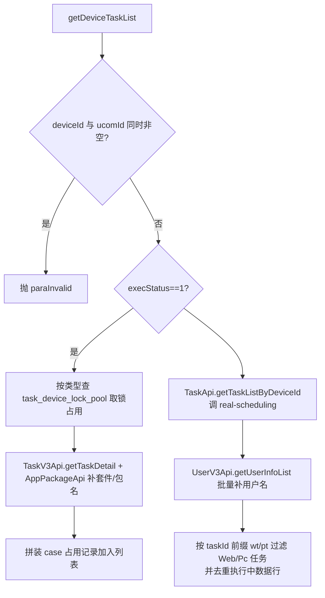
```mermaid
flowchart TD
    A[getDeviceTaskList] --> B{deviceId 与 ucomId 同时非空?}
    B -->|是| C[抛 paraInvalid]
    B -->|否| D{execStatus==1?}
    D -->|是| E[按类型查 task_device_lock_pool 取锁占用]
    D --> F[TaskApi.getTaskListByDeviceId<br/>调 real-scheduling]
    F --> G[UserV3Api.getUserInfoList 批量补用户名]
    G --> H[按 taskId 前缀 wt/pt 过滤 Web/Pc 任务<br/>并去重执行中数据行]
    E --> I[TaskV3Api.getTaskDetail + AppPackageApi 补套件/包名]
    I --> J[拼装 case 占用记录加入列表]
```

- **调用链**：[任务调度服务](../../../任务调度服务（real-scheduling）/07-开放接口文档/00-模块索引.md)（TaskApi.getTaskListByDeviceId）、[user-manager](../../../平台基础功能服务/00-首页.md)（UserV3Api.getUserInfoList、UserApi.getByUserid）、[app处理服务](../../../app处理服务（real-test）/07-开放接口文档/00-模块索引.md)（TaskV3Api.getTaskDetail）、[App包管理（脚本服务）](../../../脚本服务/00-首页.md)（AppPackageApi.getPackageFile）。
- **涉及表与 SQL**：`task_device_lock_pool`（SELECT limit 1；ITaskDeviceLockPoolDAO）。
- **异常与校验**：deviceId 与 ucomId 互斥，同传抛 `paraInvalid`；待执行任务会并入 EXEC 状态一并查询再过滤。
- **关键代码摘录**：

```java
// mvc/service/DeviceService.java
PageInfoList<DeviceTaskDTO> result = taskApi.getTaskListByDeviceId(deviceId, ucomId, exeStatusList, page, pageSize);
...
if (lockDeviceTaskInfo != null) {
    DeviceTaskDTO caseTaskDTO = new DeviceTaskDTO();
    caseTaskDTO.setResourceType("case");
    caseTaskDTO.setTaskId(lockDeviceTaskInfo.getTaskId());
    TaskExecuteRecordDetailResponseDTO taskDetail = taskV3Api.getTaskDetail(lockDeviceTaskInfo.getTaskId());
```

---

### 设备截图 (`GET /v3/ControlCenter/device/capture_screen`)

- **实现意图**：通过长连接协议向设备所在上位机下发截图指令，轮询等待上位机回传截图 URL（最长约 30 秒）。
- **请求参数**：

| 参数名 | 类型 | 必填 | 说明 |
|--------|------|------|------|
| device_id | String | 是 | 设备 id |

- **返回参数**

| 字段 | 类型 | 说明 |
| --- | --- | --- |
| code | int | 状态码，0 成功 |
| msg | String | 提示信息 |
| data | Object | BaseResponseDTO 返回数据对象 |
| data.result | String | 截图 URL |
- **处理流程**：

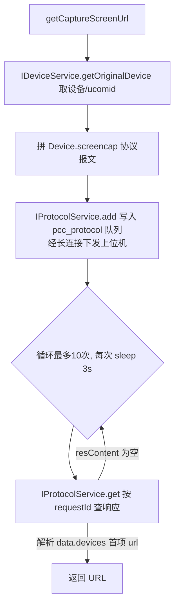
```mermaid
flowchart TD
    A[getCaptureScreenUrl] --> B[IDeviceService.getOriginalDevice 取设备/ucomid]
    B --> C[拼 Device.screencap 协议报文]
    C --> D[IProtocolService.add 写入 pcc_protocol 队列<br/>经长连接下发上位机]
    D --> E{循环最多10次, 每次 sleep 3s}
    E --> F[IProtocolService.get 按 requestId 查响应]
    F -->|resContent 为空| E
    F -->|解析 data.devices 首项 url| G[返回 URL]
```

- **调用链**：上位机 ucom（长连接协议 `Device.screencap`，op=`DeviceControl.screencap`，mkey=`script`）。
- **涉及表与 SQL**：`pcc_protocol`（INSERT 请求 / SELECT 响应；IProtocolService）、`device_info`（IDeviceService.getOriginalDevice）。
- **异常与校验**：requestId 为空或 reqContent 为空抛 `paraInvalid("截图失败")`；超时重试 10 次后 url 仍为 null 则返回空。
- **关键代码摘录**：

```java
// mvc/service/DeviceService.java
while (StringUtils.isBlank(url) && count < 10) {
    count++;
    url = getCaptureScreenResponse(requestId);
    Thread.sleep(3000);
}
```

---

### 设备关机 (`PUT /v3/ControlCenter/device/shutdown`)

- **实现意图**：向设备所在上位机下发关机指令（异步，不等响应）。
- **请求参数**（`ShutdownDeviceDTO`）：

| 参数名 | 类型 | 必填 | 说明 |
|--------|------|------|------|
| deviceId | String | 是 | 设备 id |

- **返回参数**

| 字段 | 类型 | 说明 |
| --- | --- | --- |
| code | int | 状态码，0 成功 |
| msg | String | 提示信息 |
| data | Object | BaseResponseDTO 返回数据对象 |
| data.result | String | 协议 requestId |
- **处理流程**：

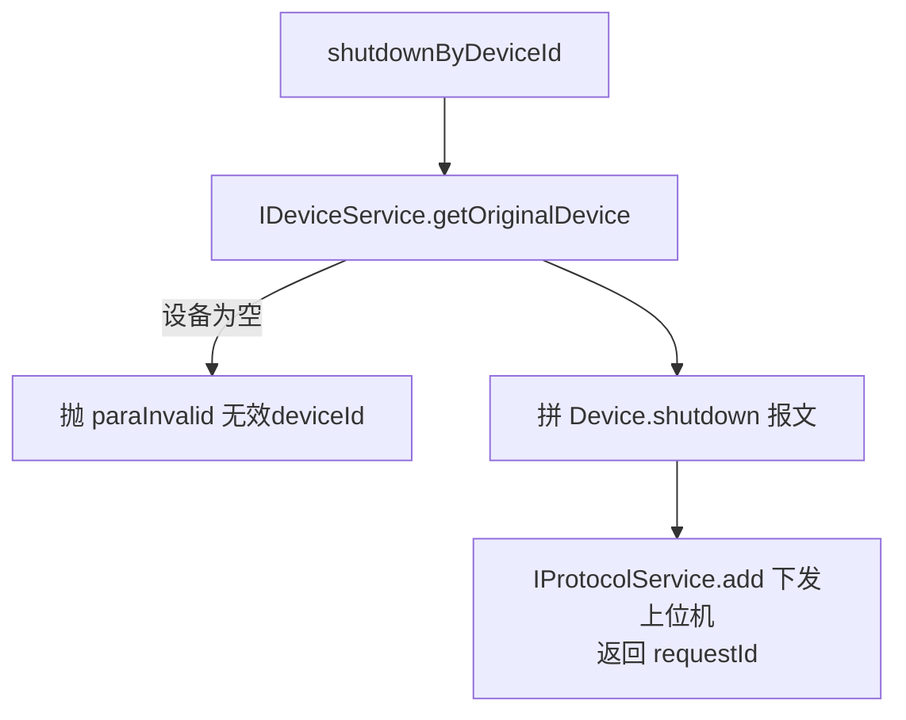
```mermaid
flowchart TD
    A[shutdownByDeviceId] --> B[IDeviceService.getOriginalDevice]
    B -->|设备为空| C[抛 paraInvalid 无效deviceId]
    B --> D[拼 Device.shutdown 报文]
    D --> E[IProtocolService.add 下发上位机<br/>返回 requestId]
```

- **调用链**：上位机 ucom（长连接 `Device.shutdown`）。
- **涉及表与 SQL**：`pcc_protocol`（INSERT）、`device_info`（SELECT）。
- **异常与校验**：设备不存在抛 `paraInvalid`。
- **关键代码摘录**：

```java
// mvc/service/DeviceService.java
jsonContent.put("op", "Device.shutdown");
...
return iprotocolservice.add(deviceInfo.getVhost(), type, sessionKey, requestId, mkey, op, content, status, null, null);
```

---

### 批量修改投屏模式 (`PUT /v3/ControlCenter/device/batch_update_screen_mode`)

- **实现意图**：按显式设备列表或查询条件批量修改手机屏幕模式（目前仅支持 android + HarmonyOS）。
- **请求参数**（`BatchUpdateScreenModeDTO`）：

| 参数名 | 类型 | 必填 | 说明 |
|--------|------|------|------|
| deviceQueryCondition | DeviceQueryCondition | 否 | 查询条件（deviceIdList 为空时必选） |
| targetScreenMode | Integer | 是 | 目标投屏模式 @NotNull |
| eid / projectId | Integer | 否 | 企业/项目 |
| deviceIdList | List<String> | 否 | 设备 id 集合（优先） |

- **返回参数**

| 字段 | 类型 | 说明 |
| --- | --- | --- |
| code | int | 状态码，0 成功 |
| msg | String | 提示信息 |
| data | Object | BaseResponseDTO 返回数据对象 |
| data.result | Integer | 更新行数 |
- **处理流程**：

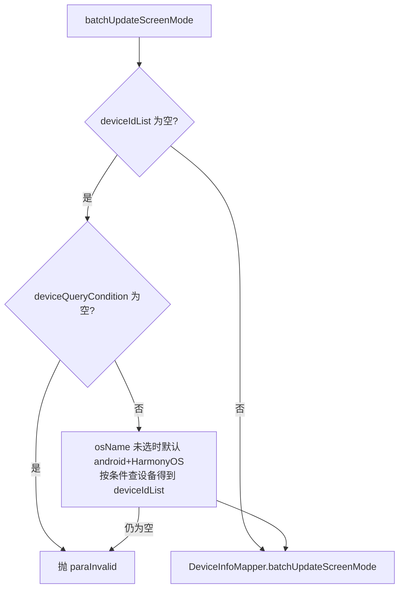
```mermaid
flowchart TD
    A[batchUpdateScreenMode] --> B{deviceIdList 为空?}
    B -->|是| C{deviceQueryCondition 为空?}
    C -->|是| D[抛 paraInvalid]
    C -->|否| E[osName 未选时默认 android+HarmonyOS<br/>按条件查设备得到 deviceIdList]
    B -->|否| F[DeviceInfoMapper.batchUpdateScreenMode]
    E --> F
    E -->|仍为空| D
```

- **调用链**：[平台配置](../../../平台配置（real-cfg）/07-开放接口文档/00-模块索引.md)（DeviceSourceApi，条件查询时取设备云分组）。
- **涉及表与 SQL**：`device_info`（批量 UPDATE screen_mode；DeviceInfoMapper.batchUpdateScreenMode）。
- **异常与校验**：`@Valid` 校验 targetScreenMode；两类入参都空抛 `paraInvalid`。
- **关键代码摘录**：

```java
// mvc/service/DeviceService.java
return deviceInfoMapper.batchUpdateScreenMode(deviceIdList, batchUpdateScreenModeDTO.getTargetScreenMode());
```

---

### 重启设备 (`PUT /v3/ControlCenter/device/reboot_device`)

- **实现意图**：下发重启指令并轮询等待上位机响应（最长约 30 秒），返回上位机结果码。
- **请求参数**（`BatchRebootDeviceDTO`，实际只用 deviceId/eid/projectId）：

| 参数名 | 类型 | 必填 | 说明 |
|--------|------|------|------|
| deviceId | String | 是 | 设备 id |
| eid / projectId | Integer | 否 | 企业/项目（用于设备云分组校验） |

- **返回参数**

| 字段 | 类型 | 说明 |
| --- | --- | --- |
| code | int | 状态码，0 成功 |
| msg | String | 提示信息 |
| data | Object | BaseResponseDTO 返回数据对象 |
| data.result | Integer | 上位机返回 code（0 成功） |
- **处理流程**：

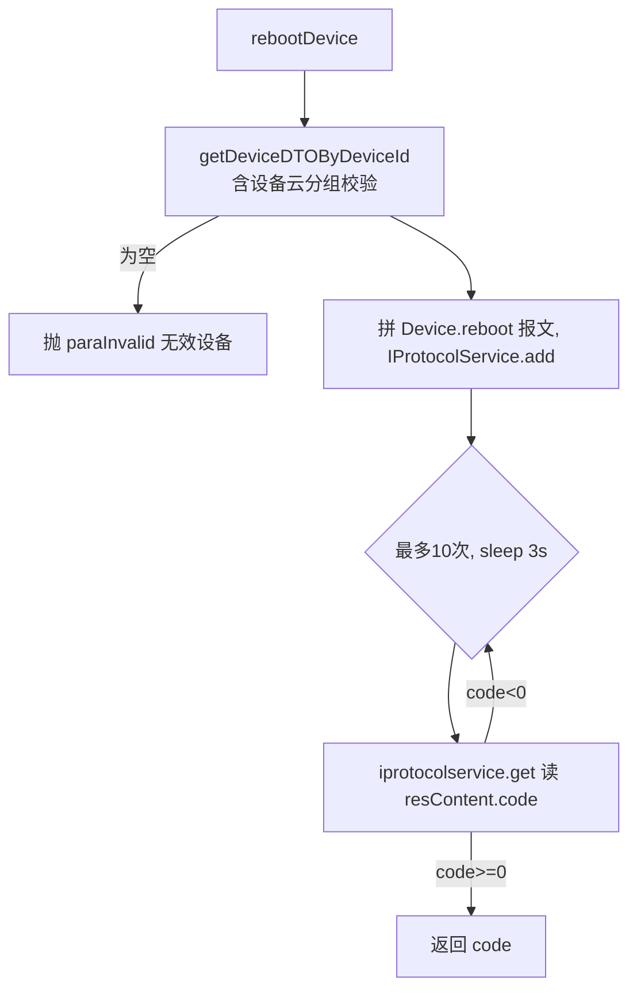
```mermaid
flowchart TD
    A[rebootDevice] --> B[getDeviceDTOByDeviceId<br/>含设备云分组校验]
    B -->|为空| C[抛 paraInvalid 无效设备]
    B --> D[拼 Device.reboot 报文, IProtocolService.add]
    D --> E{最多10次, sleep 3s}
    E --> F[iprotocolservice.get 读 resContent.code]
    F -->|code<0| E
    F -->|code>=0| G[返回 code]
```

- **调用链**：[平台配置](../../../平台配置（real-cfg）/07-开放接口文档/00-模块索引.md)（DeviceSourceApi）；上位机 ucom（长连接 `Device.reboot`）。
- **涉及表与 SQL**：`pcc_protocol`（INSERT/SELECT）、`device_info`（selectDeviceDTOById）。
- **异常与校验**：设备不存在抛 `paraInvalid`；requestId/reqContent 空抛"重启失败"。
- **关键代码摘录**：

```java
// mvc/service/DeviceService.java
while (code < 0 && count < 10) {
    count++;
    code = getRebootDeviceResponse(requestId);
    Thread.sleep(3000);
}
```

---

### 按 id 批量查询设备 (`POST /v3/ControlCenter/device/device_list`)

- **实现意图**：内部接口，供调度侧按设备 id 列表批量查询设备状态/IP/可用性（Pc 设备还会叠加时段禁用判定）。
- **请求参数**（`DeviceQueryRequestDTO`）：

| 参数名 | 类型 | 必填 | 说明 |
|--------|------|------|------|
| deviceIds | List<String> | 是 | @NotNull；Web 设备格式 `ip_osName_type_osVersion` |
| taskType | Integer | 是 | @NotNull；TaskTypeEnum APP/WEB/DESKTOP |
| eid | Integer | 否 | 企业 id |
| projectId | Integer | 是 | @NotNull |

- **返回参数**

| 字段 | 类型 | 说明 |
| --- | --- | --- |
| code | int | 状态码，0 成功 |
| msg | String | 提示信息 |
| data | Object | ResultListResponseDTO&lt;DeviceInfoResponse&gt; 返回数据对象 |
| data.list | JSONArray&lt;DeviceInfoResponse&gt; | 设备列表，元素含 deviceId/status/ip/ucomid/type/version/osName |
- **处理流程**：

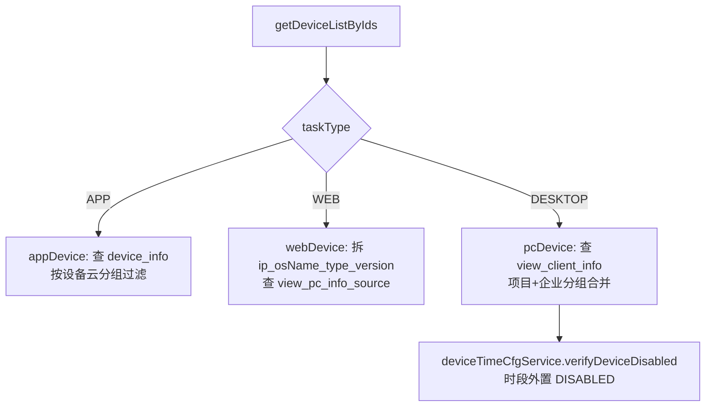
```mermaid
flowchart TD
    A[getDeviceListByIds] --> B{taskType}
    B -->|APP| C[appDevice: 查 device_info<br/>按设备云分组过滤]
    B -->|WEB| D[webDevice: 拆 ip_osName_type_version<br/>查 view_pc_info_source]
    B -->|DESKTOP| E[pcDevice: 查 view_client_info<br/>项目+企业分组合并]
    E --> F[deviceTimeCfgService.verifyDeviceDisabled<br/>时段外置 DISABLED]
```

- **调用链**：[平台配置](../../../平台配置（real-cfg）/07-开放接口文档/00-模块索引.md)（DeviceSourceApi、ProjectGroupApi.my）。
- **涉及表与 SQL**：`device_info`、`view_pc_info_source`、`view_client_info`、`device_time_cfg`（SELECT）。
- **异常与校验**：`@Valid` 触发 MethodArgumentNotValidException，由全局处理器返回参数错误。
- **关键代码摘录**：

```java
// mvc/service/DeviceService.java
if (TaskTypeEnum.APP.getType().equals(taskType)) { return appDevice(deviceIds, eid, projectId); }
if (TaskTypeEnum.WEB.getType().equals(taskType)) { return webDevice(deviceIds, eid, projectId); }
return pcDevice(deviceIds, eid, projectId);
```

---

### 设备天统计导出 (`GET /v3/ControlCenter/device/export`)

- **实现意图**：导出 App 设备天统计 CSV（带 BOM，前端直接下载）。
- **请求参数**：同 history_count（无分页参数）。
- **响应结构**：`HttpServletResponse` 直接写 CSV 流，文件名 `设备天统计yyyyMMdd-yyyyMMdd.csv`。
- **处理流程**：

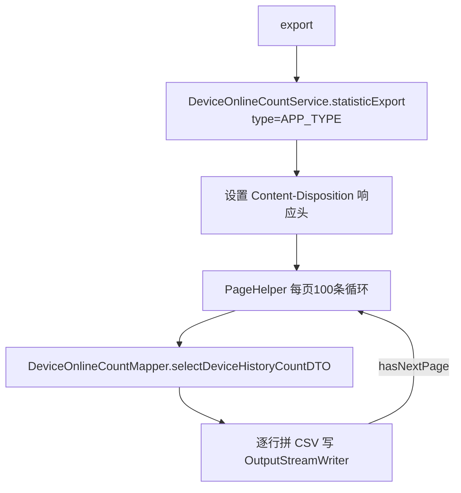
```mermaid
flowchart TD
    A[export] --> B[DeviceOnlineCountService.statisticExport<br/>type=APP_TYPE]
    B --> C[设置 Content-Disposition 响应头]
    C --> D[PageHelper 每页100条循环]
    D --> E[DeviceOnlineCountMapper.selectDeviceHistoryCountDTO]
    E --> F[逐行拼 CSV 写 OutputStreamWriter]
    F -->|hasNextPage| D
```

- **调用链**：无。
- **涉及表与 SQL**：`device_online_count`（SELECT）。
- **异常与校验**：写流异常仅记日志 `Logit.errorLog`。
- **关键代码摘录**：

```java
// mvc/service/DeviceOnlineCountService.java
outputStreamWriter.write(StatisticConstant.CSV_BOM);
outputStreamWriter.write(StatisticConstant.APP_CSV_TITLE);
```

---

### 设备错误日志 (`GET /v3/ControlCenter/device/error_log_info`)

- **实现意图**：按子任务 id（可叠加子子任务 id）查最新一条设备错误日志内容。
- **请求参数**：

| 参数名 | 类型 | 必填 | 说明 |
|--------|------|------|------|
| sub_taskid | String | 是 | 子任务 id |
| sub_sub_taskid | String | 否 | 子子任务 id |

- **返回参数**

| 字段 | 类型 | 说明 |
| --- | --- | --- |
| code | int | 状态码，0 成功 |
| msg | String | 提示信息 |
| data | String | 错误信息 msg（无记录返回 null） |
- **处理流程**：

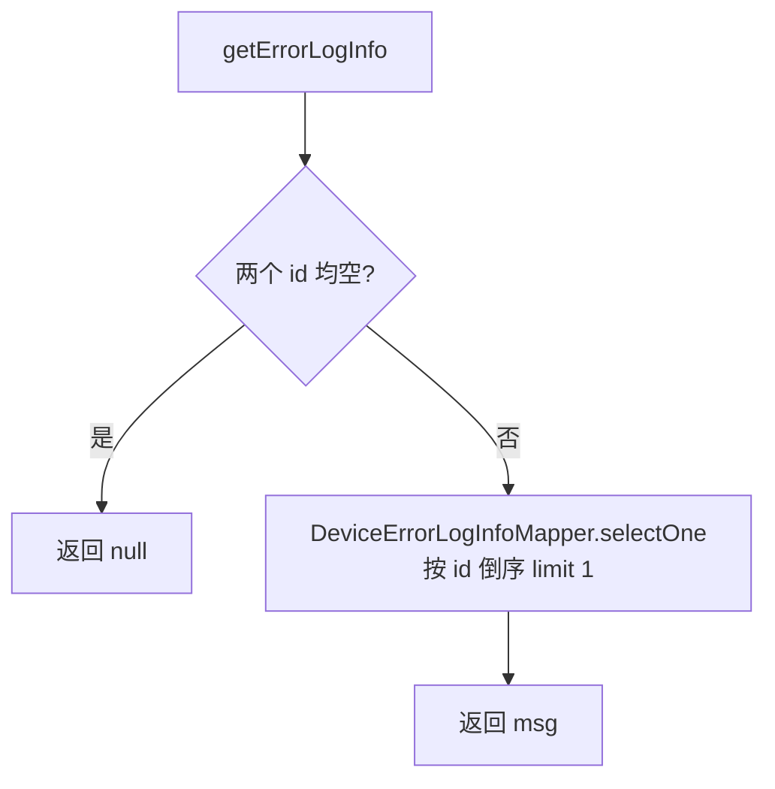
```mermaid
flowchart TD
    A[getErrorLogInfo] --> B{两个 id 均空?}
    B -->|是| C[返回 null]
    B -->|否| D[DeviceErrorLogInfoMapper.selectOne<br/>按 id 倒序 limit 1]
    D --> E[返回 msg]
```

- **调用链**：无。
- **涉及表与 SQL**：`device_error_log_info`（SELECT ... ORDER BY id DESC LIMIT 1）。
- **异常与校验**：无显式异常。
- **关键代码摘录**：

```java
// mvc/service/DeviceService.java
queryWrapper.eq(DeviceLogInfo::getSubtaskid, subTaskId);
queryWrapper.orderByDesc(DeviceLogInfo::getId);
queryWrapper.last("limit 1");
```

---

### 设备释放-服务端主动 (`PUT /v3/ControlCenter/device/release`)

- **实现意图**：服务端主动释放被调试占用的设备（App/Web/Pc 三类），通过长连接向上位机发送 `Device.release` 通知。
- **请求参数**（`mvc.request.device.DeviceReleaseRequestDTO extends BaseRequestDTO`）：

| 参数名 | 类型 | 必填 | 说明 |
|--------|------|------|------|
| deviceId | String | 是 | 设备 id |
| deviceType | Integer | 是 | TaskTypeEnum APP/WEB/DESKTOP |
| eid / projectId / userId | Integer | 是 | BaseRequestDTO 字段（userId @NotNull） |

- **返回参数**

| 字段 | 类型 | 说明 |
| --- | --- | --- |
| code | int | 状态码，0 成功 |
| msg | String | 提示信息 |
| data | Object | BaseResponseDTO 返回数据对象 |
| data.result | Integer | 1（成功）；设备查不到返回 0 |
- **处理流程**：

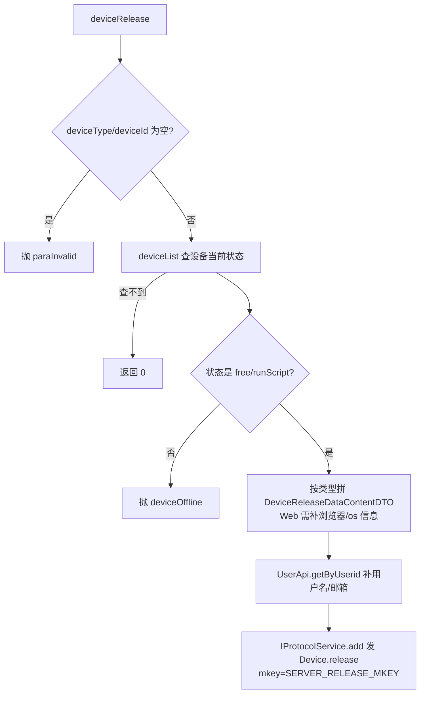
```mermaid
flowchart TD
    A[deviceRelease] --> B{deviceType/deviceId 为空?}
    B -->|是| C[抛 paraInvalid]
    B -->|否| D[deviceList 查设备当前状态]
    D -->|查不到| E[返回 0]
    D --> F{状态是 free/runScript?}
    F -->|否| G[抛 deviceOffline]
    F -->|是| H[按类型拼 DeviceReleaseDataContentDTO<br/>Web 需补浏览器/os 信息]
    H --> I[UserApi.getByUserid 补用户名/邮箱]
    I --> J[IProtocolService.add 发 Device.release<br/>mkey=SERVER_RELEASE_MKEY]
```

- **调用链**：[user-manager](../../../平台基础功能服务/00-首页.md)（UserApi.getByUserid）；上位机 ucom（长连接 `Device.release`）。
- **涉及表与 SQL**：`pcc_protocol`（INSERT）；设备查询复用 device_list 链路表。
- **异常与校验**：设备非 free/runScript（如 disconnect）抛 `ControlCenterCode.deviceOffline`。
- **关键代码摘录**：

```java
// mvc/service/DeviceService.java
releaseContentDTO.setOp("Device.release");
iprotocolservice.add(Config.MODULE_NODE_ID, ProtocolConfig.ProtocolType.activity.getValue(), ucomId, null,
        CommonConstant.SERVER_RELEASE_MKEY, CommonConstant.SERVER_RELEASE_OP,
        JsonUtil.toJsonString(releaseContentDTO), ProtocolConfig.ProtocolStatus.pendingRequest.getValue(), null, null);
```

---

### 任务锁设备 (`POST /v3/ControlCenter/device/lock_device_by_taskid`)

- **实现意图**：用例任务执行前批量锁定设备到 `task_device_lock_pool`，防止被其他任务抢占；App 按 deviceId 加 JVM 同步锁，Web/Pc 按 ucomId 加锁。
- **请求参数**（`DeviceLockRequestDTO`）：

| 参数名 | 类型 | 必填 | 说明 |
|--------|------|------|------|
| devices | List<DeviceInfo{deviceId,ucomId,deviceType}> | 是 | 待锁设备 |
| taskId | String | 是 | @NotNull |
| taskType | Integer | 否 | 任务类型 |
| taskDescr | String | 否 | 任务描述 |
| lockAllDevice | Integer | 否 | 0=允许部分失败（continue），否则单台失败整体抛出 |

- **返回参数**

| 字段 | 类型 | 说明 |
| --- | --- | --- |
| code | int | 状态码，0 成功 |
| msg | String | 提示信息 |
| data | Object | BaseResponseDTO 返回数据对象 |
| data.result | Integer | 成功锁定台数 |
- **处理流程**：

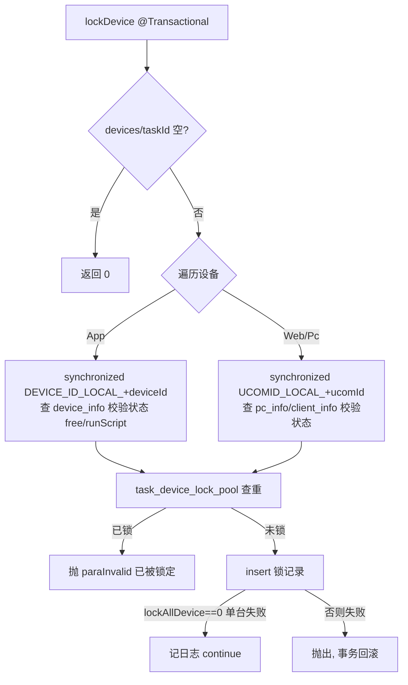
```mermaid
flowchart TD
    A["lockDevice @Transactional"] --> B{devices/taskId 空?}
    B -->|是| C[返回 0]
    B -->|否| D{遍历设备}
    D -->|App| E[synchronized DEVICE_ID_LOCAL_+deviceId<br/>查 device_info 校验状态 free/runScript]
    D -->|Web/Pc| F[synchronized UCOMID_LOCAL_+ucomId<br/>查 pc_info/client_info 校验状态]
    E & F --> G[task_device_lock_pool 查重]
    G -->|已锁| H[抛 paraInvalid 已被锁定]
    G -->|未锁| I[insert 锁记录]
    I -->|lockAllDevice==0 单台失败| J[记日志 continue]
    I -->|否则失败| K[抛出, 事务回滚]
```

- **调用链**：无（仅本模块 DB；设备状态经 IDeviceInfoDAO/IPcInfoDAO/IClientInfoDAO）。
- **涉及表与 SQL**：`task_device_lock_pool`（SELECT COUNT / INSERT；ITaskDeviceLockPoolDAO）、`device_info`、`pc_info`、`client_info`（SELECT）。
- **异常与校验**：设备不存在/状态未知/非空闲/已被锁均抛 `paraInvalid`；`@Transactional(rollbackFor = Exception.class)`。
- **关键代码摘录**：

```java
// mvc/service/DeviceService.java
synchronized (DEVICE_ID_LOCAL + deviceDTO.getDeviceId()) {
    DeviceInfo deviceInfo = ideviceinfodao.get(deviceDTO.getDeviceId());
    ...
    int count = iTaskDeviceLockPoolDAO.selectCount(queryWrapper);
    if (count > 0) { throw new GeneralException(..., "已被锁定"); }
    iTaskDeviceLockPoolDAO.insert(deviceLock);
}
```

---

### 任务解锁设备 (`POST /v3/ControlCenter/device/unlock_device_by_taskid`)

- **实现意图**：按 taskId（可叠加设备列表）删除锁池记录，释放任务持有的设备。
- **请求参数**：`DeviceLockRequestDTO`，主要用 taskId + devices（可选）。
- **返回参数**

| 字段 | 类型 | 说明 |
| --- | --- | --- |
| code | int | 状态码，0 成功 |
| msg | String | 提示信息 |
| data | Object | BaseResponseDTO 返回数据对象 |
| data.result | Integer | 删除行数 |
- **处理流程**：

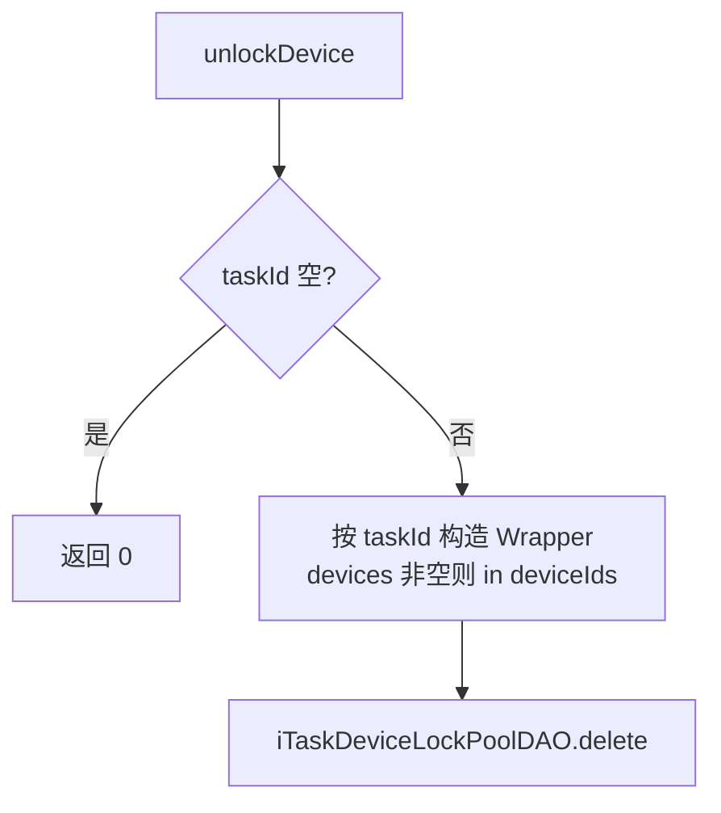
```mermaid
flowchart TD
    A[unlockDevice] --> B{taskId 空?}
    B -->|是| C[返回 0]
    B -->|否| D[按 taskId 构造 Wrapper<br/>devices 非空则 in deviceIds]
    D --> E[iTaskDeviceLockPoolDAO.delete]
```

- **调用链**：无。
- **涉及表与 SQL**：`task_device_lock_pool`（DELETE）。
- **异常与校验**：入参空返回 0。
- **关键代码摘录**：

```java
// mvc/service/DeviceService.java
queryWrapper.eq(TaskDeviceLockPoolDO::getTaskId, deviceLockRequestDTO.getTaskId());
return iTaskDeviceLockPoolDAO.delete(queryWrapper);
```

---

### 查询设备被锁任务 (`GET /v3/ControlCenter/device/get_lock_device_taskid`)

- **实现意图**：查某台设备（deviceId 或 ucomId）当前被哪个 taskId 锁定。
- **请求参数**：

| 参数名 | 类型 | 必填 | 说明 |
|--------|------|------|------|
| device_id | String | 否 | App 设备 id |
| ucom_id | String | 否 | 上位机账号 |

- **返回参数**

| 字段 | 类型 | 说明 |
| --- | --- | --- |
| code | int | 状态码，0 成功 |
| msg | String | 提示信息 |
| data | Object | BaseResponseDTO 返回数据对象 |
| data.result | String | taskId（无锁返回 null） |
- **处理流程**：Controller → `DeviceService.getLockDeviceTaskId` → `task_device_lock_pool` 按 deviceId/ucomId 查询 limit 1 → 返回 taskId。
- **调用链**：无。
- **涉及表与 SQL**：`task_device_lock_pool`（SELECT ... LIMIT 1）。
- **异常与校验**：两参数均空返回 null。
- **关键代码摘录**：

```java
// mvc/service/DeviceService.java
queryWrapper.last(" limit 1 ");
TaskDeviceLockPoolDO taskDeviceLockPoolDO = iTaskDeviceLockPoolDAO.selectOne(queryWrapper);
```

---

### 查询任务锁定设备列表 (`GET /v3/ControlCenter/device/get_lock_devices_by_taskid`)

- **实现意图**：按 taskId 查出该任务锁定的全部设备锁记录。
- **请求参数**：

| 参数名 | 类型 | 必填 | 说明 |
|--------|------|------|------|
| task_id | String | 否 | 任务 id |

- **返回参数**

| 字段 | 类型 | 说明 |
| --- | --- | --- |
| code | int | 状态码，0 成功 |
| msg | String | 提示信息 |
| data | Object | ResultListResponseDTO&lt;TaskDeviceLockPoolDO&gt; 返回数据对象 |
| data.list | JSONArray&lt;TaskDeviceLockPoolDO&gt; | 设备锁记录列表 |
- **处理流程**：Controller → `DeviceService.getLockDevicesByTaskId` → `task_device_lock_pool` 按 taskId 查询列表。
- **调用链**：无。
- **涉及表与 SQL**：`task_device_lock_pool`（SELECT 列表）。
- **异常与校验**：taskId 空返回 null。
- **关键代码摘录**：

```java
// mvc/service/DeviceService.java
LambdaQueryWrapper<TaskDeviceLockPoolDO> queryWrapper = new LambdaQueryWrapper<>();
queryWrapper.eq(TaskDeviceLockPoolDO::getTaskId, taskId);
return iTaskDeviceLockPoolDAO.selectList(queryWrapper);
```
