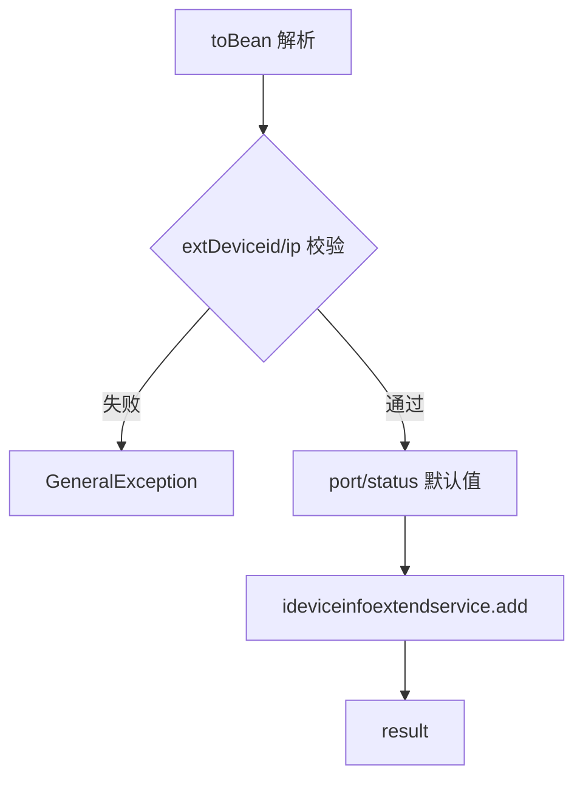
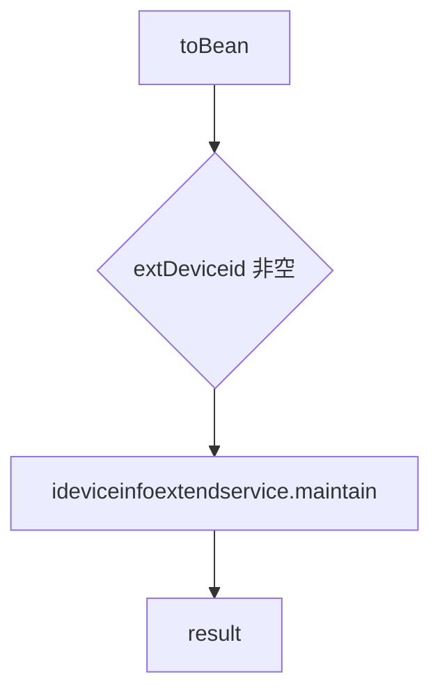
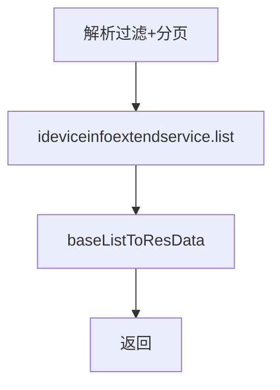

# DeviceExtend（device 包）

## 职责
扩展设备（外接硬件/上位机控制的扩展装置）的登记、移除、维护、单查与分页列表。

- 源码：`real-controlcenter/src/main/java/cn/testin/service/device/DeviceExtend.java`
- 基类：`GenericBaseService`（注入 ideviceinfoextendservice）

## op 一览表

| op | 说明 |
|---|---|
| add | 新增扩展设备 |
| remove | 移除扩展设备 |
| maintain | 维护扩展设备信息 |
| get | 按扩展设备 ID 查询 |
| list | 分页查询扩展设备 |

---

### add (`DeviceExtend.add`)
- **入口**：ApiServlet，action/op（action=deviceExtend，op=DeviceExtend.add）
- **实现意图**：登记一台扩展设备（IP/端口/位置等）。
- **请求参数**：DeviceInfoExtend JSON，关键字段：

| 参数 | 类型 | 必填 | 说明 |
|---|---|---|---|
| extDeviceid | String | 是 | 扩展设备 ID |
| ip | String | 是 | IP 地址 |
| port | int | 否 | 端口，缺省置 0 |
| status | int | 否 | 状态，缺省 STATUS_ON |

- **返回参数**

| 字段 | 类型 | 说明 |
| --- | --- | --- |
| code | Integer | 状态码，0 成功 |
| msg | String | 提示信息 |
| data | Object | 返回数据对象 |
| data.result | Integer | 1 成功 / 0 失败 |
- **处理流程**：

- **涉及表与 SQL**：`device_info_extend`（INSERT）。
- **异常与校验**：extDeviceid/ip 空 → GeneralException(paraInvalid)。
- **关键代码摘录**：
```java
// real-controlcenter/src/main/java/cn/testin/service/device/DeviceExtend.java
if (deviceInfoExtend.getPort() == null) { deviceInfoExtend.setPort(0); }
if (deviceInfoExtend.getStatus() == null) { deviceInfoExtend.setStatus(DeviceInfoExtend.STATUS_ON); }
boolean result = this.ideviceinfoextendservice.add(deviceInfoExtend);
```

### remove (`DeviceExtend.remove`)
- **入口**：ApiServlet，action/op（action=deviceExtend，op=DeviceExtend.remove）
- **实现意图**：按扩展设备 ID 删除。
- **请求参数**

| 字段 | 类型 | 必填 | 说明 |
| --- | --- | --- | --- |
| extDeviceid | String | 是 | 扩展设备 ID |

- **返回参数**

| 字段 | 类型 | 说明 |
| --- | --- | --- |
| code | Integer | 状态码，0 成功 |
| msg | String | 提示信息 |
| data | Object | 返回数据对象 |
| data.result | Integer | 1 成功 / 0 失败 |
- **涉及表与 SQL**：`device_info_extend`（DELETE）。
- **异常与校验**：extDeviceid 空 → GeneralException。

### maintain (`DeviceExtend.maintain`)
- **入口**：ApiServlet，action/op（action=deviceExtend，op=DeviceExtend.maintain）
- **实现意图**：更新扩展设备信息（不强制校验 ip，允许局部更新）。
- **请求参数**

| 字段 | 类型 | 必填 | 说明 |
| --- | --- | --- | --- |
| extDeviceid | String | 是 | 扩展设备 ID |
| ip | String | 否 | IP 地址（允许局部更新，不强制校验） |
| 其余字段 | - | 否 | DeviceInfoExtend JSON，由 toBean 解析 |
- **返回参数**

| 字段 | 类型 | 说明 |
| --- | --- | --- |
| code | Integer | 状态码，0 成功 |
| msg | String | 提示信息 |
| data | Object | 返回数据对象 |
| data.result | Integer | 1 成功 / 0 失败 |
- **处理流程**：

- **涉及表与 SQL**：`device_info_extend`（UPDATE）。
- **异常与校验**：extDeviceid 空 → GeneralException。

### get (`DeviceExtend.get`)
- **入口**：ApiServlet，action/op（action=deviceExtend，op=DeviceExtend.get）
- **实现意图**：按扩展设备 ID 查询详情。
- **请求参数**

| 字段 | 类型 | 必填 | 说明 |
| --- | --- | --- | --- |
| extDeviceid | String | 是 | 扩展设备 ID |

- **返回参数**

| 字段 | 类型 | 说明 |
| --- | --- | --- |
| code | Integer | 状态码，0 成功 |
| msg | String | 提示信息 |
| data | Object | 返回数据对象 |
| data.objInfo | Object | DeviceInfoExtend JSON（无则缺省） |
- **涉及表与 SQL**：`device_info_extend`（主键查询）。
- **异常与校验**：extDeviceid 空 → GeneralException。

### list (`DeviceExtend.list`)
- **入口**：ApiServlet，action/op（action=deviceExtend，op=DeviceExtend.list）
- **实现意图**：扩展设备分页查询，支持 ID/IP/上位机/位置过滤。
- **请求参数**

| 字段 | 类型 | 必填 | 说明 |
| --- | --- | --- | --- |
| page | Integer | 是 | 页码，>0 |
| pageSize | Integer | 是 | 页大小，<Config.MaxSize |
| extDeviceid | String | 否 | 扩展设备 ID |
| ip | String | 否 | IP 地址 |
| ucomid | String | 否 | 上位机账号 |
| location | String | 否 | 位置 |

- **返回参数**

| 字段 | 类型 | 说明 |
| --- | --- | --- |
| code | Integer | 状态码，0 成功 |
| msg | String | 提示信息 |
| data | Object | 返回数据对象 |
| data.page | Integer | 当前页 |
| data.pageSize | Integer | 每页条数 |
| data.totalRow | Integer | 总记录数 |
| data.totalPage | Integer | 总页数 |
| data.list | JSONArray&lt;DeviceInfoExtend&gt; | 扩展设备列表 |
- **处理流程**：

- **涉及表与 SQL**：`device_info_extend`（条件分页）。
- **异常与校验**：分页非法 → GeneralException；结果 null → unknown。

---

## 依赖汇总
- 外部服务：无
- 主要表：device_info_extend
