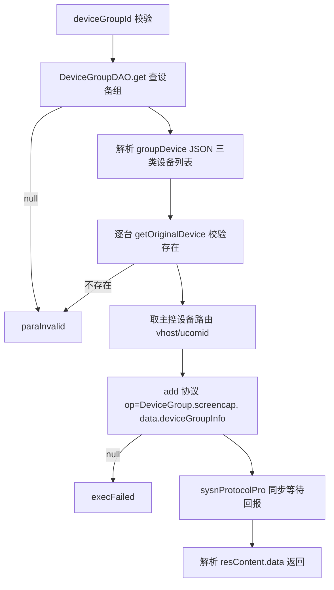

# DeviceGroup-control

- **类全名**：`cn.testin.service.control.DeviceGroup`
- **源码路径**：`real-controlcenter/src/main/java/cn/testin/service/control/DeviceGroup.java`
- **同名说明**：与 `cn.testin.service.deviceGroup.DeviceGroup` 区分，本文档为 control 包（设备组控制）。
- **职责**：设备组（主控设备+功能设备+手机设备的组合）级控制指令。

## op 一览表

| op | 方法 | 职责 |
| --- | --- | --- |
| screencap | `DeviceGroup.screencap` | 获取设备组屏幕配置及对应屏幕截图 |

---

### screencap (`DeviceGroup.screencap`)

- **入口**：ApiServlet，action=control，op=DeviceGroup.screencap
- **实现意图**：按设备组 ID 取出组内设备编排（groupDevice JSON：mainControlDeviceList/funDeviceList/phoneDeviceList），逐台校验设备存在性后，以主控设备的上位机为路由下发 `DeviceGroup.screencap` 指令，同步等待上位机返回整组截图数据。

**请求参数**

| 参数 | 类型 | 必填 | 说明 |
| --- | --- | --- | --- |
| deviceGroupId | String | 是 | 设备组 ID |

**返回参数**

| 字段 | 类型 | 说明 |
| --- | --- | --- |
| code | Integer | 状态码，0 成功 |
| msg | String | 提示信息 |
| data | Object | 返回数据对象 |
| data.result | Object | 上位机回报报文中的 `data` 节点（设备组各屏幕截图信息） |

**处理流程**



**调用链**：`DeviceGroupDAO.get` → `IDeviceService.getOriginalDevice`（逐台）→ `IProtocolService.add/get` → 主控设备上位机；截图文件经 [file-service](../../../文件管理服务/00-首页.md) 流转。
**涉及表与 SQL**：`device_group`（select by id，DAO：`DeviceGroupDAO.get`）；`device_info`（select）。
**异常与校验**：deviceGroupId 空/设备组不存在/组内设备不存在 → paraInvalid；add 失败 → execFailed；上位机 code>0 → sysnProtocolPro 抛 GeneralException。

**关键代码摘录**

```java
// real-controlcenter/.../service/control/DeviceGroup.java
DeviceGroupment deviceGroupment = DeviceGroupDAO.get(deviceGroupId);
JSONObject groupDeviceJSONObj = new JSONObject(deviceGroupment.getGroupDevice());
DeviceInfo dbdeviceinfo = ideviceservice.getOriginalDevice(
        mainControlDeviceList.optJSONObject(0).optString("deviceid"));
String result = iprotocolservice.add(dbdeviceinfo.getVhost(), type, sessionKey, reqid, mkey, op, content, status, null, null);
sysnProtocolPro(result, content);
```
