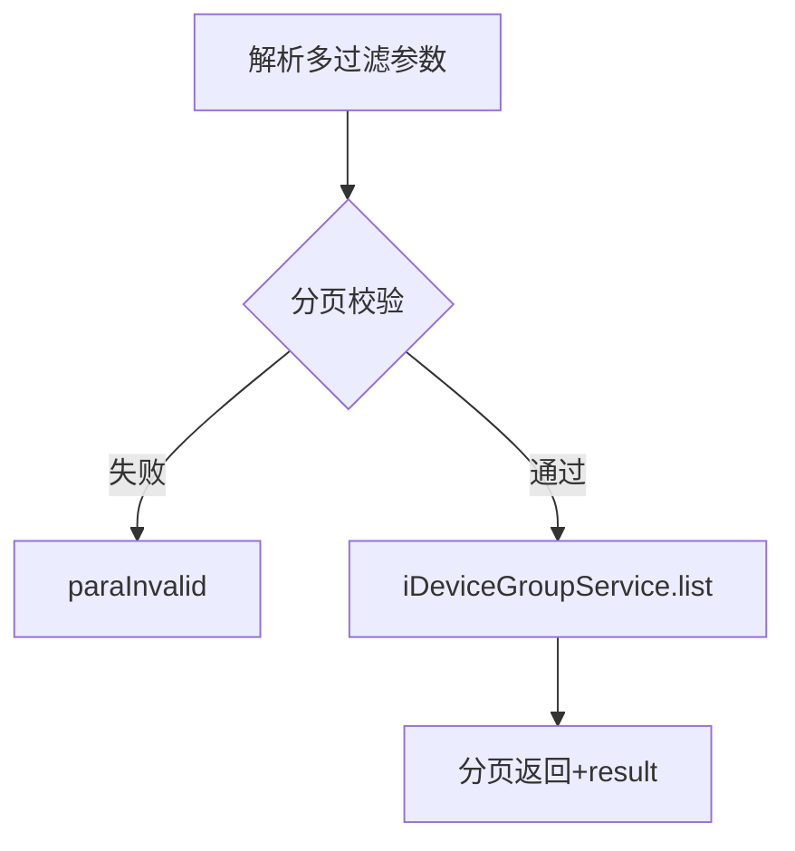
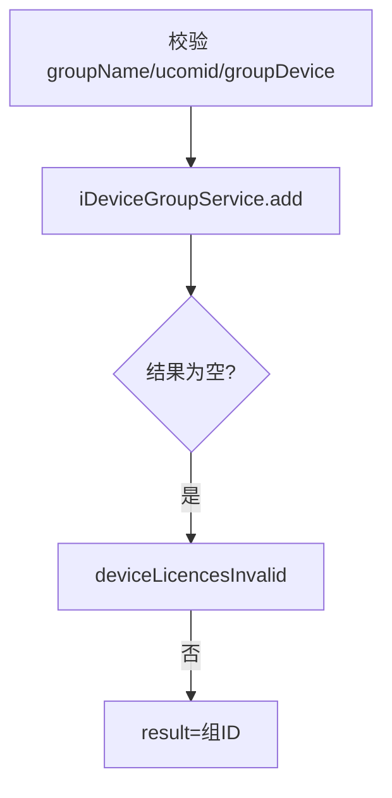
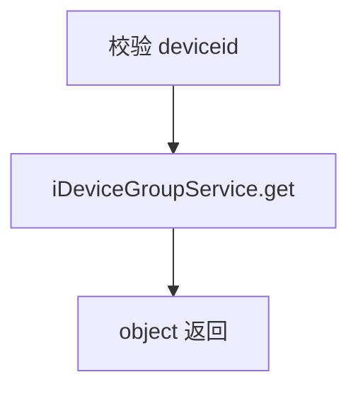

# DeviceGroup-deviceGroup（deviceGroup 包）

## 职责
设备组（按业务自定义的设备分组，关联上位机 ucomid）的增删改查与分页列表。

- 源码：`real-controlcenter/src/main/java/cn/testin/service/deviceGroup/DeviceGroup.java`
- 基类：`GenericBaseService`（注入 iDeviceGroupService）

## op 一览表

| op | 说明 |
|---|---|
| list | 设备组分页列表 |
| add | 新增设备组 |
| update | 更新设备组 |
| del | 逻辑删除设备组 |
| get | 按设备 ID 查设备组 |

---

### list (`DeviceGroup.list`)
- **入口**：ApiServlet，action/op（action=deviceGroup，op=DeviceGroup.list）
- **实现意图**：设备组分页查询，支持组名、关键字、描述、状态、设备集合、项目等多维过滤。
- **请求参数**：

| 参数 | 类型 | 必填 | 说明 |
|---|---|---|---|
| page / pageSize | int | 是 | 分页，pageSize≤Config.MaxSize |
| groupName | String | 否 | 组名 |
| keyWord | String | 否 | 关键字 |
| marks / descr | String | 否 | 标记/描述 |
| status | int | 否 | 状态 |
| statusArr | JSONArray | 否 | 状态多值 |
| deviceIds | JSONArray | 否 | 设备 ID 集合 |
| deviceid / ucomid | String | 否 | 设备/上位机（解析但透传给业务层决定是否使用） |
| action | int | 否 | 动作标记 |
| projectid | int | 否 | 项目组 |

- **返回参数**

| 字段 | 类型 | 说明 |
| --- | --- | --- |
| code | Integer | 状态码，0 成功 |
| msg | String | 提示信息 |
| data | Object | 返回数据对象 |
| data.page | Integer | 当前页 |
| data.pageSize | Integer | 每页条数 |
| data.totalRow | Integer | 总记录数 |
| data.totalPage | Integer | 总页数 |
| data.list | JSONArray&lt;DeviceGroupment&gt; | 设备组列表 |
| data.result | Object | BaseList&lt;DeviceGroupment&gt; 整页对象（与上述分页字段冗余） |
- **处理流程**：

- **涉及表与 SQL**：`device_group`（条件分页）。
- **异常与校验**：分页非法 → paraInvalid；结果 null → unknown。

### add (`DeviceGroup.add`)
- **入口**：ApiServlet，action/op（action=deviceGroup，op=DeviceGroup.add）
- **实现意图**：新增设备组并绑定设备集合。
- **请求参数**

| 字段 | 类型 | 必填 | 说明 |
| --- | --- | --- | --- |
| groupName | String | 是 | 组名 |
| ucomid | String | 是 | 上位机 ID |
| groupDevice | String | 是 | 组内设备 JSON |

- **返回参数**

| 字段 | 类型 | 说明 |
| --- | --- | --- |
| code | Integer | 状态码，0 成功 |
| msg | String | 提示信息 |
| data | Object | 返回数据对象 |
| data.result | String | 新增组 ID |
- **处理流程**：

- **涉及表与 SQL**：`device_group`（INSERT 组及组-设备关系）。
- **异常与校验**：必填缺失 → paraInvalid；新增失败 → `ControlCenterCode.deviceLicencesInvalid`。
- **关键代码摘录**：
```java
// real-controlcenter/src/main/java/cn/testin/service/deviceGroup/DeviceGroup.java
if (reqJson.isNull("groupName")) { return ApiUtil.getResult(apirequest, CommonCode.paraInvalid.getValue(), msg); }
String result = iDeviceGroupService.add(reqJson);
```

### update (`DeviceGroup.update`)
- **入口**：ApiServlet，action/op（action=deviceGroup，op=DeviceGroup.update）
- **实现意图**：更新设备组信息与组内设备。
- **请求参数**

| 字段 | 类型 | 必填 | 说明 |
| --- | --- | --- | --- |
| id | String | 是 | 组 ID |
| groupName | String | 是 | 组名 |
| ucomid | String | 是 | 上位机 ID |
| deviceid | String | 是 | 组内设备 ID |

- **返回参数**

| 字段 | 类型 | 说明 |
| --- | --- | --- |
| code | Integer | 状态码，0 成功 |
| msg | String | 提示信息 |
| data | Object | 返回数据对象 |
| data.result | Integer | 影响行数 |
- **涉及表与 SQL**：`device_group`（UPDATE）。
- **异常与校验**：必填缺失 → paraInvalid；result==null → unknown。

### del (`DeviceGroup.del`)
- **入口**：ApiServlet，action/op（action=deviceGroup，op=DeviceGroup.del）
- **实现意图**：逻辑删除设备组（按设备 ID 定位组）。
- **请求参数**

| 字段 | 类型 | 必填 | 说明 |
| --- | --- | --- | --- |
| deviceid | String | 是 | 设备 ID（按设备 ID 定位组） |

- **返回参数**

| 字段 | 类型 | 说明 |
| --- | --- | --- |
| code | Integer | 状态码，0 成功 |
| msg | String | 提示信息 |
| data | Object | 返回数据对象 |
| data.result | Integer | 1 成功 / 0 无影响 |
- **涉及表与 SQL**：`device_group`（逻辑删除，更新状态位）。
- **异常与校验**：deviceid 空 → GeneralException；result==null → GeneralException。

### get (`DeviceGroup.get`)
- **入口**：ApiServlet，action/op（action=deviceGroup，op=DeviceGroup.get）
- **实现意图**：按设备 ID 查询其所属设备组。
- **请求参数**

| 字段 | 类型 | 必填 | 说明 |
| --- | --- | --- | --- |
| deviceid | String | 是 | 设备 ID |

- **返回参数**

| 字段 | 类型 | 说明 |
| --- | --- | --- |
| code | Integer | 状态码，0 成功 |
| msg | String | 提示信息 |
| data | Object | 返回数据对象 |
| data.objInfo | Object | DeviceGroupment 设备组信息（无记录时缺省） |
- **处理流程**：

- **涉及表与 SQL**：`device_group`。
- **异常与校验**：deviceid 空 → GeneralException。

---

## 依赖汇总
- 外部服务：无
- 主要表：device_group
