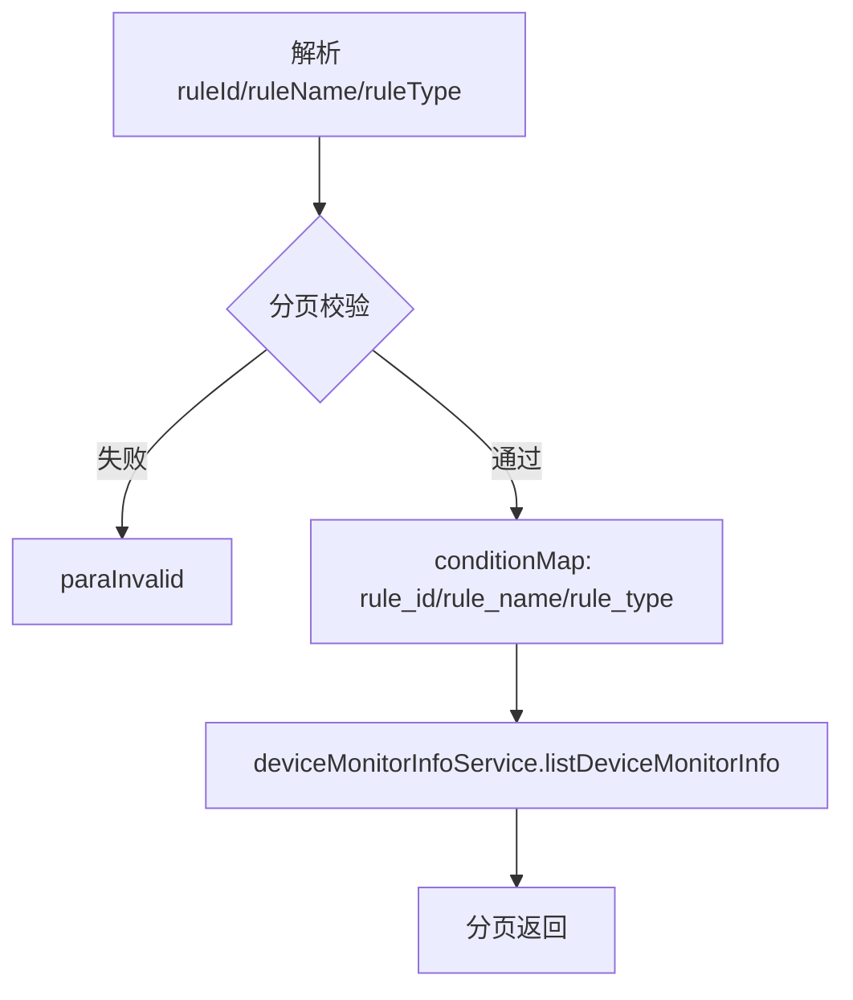
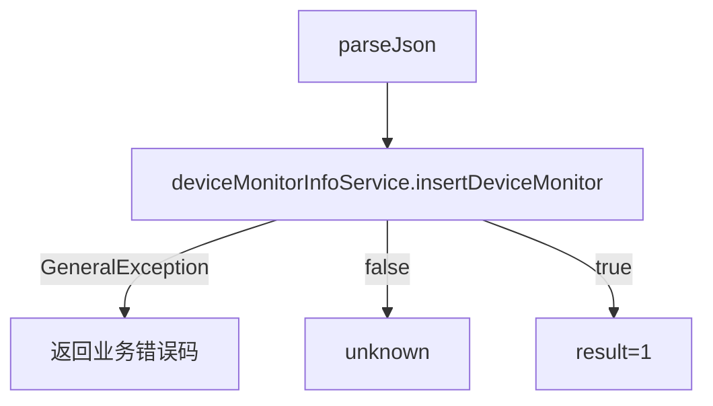
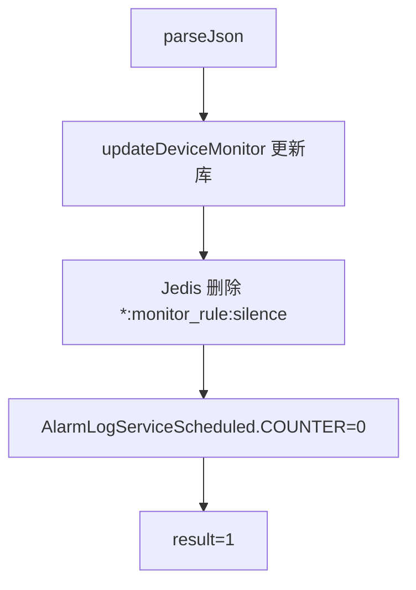

# DeviceMonitor（monitor 包）

## 职责
设备监控规则（温度阈值、触发次数、通知邮箱等）的增删改查。修改规则时同步清理 Redis 静默缓存并重置定时任务计数器，使新规则立即生效。

- 源码：`real-controlcenter/src/main/java/cn/testin/service/monitor/DeviceMonitor.java`
- 基类：`GenericBaseService`（注入 deviceMonitorInfoService、jedisPool）

## op 一览表

| op | 说明 |
|---|---|
| listDeviceMonitor | 监控规则分页列表 |
| insertDeviceMonitor | 新增监控规则 |
| updateDeviceMonitor | 修改监控规则（立即生效） |
| deleteDeviceMonitor | 删除监控规则 |

---

### listDeviceMonitor (`DeviceMonitor.listDeviceMonitor`)
- **入口**：ApiServlet，action/op（action=deviceMonitor，op=DeviceMonitor.listDeviceMonitor）
- **实现意图**：分页查询监控规则，支持按规则 ID/名称/类型过滤。
- **请求参数**

| 字段 | 类型 | 必填 | 说明 |
| --- | --- | --- | --- |
| page | Integer | 是 | 页码，>0 |
| pageSize | Integer | 是 | 每页条数，≤Config.MaxSize |
| ruleId | Integer | 否 | 规则 ID |
| ruleName | String | 否 | 规则名称 |
| ruleType | String | 否 | 规则类型 |

- **返回参数**

| 字段 | 类型 | 说明 |
| --- | --- | --- |
| code | Integer | 状态码，0 成功 |
| msg | String | 提示信息 |
| data | Object | 返回数据对象 |
| data.page | Integer | 当前页 |
| data.pageSize | Integer | 每页条数 |
| data.totalRow | Integer | 总记录数 |
| data.totalPage | Integer | 总页数 |
| data.list | JSONArray&lt;DeviceMonitorInfo&gt; | 监控规则列表 |
- **处理流程**：

- **涉及表与 SQL**：`device_monitor`（规则表，条件分页）。
- **异常与校验**：分页非法 → paraInvalid；结果 null → unknown。

### insertDeviceMonitor (`DeviceMonitor.insertDeviceMonitor`)
- **入口**：ApiServlet，action/op（action=deviceMonitor，op=DeviceMonitor.insertDeviceMonitor）
- **实现意图**：新增一条监控规则（阈值、触发次数、通知邮箱、规则名等由 `DeviceMonitorInfo.parseJson` 解析）。
- **请求参数**

| 字段 | 类型 | 必填 | 说明 |
| --- | --- | --- | --- |
| ruleName | String | 否 | 规则名称（业务层校验） |
| ruleType | String | 否 | 规则类型 |
| thresholdValue | Double | 否 | 温度阈值 |
| triggerTimes | Integer | 否 | 触发次数 |
| emailAddress | String | 否 | 通知邮箱 |
| emailDescr | String | 否 | 邮件描述 |
| 其余字段 | - | 否 | DeviceMonitorInfo JSON 整体，由 DeviceMonitorInfo.parseJson 解析 |

- **返回参数**

| 字段 | 类型 | 说明 |
| --- | --- | --- |
| code | Integer | 状态码，0 成功 |
| msg | String | 提示信息 |
| data | Object | 返回数据对象 |
| data.result | Integer | 1（成功） |
- **处理流程**：

- **涉及表与 SQL**：`device_monitor`（INSERT）。
- **异常与校验**：业务校验（如规则重名）在 service 抛 GeneralException，原样透传 code/msg。
- **关键代码摘录**：
```java
// real-controlcenter/src/main/java/cn/testin/service/monitor/DeviceMonitor.java
DeviceMonitorInfo deviceMonitorInfo = DeviceMonitorInfo.parseJson(reqjson);
try {
    result = deviceMonitorInfoService.insertDeviceMonitor(deviceMonitorInfo);
} catch (GeneralException e) {
    return ApiUtil.getResult(apirequest, e.getCode(), e.getMsg());
}
```

### updateDeviceMonitor (`DeviceMonitor.updateDeviceMonitor`)
- **入口**：ApiServlet，action/op（action=deviceMonitor，op=DeviceMonitor.updateDeviceMonitor）
- **实现意图**：修改监控规则；更新后删除该规则的 Redis 静默 key 并重置定时任务计数器，保证新规则立刻生效。
- **请求参数**

| 字段 | 类型 | 必填 | 说明 |
| --- | --- | --- | --- |
| ruleId | Integer | 是 | 规则 ID |
| ruleName | String | 否 | 规则名称 |
| ruleType | String | 否 | 规则类型 |
| thresholdValue | Double | 否 | 温度阈值 |
| triggerTimes | Integer | 否 | 触发次数 |
| emailAddress | String | 否 | 通知邮箱 |
| emailDescr | String | 否 | 邮件描述 |
| 其余字段 | - | 否 | DeviceMonitorInfo JSON 整体，由 DeviceMonitorInfo.parseJson 解析 |

- **返回参数**

| 字段 | 类型 | 说明 |
| --- | --- | --- |
| code | Integer | 状态码，0 成功 |
| msg | String | 提示信息 |
| data | Object | 返回数据对象 |
| data.result | Integer | 1（成功） |
- **处理流程**：

- **涉及表与 SQL**：`device_monitor`（UPDATE）；Redis 删除 `*:monitor_rule:<ruleId>silence`。
- **异常与校验**：GeneralException 透传；result=false → unknown。
- **关键代码摘录**：
```java
// DeviceMonitor.java updateDeviceMonitor —— 编辑后规则立马生效
try (Jedis jedis = jedisPool.getResource()) {
    Set<String> keys = jedis.keys("*:" + DeviceAlarmLog.MONITOR_RULE + ":" + deviceMonitorInfo.getRuleId() + DeviceAlarmLog.SILENCE);
    for (String key : keys) { jedis.del(key); }
}
AlarmLogServiceScheduled.COUNTER = 0;
```

### deleteDeviceMonitor (`DeviceMonitor.deleteDeviceMonitor`)
- **入口**：ApiServlet，action/op（action=deviceMonitor，op=DeviceMonitor.deleteDeviceMonitor）
- **实现意图**：按规则 ID 删除监控规则。
- **请求参数**

| 字段 | 类型 | 必填 | 说明 |
| --- | --- | --- | --- |
| ruleId | Integer | 是 | 规则 ID |

- **返回参数**

| 字段 | 类型 | 说明 |
| --- | --- | --- |
| code | Integer | 状态码，0 成功 |
| msg | String | 提示信息 |
| data | Object | 返回数据对象 |
| data.result | Integer | 1（成功） |
- **涉及表与 SQL**：`device_monitor`（DELETE）。
- **异常与校验**：ruleId 空 → GeneralException(paraInvalid)；GeneralException 透传；result=false → unknown。

---

## 依赖汇总
- 外部服务：无（报警发送见 [DeviceAlarmLog](设备管理/DeviceAlarmLog.md) → notice-manager）
- 缓存：Redis（规则静默 key）
- 主要表：device_monitor
