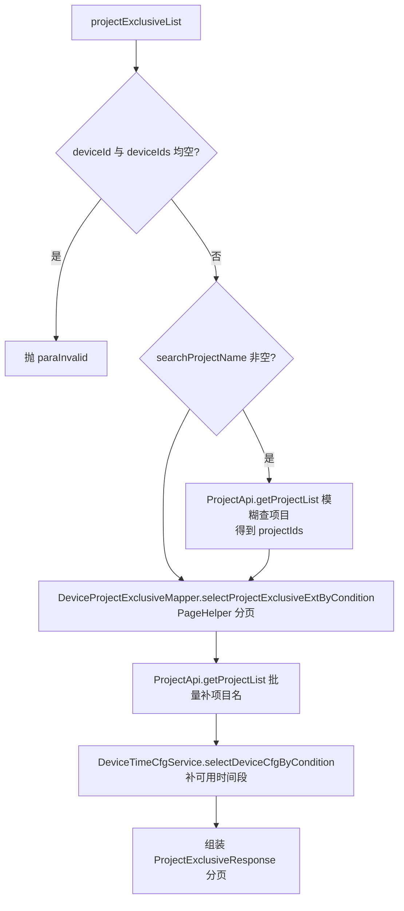
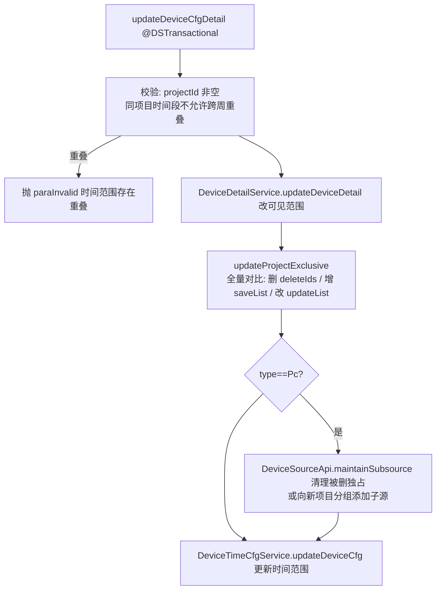

# DeviceProjectExclusiveController（设备项目独占配置）

- 源码：`real-controlcenter/src/main/java/cn/testin/mvc/controller/DeviceProjectExclusiveController.java`
- 职责：管理设备（主要是 Pc 设备）的项目独占配置——可见范围、独占项目、可用时间段。
- 基础路径 `/v3/ControlCenter/device`

## 接口一览

| # | 方法 | 路径 | 说明 |
|---|------|------|------|
| 1 | GET | /v3/ControlCenter/device/device_cfg/project_exclusive_list | 项目独占配置分页查询 |
| 2 | POST | /v3/ControlCenter/device/device_cfg/project_exclusive_list/condition | 同上（内部批量查询） |
| 3 | PUT | /v3/ControlCenter/device/device_cfg/modify_device_cfg | 修改设备项目配置 |

---

### 项目独占配置分页查询 (`GET /v3/ControlCenter/device/device_cfg/project_exclusive_list`)

- **实现意图**：按设备查询其项目独占配置（哪些项目独占该设备、可见状态、可用时间段），并补充项目名称。
- **请求参数**（`ProjectExclusiveRequestDTO extends BaseQueryRequestDTO`，@UnderlineToCamel）：

| 参数名 | 类型 | 必填 | 说明 |
|--------|------|------|------|
| device_id | String | 二选一 | 设备 id |
| device_ids | List<String> | 二选一 | 设备 id 列表 |
| search_project_name | String | 否 | 项目名模糊查询 |
| page / page_size | Integer | 否 | 缺省补默认分页 |
| project_id / user_id | Integer | 是 | BaseQueryRequestDTO @NotNull |

- **返回参数**

| 字段 | 类型 | 说明 |
| --- | --- | --- |
| code | int | 状态码，0 成功 |
| msg | String | 提示信息 |
| data | Object | 分页对象 PageInfoList&lt;ProjectExclusiveResponse&gt; |
| data.totalRow | Long | 总记录数 |
| data.totalPage | Integer | 总页数 |
| data.pageSize | Integer | 每页条数 |
| data.page | Integer | 当前页 |
| data.list | JSONArray&lt;ProjectExclusiveResponse&gt; | 项目独占配置列表，元素含 projectId/projectName/deviceId/visibleStatus/timePeriodList/deviceProjectExclusiveId |
- **处理流程**：



- **调用链**：[user-manager](../../../平台基础功能服务/00-首页.md)（ProjectApi.getProjectList，bean `user.user.ProjectApi`）。
- **涉及表与 SQL**：`device_project_exclusive` 关联 `device_detail`（selectProjectExclusiveExtByCondition）、`device_time_cfg`（SELECT）。
- **异常与校验**：deviceId/deviceIds 均空抛 `paraInvalid`。
- **关键代码摘录**：

```java
// mvc/controller/DeviceProjectExclusiveController.java
@GetMapping("/device_cfg/project_exclusive_list")
@UnderlineToCamel
public ResponseResult<PageInfoList<ProjectExclusiveResponse>> projectExclusiveList(ProjectExclusiveRequestDTO requestDTO) throws GeneralException {
    PageInfoList<ProjectExclusiveResponse> result = deviceProjectExclusiveService.getProjectExclusivePageByCondition(requestDTO);
    return ResponseResult.success(result);
}
```

---

### 项目独占配置批量查询-内部 (`POST /v3/ControlCenter/device/device_cfg/project_exclusive_list/condition`)

- **实现意图**：内部接口，请求体方式批量查询项目独占配置，逻辑与 GET 完全一致。
- **请求参数**：`@RequestBody ProjectExclusiveRequestDTO`，字段同上。
- **返回参数**：同「项目独占配置分页查询」——`ResponseResult<PageInfoList<ProjectExclusiveResponse>>`（code/msg/data，data 含 totalRow/totalPage/pageSize/page/list）。
- **处理流程 / 调用链 / 表**：同「项目独占配置分页查询」。
- **异常与校验**：同 GET。
- **关键代码摘录**：

```java
// mvc/controller/DeviceProjectExclusiveController.java
@PostMapping("/device_cfg/project_exclusive_list/condition")
public ResponseResult<PageInfoList<ProjectExclusiveResponse>> projectExclusiveListCondition(@RequestBody ProjectExclusiveRequestDTO requestDTO) throws GeneralException {
    PageInfoList<ProjectExclusiveResponse> result = deviceProjectExclusiveService.getProjectExclusivePageByCondition(requestDTO);
    return ResponseResult.success(result);
}
```

---

### 修改设备项目配置 (`PUT /v3/ControlCenter/device/device_cfg/modify_device_cfg`)

- **实现意图**：事务性修改设备配置：可见范围（device_detail）+ 项目独占列表（增删改）+ 可用时间段；Pc 设备还需同步 平台配置 的设备云分组（子源维护）。
- **请求参数**（`UpdateDeviceDetailRequestDTO extends BaseRequestDTO`）：

| 参数名 | 类型 | 必填 | 说明 |
|--------|------|------|------|
| eid | Integer | 否 | 企业 id |
| deviceId | String | 是 | 设备 id |
| visibleStatus | Integer | 否 | 可见状态 |
| type | Integer | 是 | 设备类型（NewDeviceTypeEnum，Pc 走分组同步） |
| projectExclusiveList | List<ProjectExclusive> | 否 | 独占配置：projectId + timePeriodList + deviceProjectExclusiveId |

- **返回参数**

| 字段 | 类型 | 说明 |
| --- | --- | --- |
| code | int | 状态码，0 成功 |
| msg | String | 提示信息 |
| data | Object | BaseResponseDTO 返回数据对象 |
| data.result | Integer | 影响行数合计 |
- **处理流程**：



- **调用链**：[平台配置](../../../平台配置（real-cfg）/07-开放接口文档/00-模块索引.md)（DeviceSourceApi.list / addDeviceSource / maintainSubsource）。
- **涉及表与 SQL**：`device_detail`（UPDATE）、`device_project_exclusive`（SELECT/INSERT/UPDATE/批量 DELETE）、`device_time_cfg`（增删改）。
- **异常与校验**：projectId 空抛 `paraInvalid`；同项目时间段（含跨周拆分后）重叠抛"修改的时间范围存在重叠"；星期参数必须 1-7。
- **关键代码摘录**：

```java
// mvc/service/DeviceProjectExclusiveService.java
@DSTransactional
public Integer updateDeviceCfgDetail(UpdateDeviceDetailRequestDTO requestDTO) throws GeneralException {
    ...
    result += deviceDetailService.updateDeviceDetail(requestDTO);   // 修改可见范围
    result += updateProjectExclusive(requestDTO);                   // 更新可用项目
    result += deviceTimeCfgService.updateDeviceCfg(requestDTO);     // 更新时间范围
    return result;
}
```
