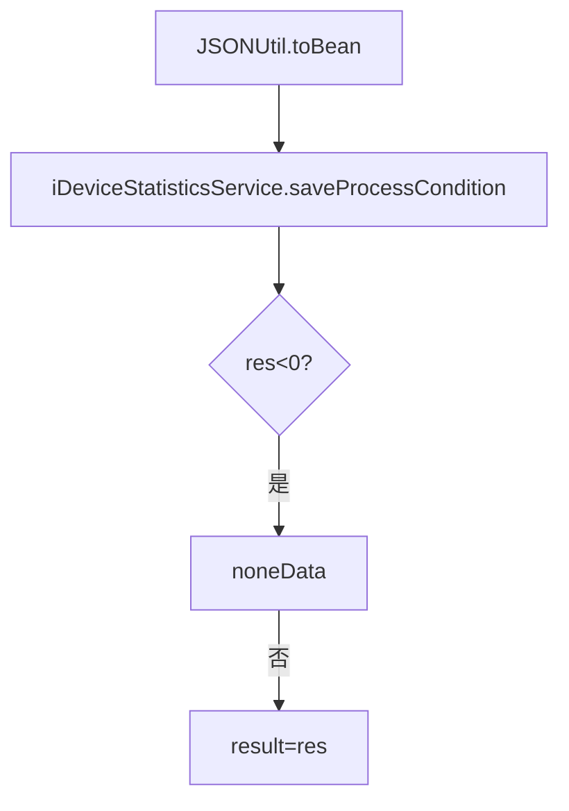
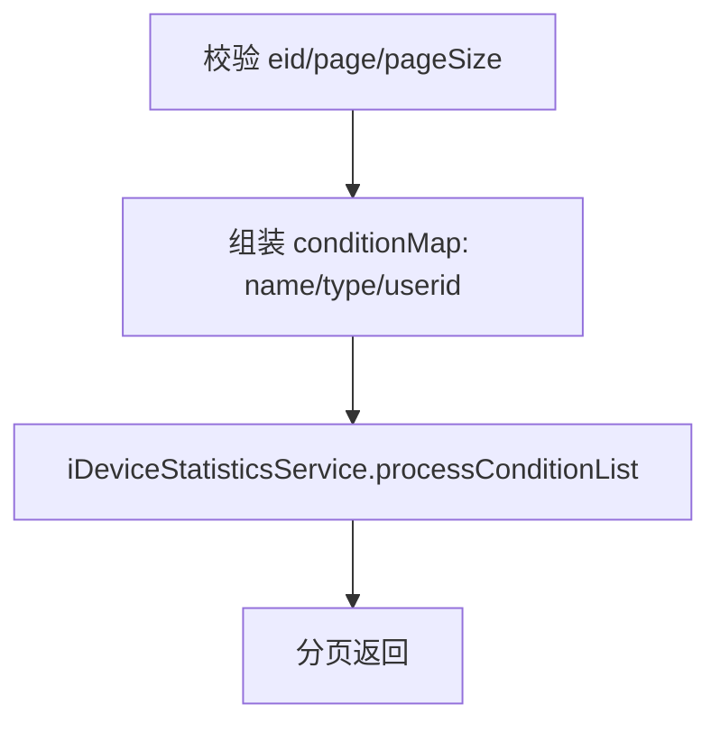
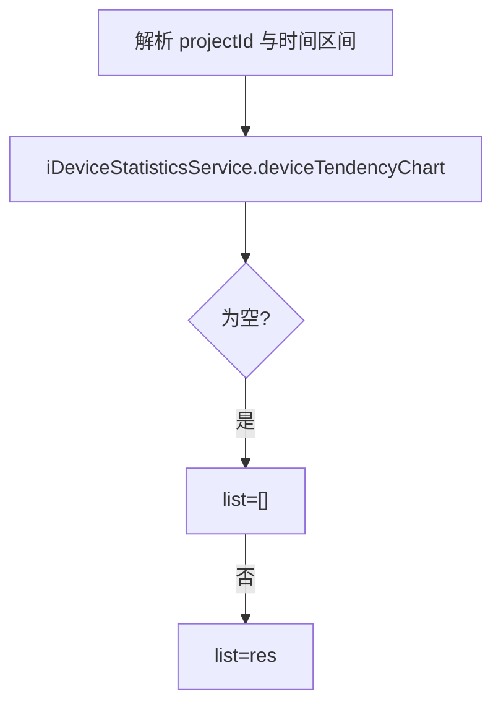

# DeviceStatistics（device 包）

## 职责
设备统计相关：设备占用查询条件（用户保存的筛选模板）的增删改查，以及设备使用趋势图数据。

- 源码：`real-controlcenter/src/main/java/cn/testin/service/device/DeviceStatistics.java`
- 基类：`GenericBaseService`（注入 iDeviceStatisticsService）

## op 一览表

| op | 说明 |
|---|---|
| saveProcessCondition | 保存查询条件模板 |
| delProcessCondition | 删除查询条件模板 |
| processConditionList | 查询条件模板分页列表 |
| updateProcessCondition | 更新查询条件模板 |
| deviceTendencyChart | 设备使用趋势图数据 |

---

### saveProcessCondition (`DeviceStatistics.saveProcessCondition`)
- **入口**：ApiServlet，action/op（action=deviceStatistics，op=DeviceStatistics.saveProcessCondition）
- **实现意图**：保存用户在设备占用页配置的查询条件模板（名称+条件 JSON）。
- **请求参数**

| 字段 | 类型 | 必填 | 说明 |
| --- | --- | --- | --- |
| name | String | 否 | 模板名称 |
| type | Integer | 否 | 模板类型 |
| userid | Integer | 否 | 用户 ID |
| 其余条件字段 | - | 否 | DeviceProcessCondition JSON 整体，hutool JSONUtil.toBean 解析 |

- **返回参数**

| 字段 | 类型 | 说明 |
| --- | --- | --- |
| code | Integer | 状态码，0 成功 |
| msg | String | 提示信息 |
| data | Object | 返回数据对象 |
| data.result | Integer | 影响行数（<0 时返回 noneData） |
- **处理流程**：

- **涉及表与 SQL**：`device_process_condition`（INSERT）。
- **异常与校验**：保存失败（res<0）→ `CommonCode.noneData`。
- **关键代码摘录**：
```java
// real-controlcenter/src/main/java/cn/testin/service/device/DeviceStatistics.java
DeviceProcessCondition processCondition = JSONUtil.toBean(reqJson.toString(), DeviceProcessCondition.class);
int res = this.iDeviceStatisticsService.saveProcessCondition(processCondition);
```

### delProcessCondition (`DeviceStatistics.delProcessCondition`)
- **入口**：ApiServlet，action/op（action=deviceStatistics，op=DeviceStatistics.delProcessCondition）
- **实现意图**：按模板 ID 删除查询条件。
- **请求参数**

| 字段 | 类型 | 必填 | 说明 |
| --- | --- | --- | --- |
| id | Integer | 是 | 模板 ID |

- **返回参数**

| 字段 | 类型 | 说明 |
| --- | --- | --- |
| code | Integer | 状态码，0 成功 |
| msg | String | 提示信息 |
| data | Object | 返回数据对象 |
| data.result | Integer | 影响行数（≤0 返回 noneData） |
- **涉及表与 SQL**：`device_process_condition`（DELETE）。
- **异常与校验**：id 为空 → 抛 GeneralException(paraInvalid)。

### processConditionList (`DeviceStatistics.processConditionList`)
- **入口**：ApiServlet，action/op（action=deviceStatistics，op=DeviceStatistics.processConditionList）
- **实现意图**：企业维度分页查询用户保存的条件模板，支持排序。
- **请求参数**

| 字段 | 类型 | 必填 | 说明 |
| --- | --- | --- | --- |
| eid | Integer | 是 | 企业 ID |
| page | Integer | 是 | 页码，>0 |
| pageSize | Integer | 是 | 页大小，≤Config.MaxSize |
| name | String | 否 | 模板名（模糊） |
| type | Integer | 否 | 模板类型 |
| userid | Integer | 否 | 用户 ID |
| sortKey | JSONArray | 否 | [{key, sortType(1倒序/0升序)}] |

- **返回参数**

| 字段 | 类型 | 说明 |
| --- | --- | --- |
| code | Integer | 状态码，0 成功 |
| msg | String | 提示信息 |
| data | Object | 返回数据对象 |
| data.page | Integer | 当前页 |
| data.pageSize | Integer | 每页条数 |
| data.totalRow | Integer | 总记录数 |
| data.totalPage | Integer | 总页数 |
| data.list | JSONArray&lt;DeviceProcessCondition&gt; | 查询条件模板列表 |
- **处理流程**：

- **涉及表与 SQL**：`device_process_condition`（条件分页+排序）。
- **异常与校验**：eid/page/pageSize 非法 → paraInvalid；结果 null → unknown。

### updateProcessCondition (`DeviceStatistics.updateProcessCondition`)
- **入口**：ApiServlet，action/op（action=deviceStatistics，op=DeviceStatistics.updateProcessCondition）
- **实现意图**：更新已保存的查询条件模板。
- **请求参数**

| 字段 | 类型 | 必填 | 说明 |
| --- | --- | --- | --- |
| id | Integer | 是 | 模板 ID |
| name | String | 否 | 模板名称 |
| type | Integer | 否 | 模板类型 |
| userid | Integer | 否 | 用户 ID |
| 其余条件字段 | - | 否 | DeviceProcessCondition JSON 整体，hutool JSONUtil.toBean 解析 |

- **返回参数**

| 字段 | 类型 | 说明 |
| --- | --- | --- |
| code | Integer | 状态码，0 成功 |
| msg | String | 提示信息 |
| data | Object | 返回数据对象 |
| data.result | Integer | 影响行数（<0 返回 noneData） |
- **涉及表与 SQL**：`device_process_condition`（UPDATE）。

### deviceTendencyChart (`DeviceStatistics.deviceTendencyChart`)
- **入口**：ApiServlet，action/op（action=deviceStatistics，op=DeviceStatistics.deviceTendencyChart）
- **实现意图**：查询设备使用数量趋势图数据（按项目+时间区间）。
- **请求参数**：

| 参数 | 类型 | 必填 | 说明 |
|---|---|---|---|
| projectId | int | 否 | 单项目 ID |
| projectids | JSONArray | 否 | 多项目 ID |
| startTime / endTime | long | 否 | 起止时间（毫秒） |

- **返回参数**

| 字段 | 类型 | 说明 |
| --- | --- | --- |
| code | Integer | 状态码，0 成功 |
| msg | String | 提示信息 |
| data | Object | 返回数据对象 |
| data.list | JSONArray&lt;DeviceCount&gt; | 设备使用趋势数据数组（空时为空数组） |
- **处理流程**：

- **涉及表与 SQL**：`device_count`（按时间聚合统计）。

---

## 依赖汇总
- 外部服务：无
- 主要表：device_process_condition、device_count
