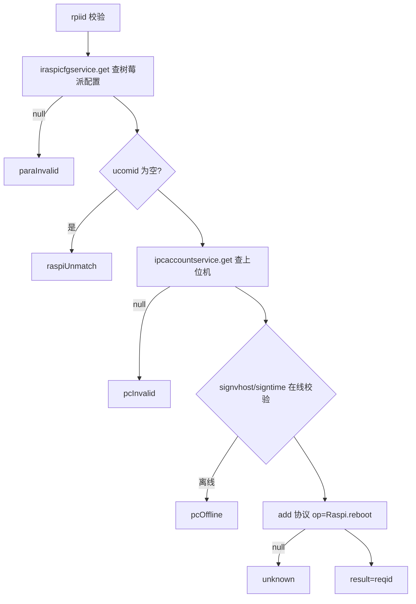

# Raspi

- **类全名**：`cn.testin.service.control.Raspi`（@Deprecated）
- **源码路径**：`real-controlcenter/src/main/java/cn/testin/service/control/Raspi.java`
- **职责**：树莓派（Raspi）控制接口，经其匹配的上位机中转下发指令。

## op 一览表

| op | 方法 | 职责 |
| --- | --- | --- |
| reboot | `Raspi.reboot` | 重启树莓派 |

---

### reboot (`Raspi.reboot`)

- **入口**：ApiServlet，action=control，op=Raspi.reboot
- **实现意图**：按树莓派 ID 查配置，找到其匹配的上位机（ucomid），校验上位机在线后向该上位机下发 `Raspi.reboot` 指令，由上位机重启树莓派。

**请求参数**

| 参数 | 类型 | 必填 | 说明 |
| --- | --- | --- | --- |
| rpiid | String | 是 | 树莓派 ID |

**返回参数**

| 字段 | 类型 | 说明 |
| --- | --- | --- |
| code | Integer | 状态码，0 成功 |
| msg | String | 提示信息 |
| data | Object | 返回数据对象 |
| data.result | String | 协议 reqid |

**处理流程**



**调用链**：`IRaspiCfgService.get` → `IPcAccountService.get` → `IProtocolService.add` → 上位机 → 树莓派。
**涉及表与 SQL**：树莓派配置表 raspi_cfg（select）；pc_account（select）。
**异常与校验**：rpiid 空/配置不存在 → paraInvalid；未匹配上位机 → raspiUnmatch；上位机不存在 → pcInvalid；上位机离线 → pcOffline；add 失败 → unknown。

**关键代码摘录**

```java
// real-controlcenter/.../service/control/Raspi.java
RealcfgRaspiCfg raspicfg = iraspicfgservice.get(rpiid);
if (StringUtils.isBlank(raspicfg.getUcomid())) {
    return ApiUtil.getResult(apirequest, ControlCenterCode.raspiUnmatch.getValue(), ...);
}
RealcfgPcAccount pcAccount = ipcaccountservice.get(raspicfg.getUcomid());
String result = iprotocolservice.add(pcAccount.getSignvhost(), type, sessionKey, reqid, mkey, op, content, status, null, null);
```
