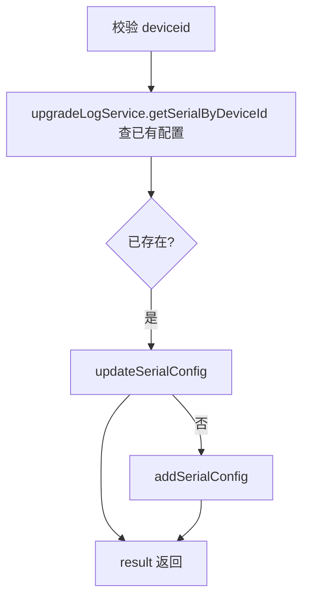
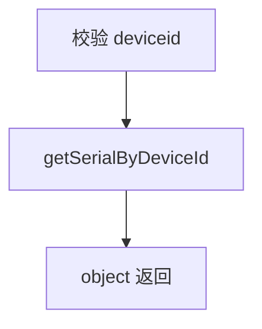

# SerialConfig（device 包）

## 职责
设备串口通信参数配置（波特率、数据位、校验位等）的查询与修改，供车机等串口调试场景使用。

- 源码：`real-controlcenter/src/main/java/cn/testin/service/device/SerialConfig.java`
- 基类：`GenericBaseService`（复用 upgradeLogService 中的串口配置方法）

## op 一览表

| op | 说明 |
|---|---|
| modifySerialConfig | 新增或更新串口配置 |
| getSerialConfig | 查询设备串口配置 |

---

### modifySerialConfig (`SerialConfig.modifySerialConfig`)
- **入口**：ApiServlet，action/op（action=serialConfig，op=SerialConfig.modifySerialConfig）
- **实现意图**：Upsert 语义——设备已有串口配置则更新，否则新增。
- **请求参数**：

| 参数 | 类型 | 必填 | 说明 |
|---|---|---|---|
| deviceid | String | 是 | 设备 ID |
| baudrate | int | 否 | 波特率 |
| dataBits | int | 否 | 数据位 |
| stopBits | int | 否 | 停止位 |
| parity | int | 否 | 校验位 |
| portName | String | 否 | 串口名 |
| flowctrlRtsCts | int | 否 | 1=开启 RTS/CTS 流控 |
| flowctrlXonXoff | int | 否 | 1=开启 XON/XOFF 流控 |

- **返回参数**

| 字段 | 类型 | 说明 |
| --- | --- | --- |
| code | Integer | 状态码，0 成功 |
| msg | String | 提示信息 |
| data | Object | 返回数据对象 |
| data.result | Integer | 影响行数 |
- **处理流程**：

- **涉及表与 SQL**：`serial_communication_config`（SELECT/UPDATE/INSERT）。
- **异常与校验**：deviceid 缺失 → paraInvalid。
- **关键代码摘录**：
```java
// real-controlcenter/src/main/java/cn/testin/service/device/SerialConfig.java
SerialComConfig config = this.upgradeLogService.getSerialByDeviceId(reqjson.getString("deviceid"));
if (config != null && !StringUtils.isEmpty(config.getDeviceid())) {
    result = this.upgradeLogService.updateSerialConfig(configDto);
} else {
    result = this.upgradeLogService.addSerialConfig(configDto);
}
```

### getSerialConfig (`SerialConfig.getSerialConfig`)
- **入口**：ApiServlet，action/op（action=serialConfig，op=SerialConfig.getSerialConfig）
- **实现意图**：查询设备当前串口配置。
- **请求参数**

| 字段 | 类型 | 必填 | 说明 |
| --- | --- | --- | --- |
| deviceid | String | 是 | 设备 ID |

- **返回参数**

| 字段 | 类型 | 说明 |
| --- | --- | --- |
| code | Integer | 状态码，0 成功 |
| msg | String | 提示信息 |
| data | Object | 返回数据对象 |
| data.objInfo | Object | SerialComConfig（无配置时为 null） |
- **处理流程**：

- **涉及表与 SQL**：`serial_communication_config`（按 deviceid 查询）。
- **异常与校验**：deviceid 缺失 → paraInvalid。

---

## 依赖汇总
- 外部服务：无
- 主要表：serial_communication_config
