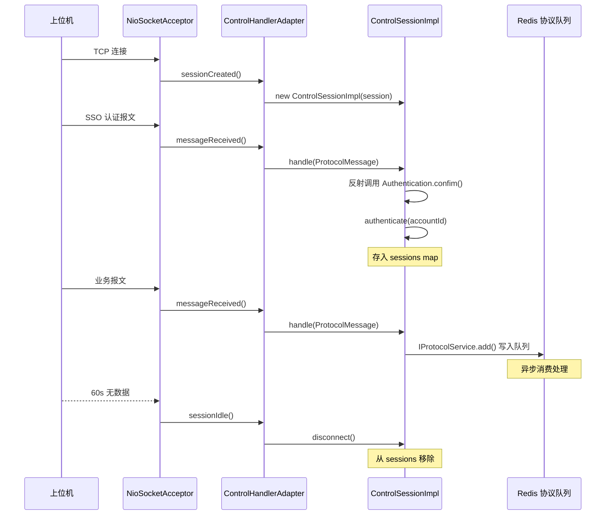
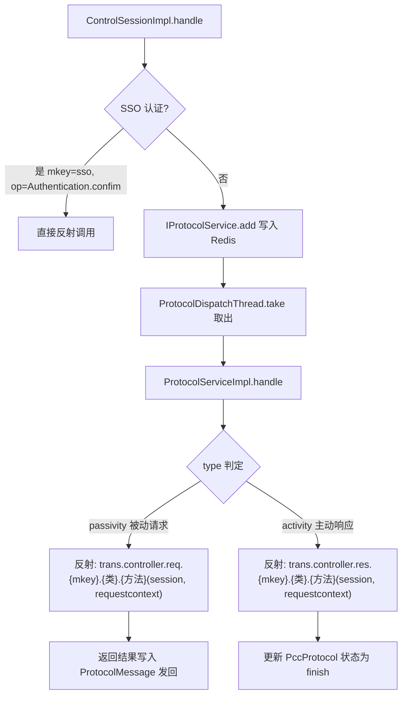

# 长连接协议框架

## 概述

设备控制中心 通过 Apache MINA NioSocketAcceptor 实现 TCP 长连接服务，用于与上位机（PC Agent / 树莓派）保持双向通信。该连接承载设备上报、心跳保活、任务下发、SQL 执行、SSO 认证等全部上位机交互功能。

## 启动链

```
StartRunner (Spring Boot 启动)
  → BootThread.run()
    → TransServer.addEndpoint(TCPEndpoint)
      → TCPEndpoint.start()
        → NioSocketAcceptor.bind(DEVICECENTER_PORT)
```

`Config.DEVICECENTER_PORT` 默认为 `8000`，可通过配置文件覆盖。

## 线程模型

```
NioSocketAcceptor
  └── ExecutorFilter (CachedThreadPool)   -- MINA I/O 读写的线程池
        └── ControlHandlerAdapter          -- MINA IoHandler 适配器
              └── ControlSessionImpl.handle()  -- 消息接收入口
                    ├── [SSO 认证] 直接反射调用 req.sso.Authentication.confim
                    └── [普通请求] 写入 Redis 协议队列
                          └── ProtocolDispatchThread (轮询消费)
                                └── ThreadPoolExecutor (core=5, max=50, queue=500)
                                      └── ProtocolServiceImpl.handle()
                                            └── 反射调用 trans.controller.{req|res}.{mkey}.{类}.{方法}()
```

- **MINA I/O 线程**：负责 TCP 读写和编解码
- **异步分发线程池**：`ProtocolDispatchThread` 以独立线程轮询 Redis 协议队列，将消息交给工作线程池处理，实现 I/O 与业务处理解耦

## 编解码

### CommandCodecFactory

- **解码器** `CommandDecoder`：继承 `CumulativeProtocolDecoder`，处理粘包/半包
- **编码器** `CommandEncoder`：发送 head + body

### 协议格式（4字节长度头 + UTF-8 JSON）

```
┌──────────────────┬────────────────────────────┐
│  Header (4字节)   │  Body (UTF-8 JSON)         │
│  大端序 body 长度  │  最大 15MB                  │
└──────────────────┴────────────────────────────┘
```

- 包头：4 字节大端序整数，表示 Body 的字节长度
- 包体：UTF-8 编码的 JSON 字符串
- 最大包体：`1024 * 1024 * 15 = 15MB`，超限直接关闭连接

### 粘包/半包处理

`CommandDecoder.doDecode()` 策略：
1. 不足 4 字节则等待更多数据（半包）
2. 读取 4 字节头获取 bodySize
3. 分段读取 body，直到读完
4. 剩余数据说明有粘包，返回 `true` 让父类继续解析

## 连接管理

### 生命周期



### 空闲断开

```java
acceptor.getSessionConfig().setIdleTime(IdleStatus.BOTH_IDLE, 60);
```

60 秒内无收发即触发 `sessionIdle`，主动关闭连接。

### 认证互踢

同一个 accountId 只允许一个连接。新连接认证时，AbstractSession 检测到已有 session，先断开旧连接再允许新连接。

## 消息路由机制

### 请求报文格式

```json
{
  "mkey": "script",
  "op": "Device.report",
  "reqid": "1620000000001",
  "data": { ... }
}
```

- `mkey`：模块键，对应 `trans.controller.{req|res}` 下的子包名（如 `script`、`sso`）
- `op`：操作，格式为 `类名.方法名`，用 `.` 分割
- `reqid`：请求唯一标识，用于响应匹配
- `data`：业务参数

### 路由流程



关键代码（`ProtocolServiceImpl.handle`）：

```java
// 被动请求：上位机 → 控制中心
private static final String CONTROLLER_REQ_PATH = "cn.testin.trans.controller.req";
// 主动下发响应：控制中心 → 上位机（上位机处理完回传结果）
private static final String CONTROLLER_RES_PATH = "cn.testin.trans.controller.res";

// 拼接类名，反射调用
StringBuffer sb = new StringBuffer();
if (activity) sb.append(CONTROLLER_RES_PATH);
else          sb.append(CONTROLLER_REQ_PATH);
sb.append(".").append(requestcontext.getMkey());
sb.append(".").append(r[0]);  // 类名

Object obj = Class.forName(sb.toString()).newInstance();
Method method = obj.getClass().getMethod(r[1], controllerClazz);  // 方法名
Object[] args = {session, requestcontext};
actionResult = method.invoke(obj, args);
```

## 协议持久化

所有协议消息存储在 Redis（`DbConfig.devicecenter`），通过 `IProtocolDAO` 操作：

- **状态机**：`pendingRequest → pendingResponse → process → finish`
- **过期清理**：每个协议有 `expiretime`
- **重试机制**：处理失败的消息重新 push 到队列，`execnum` 超过 `PccProtocol.EXEC_MAX` 则丢弃

### 两种 ProtocolType

| Type | 值 | 方向 | 说明 |
|------|-----|------|------|
| `activity` | 1 | res | 控制中心主动下发 → 上位机回应 |
| `passivity` | 2 | req | 上位机请求 → 控制中心处理响应 |

## 服务端主动下发

服务端通过 `IProtocolService.add()` 将消息写入 Redis 协议队列，由 `ProtocolDispatchThread` 取出后：

1. 编码 `ProtocolMessage`（4 字节头 + JSON 体）
2. 通过 `session.writePacket()` 推送到 TCP 连接
3. 状态更新为 `pendingResponse`，等待上位机处理回传

控制中心下发的类在 `trans.controller.res` 包下：
- `DeviceControl`：设备占用/释放/移除的下发响应处理
- `TaskControl`：任务停止的下发响应处理

## 关键常量

| 常量 | 值 | 说明 |
|------|-----|------|
| `ProtocolMessage.headerSize` | 4 | 包头字节数 |
| `PROTOCOL_MAX_SIZE` | 15MB | 最大包体 |
| `DEVICECENTER_PORT` | 8000 | 监听端口 |
| `IdleStatus.BOTH_IDLE` | 60s | 空闲断开时间 |
| `ProtocolDispatchThread.corePoolSize` | 5 | 核心线程 |
| `ProtocolDispatchThread.maxPoolSize` | 50 | 最大线程 |
| `ProtocolDispatchThread.queueSize` | 500 | 队列容量 |
| `PccProtocol.EXEC_MAX` | — | 最大重试次数 |

## 依赖的外部服务

- Redis — 协议队列、设备缓存
- [任务调度服务](../../../任务调度服务（real-scheduling）/07-开放接口文档/00-模块索引.md) — 任务匹配分发
- [user-manager](../../../平台基础功能服务/00-首页.md) — 用户信息查询
- [平台配置](../../../平台配置（real-cfg）/07-开放接口文档/00-模块索引.md) — 数据库配置、源码配置
- [file-service](../../../文件管理服务/00-首页.md) — 文件上传

## 核心类关系

| 类 | 职责 |
|----|------|
| `TransServer` | 服务容器，管理多个 Endpoint |
| `TCPEndpoint` | TCP 实现，配置 MINA acceptor |
| `BootThread` | 启动线程，绑定端口 |
| `ControlHandlerAdapter` | MINA IoHandler 适配器，连接事件处理 |
| `AbstractSessionHandler` | 公共的连接生命周期处理（空闲断开、异常断开） |
| `ControlSessionImpl` | 会话实现，消息入口和路由 |
| `AbstractSession` | 会话基类，认证、写包、断开处理 |
| `CommandCodecFactory` | 编解码工厂 |
| `CommandDecoder` | 解码器（粘包/半包处理） |
| `CommandEncoder` | 编码器 |
| `ProtocolMessage` | 协议消息实体 |
| `RequestContext` | 请求上下文，解析 JSON → 结构化字段 |
| `GenericBaseController` | Handler 基类，注入所有 business service |
| `ProtocolServiceImpl` | 协议处理核心，队列管理 + 反射路由 |
| `ProtocolDispatchThread` | 异步分发线程，轮询队列 → 线程池执行 |
