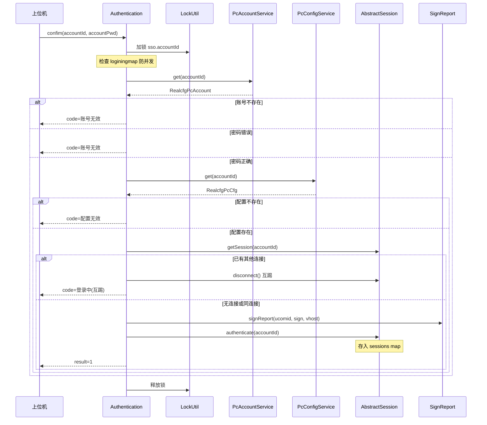

# Authentication

> mkey: `sso` | 包路径: `cn.testin.trans.controller.req.sso.Authentication`

上位机和树莓派的 SSO 登录认证，处理 accountId/accountPwd 校验和互踢逻辑。

## confim

### 协议命令

```
{ "mkey": "sso", "op": "Authentication.confim", "reqid": "xxx", "data": { "accountId": "...", "accountPwd": "..." } }
```

### 实现意图

上位机首次连接后发送登录认证。校验账号密码、检查上位机配置是否存在、处理同账号互踢，成功后调用 `session.authenticate(accountId)` 将连接绑定到 accountId。

### 请求消息字段

| 字段 | 类型 | 必填 | 说明 |
|------|------|------|------|
| data.accountId | String | 是 | 上位机账号 |
| data.accountPwd | String | 是 | 上位机密码 |

### 响应

```json
{
  "resid": "xxx",
  "mkey": "sso",
  "op": "Authentication.confim",
  "code": 0,
  "msg": "SUCCESS",
  "data": { "result": 1 }
}
```

### mermaid 流程



### 调用链

```
trans.controller.req.sso.Authentication.confim(Session, RequestContext)
  → GenericBaseController.ipcaccountservice.get(accountId)     // [real-cfg](../../../平台配置（real-cfg）/07-开放接口文档/00-模块索引.md) DAO: realcfg_pc_account
  → GenericBaseController.ipcconfigservice.get(accountId)      // [real-cfg](../../../平台配置（real-cfg）/07-开放接口文档/00-模块索引.md) DAO: realcfg_pc_cfg
  → AbstractSession.getSession(accountId)                       // 内存 sessions map
  → GenericBaseController.ipcaccountservice.signReport(...)     // [real-cfg](../../../平台配置（real-cfg）/07-开放接口文档/00-模块索引.md)
  → session.authenticate(accountId)                             // 绑定连接
```

### 涉及表/SQL

- `realcfg_pc_account` — 上位机账号表
- `realcfg_pc_cfg` — 上位机配置表

### 异常处理

- accountId 为空 → `paraInvalid`，提示 "accountId is null!"
- accountPwd 为空 → `paraInvalid`，提示 "accountPwd is null!"
- 账号正在登录 → `logining`，提示 "account: xxx is logining!"
- 账号不在白名单 → `onlineuserInvalid`，提示 "accountId is invalid!"
- 密码错误 → `onlineuserInvalid`，提示 "accountPwd is invalid!"
- 上位机未配置 → `configInvalid`，提示 "PcConfig is invalid!"
- 被互踢 → `logining`，返回互踢信息

## kickoff

### 协议命令

```
{ "mkey": "sso", "op": "Authentication.kickoff", "reqid": "xxx", "data": { "ucomid": "xxx" } }
```

### 实现意图

控制中心节点间通讯，强制踢掉指定上位机账号的连接。通常在多节点部署时，A 节点通知 B 节点某账号已在 A 节点登录，B 节点需要断开该账号的连接。

### 请求消息字段

| 字段 | 类型 | 必填 | 说明 |
|------|------|------|------|
| data.ucomid | String | 是 | 要踢下线的上位机账号 |

### 调用链

```
trans.controller.req.sso.Authentication.kickoff(Session, RequestContext)
  → AbstractSession.getSession(ucomid)      // 内存查找连接
  → session.disconnect()                     // 断开连接
  → ipcaccountservice.signoutReport(...)     // [real-cfg](../../../平台配置（real-cfg）/07-开放接口文档/00-模块索引.md) 签出上报
```

### 特殊处理

在 `ProtocolServiceImpl.handle()` 中，kickoff 处理完成后**立即调用 `clean(reqid)` 删除协议记录**，不等待状态更新。这是唯一跳过 `update → finish` 流程的操作。

### 关键代码摘录

```java
// 账号登录加锁，防止并发互踢
synchronized (LockUtil.getLock(lockKey)) {
    loginingmap.put(accountId, accountId);
    // ...
}

// 同账号互踢
Session poolSession = AbstractSession.getSession(accountId);
if (poolSession != null && poolSession.getId() != session.getId()) {
    poolSession.disconnect();
}
```
