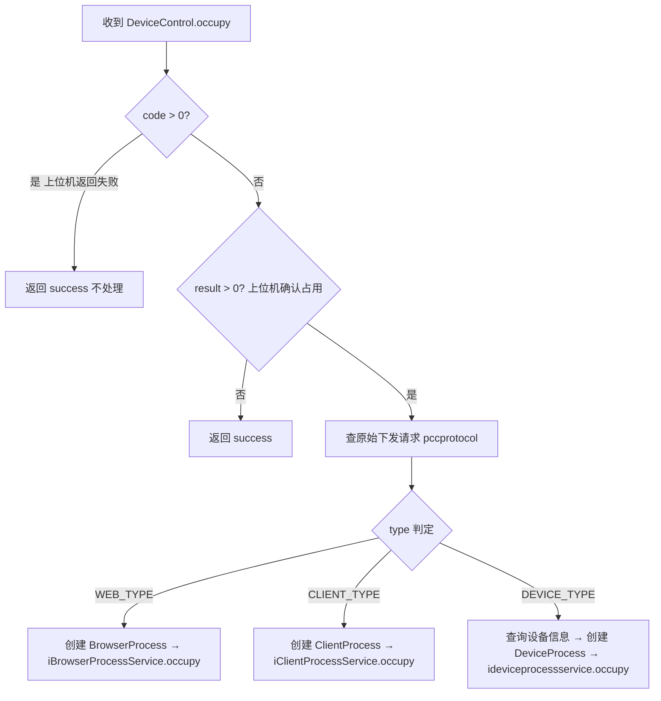

# DeviceControl

> mkey: `script` | 包路径: `cn.testin.trans.controller.res.script.DeviceControl`

服务端主动下发设备控制命令的**响应处理**。控制中心通过 IProtocolService 下发命令给上位机，上位机处理后通过此 handler 回传处理结果。

## remove

### 协议命令

```
{ "mkey": "script", "op": "DeviceControl.remove", "code": 0, "data": { "result": 1 }, "resid": "xxx" }
```

### 实现意图

处理设备移除的下发响应。先查询原始请求中的设备 ID，若设备不在线（不在 free/runScript 状态），则清理 DB 中的设备记录。

### 调用链

```
trans.controller.res.script.DeviceControl.remove(Session, RequestContext)
  → iprotocolservice.get(requestcontext.getReqid())     // 查原始请求
  → DevicePoolUtil.getDevicePool().get(deviceid)         // 检查设备是否在线
  → ideviceservice.cleanDbDevice(deviceid)              // real_device_info 清理
```

### 涉及表/SQL

- `real_device_info` — 设备信息表（清理不在线设备）
- Redis 协议表 — 通过 IProtocolService 查询

### 关键代码摘录

```java
// 只在设备不在线时清理 DB
if (pooldevice != null &&
        (DeviceStatus.free.getValue().equals(pooldevice.getStatus())
         || DeviceStatus.runScript.getValue().equals(pooldevice.getStatus()))) {
    // 设备在线，不处理
} else {
    boolean cleanDbdevice = super.ideviceservice.cleanDbDevice(deviceid);
}
```

---

## occupy

### 协议命令

```
{ "mkey": "script", "op": "DeviceControl.occupy", "code": 0, "data": { "result": 1 }, "resid": "xxx" }
```

### 实现意图

处理设备占用下发的响应。若上位机确认占用成功（data.result > 0），则读取原始下发请求中的占用信息，按设备类型（App/Web/Client）分别建立 Process 记录。

### 处理逻辑



### 调用链

```
trans.controller.res.script.DeviceControl.occupy(Session, RequestContext)
  → iprotocolservice.get(resid)                         // 查原始请求
  // WEB_TYPE
  → ipcservice.getOriginalPc(ucomid)                    // real_pc_info
  → iBrowserProcessService.occupy(BrowserProcess)       // real_browser_process
  // CLIENT_TYPE
  → iclientservice.getOriginalPc(ucomid)                // real_client_info
  → iClientProcessService.occupy(ClientProcess)         // real_client_process
  // DEVICE_TYPE
  → iviewdeviceinfodao.baselist(...)                    // view_device_info
  → ideviceprocessservice.occupy(DeviceProcess)         // real_device_process
```

### 涉及表/SQL

- `real_pc_info` — PC 信息表
- `real_client_info` — Client 信息表
- `real_device_process` — 设备占用记录
- `real_browser_process` — 浏览器占用记录
- `real_client_process` — Client 占用记录
- `view_device_info` — 设备信息视图

---

## release

### 协议命令

```
{ "mkey": "script", "op": "DeviceControl.release", "code": 0, "data": { "result": 1, "jobId": "xxx", "totaltime": 120000, "type": 0, "content": {...} }, "resid": "xxx" }
```

### 实现意图

处理设备释放下发的响应。根据 type 调用对应的 ProcessService 释放设备。

### 请求消息字段（上位机响应）

| 字段 | 类型 | 必填 | 说明 |
|------|------|------|------|
| data.jobId | String | 是 | 占用任务标识 |
| data.totaltime | long | 是 | 占用时长 |
| data.type | int | 否 | 设备类型 |
| data.content | JSONObject | 否 | 附加内容 |

### 调用链

```
trans.controller.res.script.DeviceControl.release(Session, RequestContext)
  // type=DEVICE → ideviceprocessservice.release(jobId, totaltime, null, content)
  // type=WEB    → iBrowserProcessService.release(jobId, totaltime, null, content)
  // type=CLIENT → iClientProcessService.release(jobId, totaltime, null, content)
```
