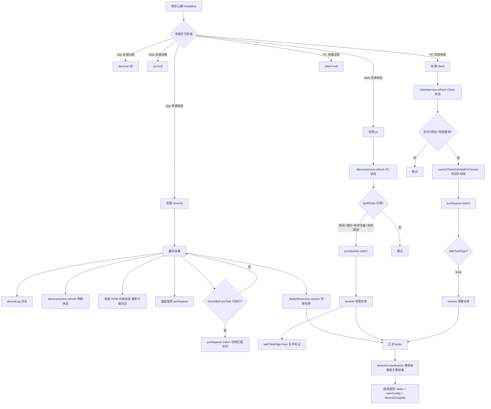

# HeartBeat

> mkey: `script` | 包路径: `cn.testin.trans.controller.req.script.HeartBeat`

上位机心跳保活，同时承载设备状态刷新、任务匹配领取、设备占用确认、OEM 配置下发、设备组信息同步等核心功能。是长连接中**最重要的命令**。

## keepalive

### 协议命令

```
{ "mkey": "script", "op": "HeartBeat.keepalive", "reqid": "xxx", "data": {
    "devices": [{...}],      // App 设备列表
    "pc": {...},             // Web 浏览器 PC 信息
    "client": {...},         // PC Client 信息
    "deviceGroup": [{...}],  // 设备组列表
    "harmonyPcs": [{...}]    // 鸿蒙 PC 列表
}}
```

### 实现意图

上位机定时发送心跳，上报名下所有设备状态和设备组信息。服务端根据资源许可策略，匹配合适的任务下发。同时下发 OEM 配置和设备组关联设备 ID 列表。

**资源许可控制**：
- App 资源：`Config.APP_RESOURCE.expiretime` 过期则拒绝处理 devices 节点
- Web 资源：`Config.WEB_RESOURCE.expiretime` 过期 OR `deviceMax <= 0` 则拒绝处理 pc 节点
- PC 资源：`Config.PC_RESOURCE.expiretime` 过期 OR `deviceMax <= 0` 则拒绝处理 client/harmonyPcs 节点

### 请求消息字段

| 字段 | 类型 | 必填 | 说明 |
|------|------|------|------|
| data.devices | JSONArray | 否 | App 设备状态列表（每项含 deviceid, status, action, debugMode, networkType 等） |
| data.pc | JSONObject | 否 | Web PC 信息（含 osName, osVersion, browsers 等） |
| data.client | JSONObject | 否 | PC Client 信息（含 pcId, systemName, systemType 等） |
| data.deviceGroup | JSONArray | 否 | 设备组列表（含 deviceid, status 等） |
| data.harmonyPcs | JSONArray | 否 | 鸿蒙 PC 列表（每项同 client 格式） |

### 响应

```json
{
  "resid": "xxx",
  "mkey": "script",
  "op": "HeartBeat.keepalive",
  "code": 0,
  "data": {
    "tasks": [{ /* 匹配到的任务列表 */ }],
    "oemConfig": {
      "realMachineTimeout": 300,
      "deliverPartVar": "...",
      "oem_domain": "..."
    },
    "deviceGroupIds": [
      { "deviceGroupId": "xxx", "deviceIds": ["a","b"] }
    ]
  }
}
```

### mermaid 流程



### 调用链

```
trans.controller.req.script.HeartBeat.keepalive(Session, RequestContext)
  // App 设备
  → ideviceservice.refresh(DeviceInfo)              → DevicePool (内存)
  → upgradeLogService.updateLog(deviceid, status)    → real_device_upgrade_log
  → ideviceservice.checkByExecTask(deviceid)         → DevicePool
  → itaskinfoservice.pushqueue(match, DeviceInfo)    → [real-scheduling](../../../任务调度服务（real-scheduling）/07-开放接口文档/00-模块索引.md)
  → itaskinfoservice.receive(freedevices)            → [real-scheduling](../../../任务调度服务（real-scheduling）/07-开放接口文档/00-模块索引.md)
  // Web PC
  → ipcservice.refresh(PcInfo)                       → PcInfoPool (内存)
  → ipcservice.listBrowsers(ucomid)                  → real_pc_browser
  → itaskinfoservice.receive(PcInfo)                 → [real-scheduling](../../../任务调度服务（real-scheduling）/07-开放接口文档/00-模块索引.md)
  // PC Client
  → iclientservice.refresh(ClientInfoPojo)           → ClientInfoPool (内存)
  → itaskinfoservice.currentTimeSlotValidForDevice   → [real-scheduling](../../../任务调度服务（real-scheduling）/07-开放接口文档/00-模块索引.md)
  → itaskinfoservice.receive(ClientInfoPojo)         → [real-scheduling](../../../任务调度服务（real-scheduling）/07-开放接口文档/00-模块索引.md)
  // 设备组
  → iDeviceGroupService.refresh(DeviceGroupment)     → DeviceGroupPool (内存)
  → itaskinfoservice.receive(freedevices, true)      → [real-scheduling](../../../任务调度服务（real-scheduling）/07-开放接口文档/00-模块索引.md)
  // 鸿蒙
  → iclientservice.refresh(ClientInfoPojo)           → ClientInfoPool (内存)
  → itaskinfoservice.receive(ClientInfoPojo)         → [real-scheduling](../../../任务调度服务（real-scheduling）/07-开放接口文档/00-模块索引.md)
  // 设备组关联查询
  → DeviceGroupDAO.list(ucomid, ...)                 → real_device_group
```

### 涉及表/SQL

- `real_device_upgrade_log` — 设备 ROM 升级日志更新
- `real_pc_browser` — 浏览器信息查询
- `real_device_group` — 设备组列表查询
- 内存池：`DevicePool`, `PcInfoPool`, `ClientInfoPool`

### 互斥逻辑

Web 任务和 PC Client 任务共享同一台上位机，不能同时运行。`webTaskSign` 标志控制：Web 领到任务后，PC Client 本轮不再领取任务。

### 关键代码摘录

```java
// Web/PC 互斥
if (taskInfos != null && taskInfos.size() > 0) {
    webTaskSign = true;
}
// ...
if (!webTaskSign) {
    tasks.addAll(this.itaskinfoservice.receive(poolClientInfoPojo));
}
```

## refreshStatus

### 协议命令

```
{ "mkey": "script", "op": "HeartBeat.refreshStatus", "reqid": "xxx", "data": {
    "devices": [{...}],
    "pc": {...},
    "client": {...},
    "harmonyPcs": [{...}]
}}
```

### 实现意图

上位机领到任务后，刷新设备/浏览器/Client 的占用状态，建立 `DeviceProcess` / `BrowserProcess` / `ClientProcess` 记录。

### 请求消息字段

| 字段 | 类型 | 必填 | 说明 |
|------|------|------|------|
| data.devices | JSONArray | 否 | 设备占用状态列表（含 deviceid, deviceState, deviceAction, debugOwner） |
| data.pc | JSONObject | 否 | Web 浏览器占用信息（含 osName, osVersion, debugOwner, action, browsers） |
| data.client | JSONObject | 否 | PC Client 占用信息（含 pcId, debugOwner, action） |
| data.harmonyPcs | JSONArray | 否 | 鸿蒙 PC 占用状态列表 |

### 响应

```json
{
  "resid": "xxx",
  "mkey": "script",
  "op": "HeartBeat.refreshStatus",
  "code": 0,
  "data": { "result": 1 }
}
```

### 调用链

```
trans.controller.req.script.HeartBeat.refreshStatus(Session, RequestContext)
  → occupyBrowser(pcJsonObject, ucomid)
    → ipcservice.refreshStatus(PcInfo)
    → iBrowserProcessService.getByPending(ucomid)     // real_browser_process
    → iBrowserProcessService.occupy(BrowserProcess)   // real_browser_process
  → occupyClient(clientJsonObject, ucomid)
    → iclientservice.refreshStatus(ClientInfoPojo)
    → iClientProcessService.getByPending(ucomid)      // real_client_process
    → iClientProcessService.occupy(ClientProcess)     // real_client_process
  → App devices 遍历
    → ideviceprocessservice.getByPending(deviceid)    // real_device_process
    → ideviceprocessservice.occupy(DeviceProcess)     // real_device_process
```

### 涉及表/SQL

- `real_device_process` — 设备占用记录
- `real_browser_process` — 浏览器占用记录
- `real_client_process` — Client 占用记录
- [user-manager](../../../平台基础功能服务/00-首页.md) — 用户信息查询

### 异常处理

- deviceState 非 runScript(2) 或 deviceAction 非 test(1) → 跳过
- 已有 DeviceProcess 且 action 非 test → `releaseByAbnormal` 异常回收
- 已有 DeviceProcess 且正在测试 → 跳过（防重复占用）
- TaskInfo 不存在 → 跳过
