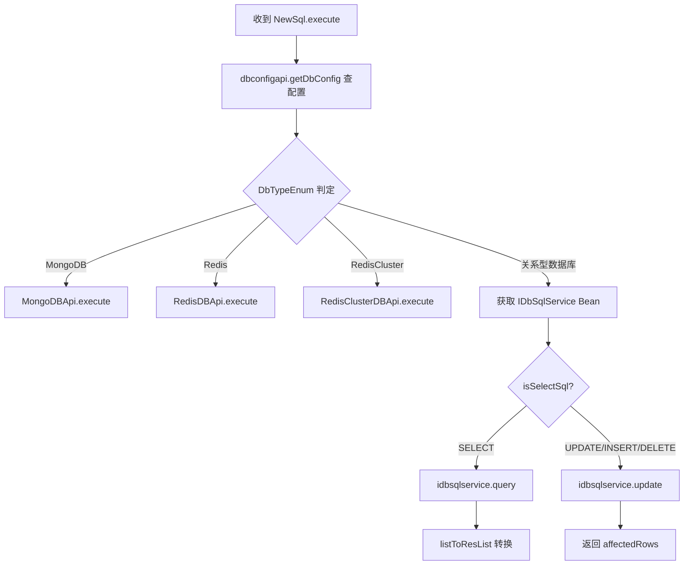

# NewSql

> mkey: `script` | 包路径: `cn.testin.trans.controller.req.script.NewSql`

新版 SQL 执行命令，支持关系型数据库（MySQL、Oracle、PostgreSQL、DB2、SQLServer、DM8、OceanBase、OpenGauss、AS400）和 NoSQL（MongoDB、Redis、Redis Cluster）。

## execute

### 协议命令

```
{ "mkey": "script", "op": "NewSql.execute", "reqid": "xxx", "data": { "envId": 1, "sql": "SELECT * FROM users", "dbAlias": "mydb", "timeout": 5000 } }
```

### 实现意图

上位机代理执行 SQL 语句。通过 envId + dbAlias 定位数据库配置，自动判断 SQL 类型（SELECT 或 UPDATE/INSERT/DELETE），调用对应的数据库执行器。

**与旧版 Sql.execute 的区别**：
- 使用 envId + dbAlias 定位配置（而非 configId + projectId）
- 仅验证 dbConfig 是否存在（不做企业/项目组权限校验）
- 支持 Redis Cluster

### 请求消息字段

| 字段 | 类型 | 必填 | 说明 |
|------|------|------|------|
| data.envId | int | 是 | 环境 ID |
| data.sql | String | 是 | SQL 语句 |
| data.dbAlias | String | 是 | 数据库别名 |
| data.timeout | int | 否 | 超时时间（毫秒），默认取配置值 |

### 响应

SELECT 查询：
```json
{
  "code": 0,
  "data": { "list": [ {"result": {"column1": "value1", ...}}, ... ] }
}
```

UPDATE/INSERT/DELETE：
```json
{
  "code": 0,
  "data": { "list": [ {"affectedRows": 5} ] }
}
```

MongoDB/Redis：
```json
{ "code": 0, "data": { "list": [ ... ] } }
```

### mermaid 流程



### 调用链

```
trans.controller.req.script.NewSql.execute(Session, RequestContext)
  → dbconfigapi.getDbConfig(null, dbAlias, envId)      // [real-cfg](../../../平台配置（real-cfg）/07-开放接口文档/00-模块索引.md)
  // NoSQL 直接调用 API
  → MongoDBApi.execute(dataJson)
  → RedisDBApi.execute(dataJson)
  → RedisClusterDBApi.execute(dataJson)
  // 关系型 DB
  → IDbSqlService (Mysql/Oracle/PG/DB2/SQLServer/DM8/OceanBase/OpenGauss/AS400).query/update(DBConnectionDTO, sql)
```

### 涉及表/SQL

- `realcfg_db_config` — 数据库配置表（通过 [平台配置](../../../平台配置（real-cfg）/07-开放接口文档/00-模块索引.md)）

### 异常处理

- dbAlias 为空 → `paraInvalid`
- envId <= 0 → `paraInvalid`
- dbConfig 不存在 → `paraInvalid`，"dbConfig is invalid!"
- dbType 不受支持 → `dbNotSupport`
- SQL 执行异常 → 返回异常 code 和 msg

### 关键代码摘录

```java
// 动态获取数据库执行器 Bean
StringBuffer dbBeanName = new StringBuffer();
dbBeanName.append("IDbSqlServiceImpl");
dbBeanName.append(".");
dbBeanName.append(dbTypeEnum.getName().toLowerCase());
IDbSqlService idbsqlservice = (IDbSqlService) SpringHelper.getBean(dbBeanName.toString());
```

支持的 Bean 名称：`IDbSqlServiceImpl.mysql`, `IDbSqlServiceImpl.oracle`, `IDbSqlServiceImpl.postgresql`, `IDbSqlServiceImpl.db2`, `IDbSqlServiceImpl.sqlserver`, `IDbSqlServiceImpl.dm8`, `IDbSqlServiceImpl.oceanbase`, `IDbSqlServiceImpl.opengauss`, `IDbSqlServiceImpl.as400`.
