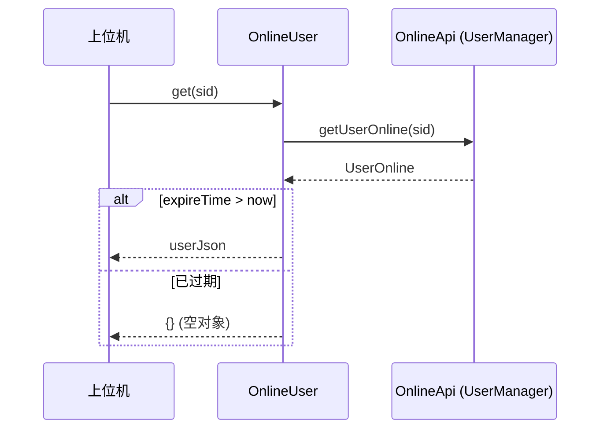

# OnlineUser

> mkey: `sso` | 包路径: `cn.testin.trans.controller.req.sso.OnlineUser`

查询在线用户的通行证信息，用于上位机验证当前 Web 用户 session 的有效性。

## get

### 协议命令

```
{ "mkey": "sso", "op": "OnlineUser.get", "reqid": "xxx", "data": { "sid": "session-token" } }
```

### 实现意图

上位机通过 sid（session ID / 通行证）查询当前 Web 在线用户信息，判断用户 session 是否有效且未过期，返回用户 JSON。

### 请求消息字段

| 字段 | 类型 | 必填 | 说明 |
|------|------|------|------|
| data.sid | String | 是 | Web 用户的 session 标识 |

### 响应

```json
{
  "resid": "xxx",
  "mkey": "sso",
  "op": "OnlineUser.get",
  "code": 0,
  "msg": "SUCCESS",
  "data": { /* UserOnline JSON，过期返回 {} */ }
}
```

### mermaid 流程



### 调用链

```
trans.controller.req.sso.OnlineUser.get(Session, RequestContext)
  → GenericBaseController.onlineapi.getUserOnline(sid)    // [user-manager](../../../平台基础功能服务/00-首页.md)
```

### 涉及表/SQL

通过 [user-manager](../../../平台基础功能服务/00-首页.md) 查询，不直接操作 DB。

### 异常处理

- sid 为空 → 不做校验，直接返回空 JSON `{}`
- `getUserOnline` 抛 `GeneralException` → 透传异常码和消息
- 结果过期 → 返回空 JSON `{}`

### 关键代码摘录

```java
// 过期判断
if (result != null && result.getExpireTime() != null
        && result.getExpireTime() > System.currentTimeMillis()) {
    userJson = result.toJson();
} else {
    userJson = new JSONObject();  // 过期返回空对象
}
```
