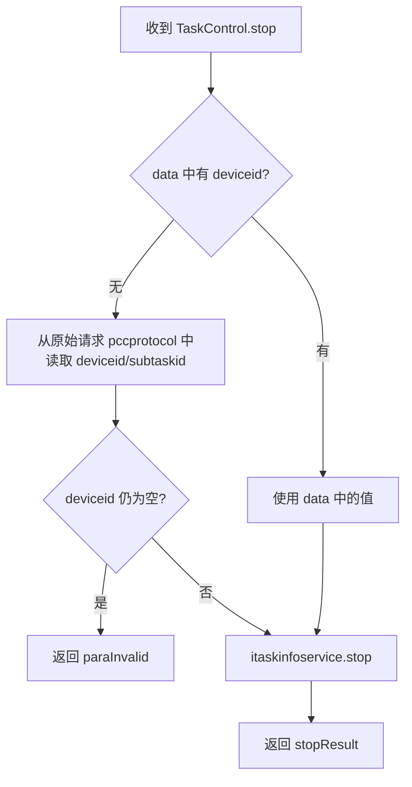

# TaskControl

> mkey: `script` | 包路径: `cn.testin.trans.controller.res.script.TaskControl`

服务端主动下发任务控制命令的**响应处理**。控制中心下发停止任务命令给上位机，上位机处理后回传结果。

## stop

### 协议命令

```
{ "mkey": "script", "op": "TaskControl.stop", "code": 0, "data": { "ucomid": "...", "subtaskid": "...", "deviceid": "...", "type": 0 }, "resid": "xxx" }
```

### 实现意图

处理任务停止的下发响应。若上位机响应的 data 中缺少 deviceid，从原始下发请求中补全。最终调用 `itaskinfoservice.stop` 完成停止逻辑。

### 请求消息字段（上位机响应）

| 字段 | 类型 | 必填 | 说明 |
|------|------|------|------|
| data.deviceid | String | 否 | 设备 ID（若缺失从原始请求补全） |
| data.subtaskid | String | 否 | 子任务 ID |
| data.type | int | 否 | 设备类型 |
| data.ucomid | String | 否 | 上位机 ID |

### mermaid 流程



### 调用链

```
trans.controller.res.script.TaskControl.stop(Session, RequestContext)
  → iprotocolservice.get(requestcontext.getReqid())     // 查原始下发请求
  → itaskinfoservice.stop(deviceid, subtaskid, type, ucomId)   // [real-scheduling](../../../任务调度服务（real-scheduling）/07-开放接口文档/00-模块索引.md)
```

### 涉及表/SQL

- [任务调度服务](../../../任务调度服务（real-scheduling）/07-开放接口文档/00-模块索引.md) — 任务停止处理
- Redis 协议表 — 通过 IProtocolService 查询原始请求

### 关键代码摘录

```java
// 无设备ID时从原始下发报文中读取
if (StringUtils.isBlank(deviceid)) {
    PccProtocol pccprotocol = iprotocolservice.get(requestcontext.getReqid());
    if (pccprotocol == null) {
        return error "resid is invalid!";
    }
    JSONObject reqContentJson = new JSONObject(pccprotocol.getReqContent());
    deviceid = dataJson.optString("deviceid");
    subtaskid = dataJson.optString("subtaskid");
}
```
