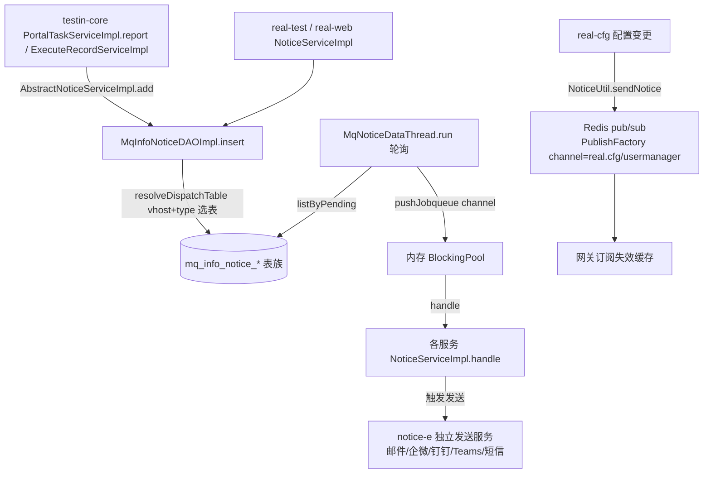

# 横切-消息通知拓扑

> 跨模块横切：三套消息机制并存——mq_info_notice（MySQL 表族 + 轮询）、Redis pub/sub（缓存失效）、notice-e（邮件/企微/钉钉/Teams/短信发送）
> 代码已核实（2026-08-14，分支 syy.release.z7.8.1.0）

## 关键结论

- **mq_info_notice 是 MySQL 表族，不是 Redis、不是 RabbitMQ**。实现位于 `real-common`（各 real 子模块共享）：`MqInfoNoticeDAOImpl`。表按 vhost 前缀 + type 分表。
- **无 RabbitMQ**：`vhost` 是数字模块节点 ID，`channel` 是内存队列名，底层为 JDBC 写表 + 线程轮询。

## 三套消息机制对比

| 机制 | 载体 | 用途 | 代码位置 |
|---|---|---|---|
| mq_info_notice | MySQL 表族 + 线程轮询 | 跨服务业务通知（任务/报告/测试计划） | real-common `mq/dao/impl/MqInfoNoticeDAOImpl` |
| Redis pub/sub | Redis channel | 缓存失效（配置/在线状态） | real-common `redismq/PublishFactory` |
| notice-e | 独立发送服务 | 邮件/企微/钉钉/Teams/短信 | workspace/notice-e |

## mq_info_notice 分表与选表

表族（`mq_info_notice_` 前缀）：`task_assembly` / `task_init` / `report_statistics` / `portal_report` / `testresult_parse` / `testprocess` / `tasksummary_statistics` / `task_testplan_notice` / `other`。

选表逻辑 `resolveDispatchTable(vhost, type)`：取 vhost 前 3 位前缀 + type 分发表，未命中落 `other`。

## 完整流程图

## 调用链明细

| # | 源 | 调用方式 | 目标 | 代码位置 |
|---|---|---|---|---|
| 1 | testin-core `PortalTaskServiceImpl.report` / `ExecuteRecordServiceImpl` | 本地 | `AbstractNoticeServiceImpl.add` | testin-core |
| 2 | real-test / real-web `NoticeServiceImpl` | 本地 | `AbstractNoticeServiceImpl.add` | real 仓子模块 |
| 3 | `AbstractNoticeServiceImpl.add` | MySQL | `MqInfoNoticeDAOImpl.insert`（resolveDispatchTable 选表） | real-common mq |
| 4 | `MqNoticeDataThread.run` | 轮询 | `listByPending` → `pushJobqueue(channel)` 入内存 BlockingPool | real-common mq/schedule |
| 5 | 各服务 `NoticeServiceImpl.handle` | 本地 | 处理通知、触发外部发送 | real 仓子模块 |
| 6 | real-cfg `NoticeUtil.sendNotice` | Redis pub/sub | `PublishFactory.publish`（channel=`real.cfg`/`usermanager`） | real-common redismq |
| 7 | `HttpTaskServiceImpl` 等 | HTTP | notice-e（邮件/企微/钉钉/Teams/短信） | workspace/notice-e |

## 待纠正项

- mq_info_notice 是 **MySQL 表族按 vhost 前缀 + type 分表**，非 Redis、非 RabbitMQ。
- Redis pub/sub（`real.cfg`/`usermanager`）与 mq_info_notice 是**两套独立系统**，前者仅用于缓存失效。

## 关联文档

- [app处理服务 通知系统拓扑](../app处理服务（real-test）/04-复杂功能细节/核心链路-通知系统拓扑.md)
- [app处理服务 通知系统总览](../app处理服务（real-test）/04-复杂功能细节/通知系统-总览.md)
- [web-pc处理服务 通知系统](../web-pc处理服务/04-复杂功能细节/横切-通知系统.md)
- [平台基础功能服务 通知系统](../平台基础功能服务/04-复杂功能细节/横切-通知系统.md)
- [端到端-网关配置变更与缓存失效](端到端-网关配置变更与缓存失效.md)
- [端到端-测试报告生成与展示](端到端-测试报告生成与展示.md)
