# 横切-超时与异常点分析

> 任务执行全链路的超时阈值、重试策略与异常后果（代码级核实，2026-08-11，分支 syy.release.z7.8.1.0）。
> 任何一环超时/异常都会落入状态机（`WAIT_EXECUTE_PRE_TEST` / `EXECUTE_WAITE_CALL_BACK` / `EXECUTE` / `TIME_OUT` / `NO_DEVICE` / `EXCEPTION` / `FINISH`）并暴露到前端报告。

## 全链路超时点总览

```mermaid
flowchart LR
    A[ExecuteTaskThread<br/>30s 兜底<br/>锁 TTL 120s] -->|HTTP 5s conn / 60s read| B[real-task executeTask]
    B --> C[TaskInitThread<br/>失败>10次 → EXCEPTION]
    C --> D[TaskStartExecuteThread<br/>20s 兜底扫描]
    D -->|匹配>10次 → FAIL<br/>超7天 → TIME_OUT| E[设备匹配]
    E --> F[controlcenter TCP 下发<br/>轮询1s 无显式超时<br/>协议10min过期/最多2次]
    F --> G[上位机执行<br/>脚本 20min 超时]
    G --> H[结果回调<br/>8s 幂等锁<br/>失败重试>100次丢弃]
    H --> I[用例卡死兜底<br/>5min 扫描强制完成]
```

## 1. HTTP 调用超时

| 位置 | 阈值 | 后果 | 业务影响 |
|---|---|---|---|
| 平台基础功能服务 `RestTemplateConfig`（OkHttp3，实际生效覆盖值） | connect 5s，read/write 60s | `SocketTimeoutException` | 平台基础功能服务 → 任务管理服务 等下游调用失败，上抛 `GeneralException`，任务停留 `WAIT_EXECUTE_PRE_TEST` 并记 `taskFailMsg` |
| 平台基础功能服务 `HttpFactory` | connect/connReq/socket 均 30s；GET/HEAD 重试 3 次；超时/DNS/SSL 不重试 | 快速失败 | 内部 HTTP 工具类调用 |
| 平台基础功能服务 `ServiceRemoteV3Api` | 继承上述 | 非 200 或 code≠0 抛 `GeneralException` | `RealTaskV3Api.executeTask` 失败直接上抛 |
| 任务管理服务 `WebClientConfig` | connect 5s，response/read/write 5s，间隔 1s 重试 3 次 | Reactor 异常入 retry | 任务管理服务 调用下游（含回调 平台基础功能服务） |
| 任务管理服务 `ServiceRemoteApiUtil.syncPostV3` | 阻塞超时 30s | 超时异常 | 任务管理服务 同步调下游统一超时 |
| 设备控制中心 `HttpPostRequestUtil` | connect/read 均 10s | 超时异常 | 中控 HTTP 通知 real-scheduling/real-task |

## 2. TCP 同步等待（下发上位机）⚠️ 风险点

| 位置 | 阈值 | 后果 | 业务影响 |
|---|---|---|---|
| 设备控制中心 `Task.distributeTask` → `IProtocolService.add` | add 返回 null 立即抛 `GeneralException` | 下发失败即报错 | 任务下发失败快速暴露 |
| `ProtocolServiceImpl` / `PccProtocol` | `EXPIRE_TIME = 10min`；`EXEC_MAX = 2` | 协议记录 10min 未响应被清理；最多执行 2 次 | 上位机不回包时协议最终被清理 |
| `GenericBaseService`（~375-471） | **轮询 1s，`while(true)` 无显式超时**，协议被删才抛异常 | 理论上可长期挂起 | ⚠️ 设备/网络异常且协议未被清理时，工作线程可能长期阻塞，是本链最薄弱点 |

## 3. 设备异常与心跳

| 位置 | 阈值 | 后果 | 业务影响 |
|---|---|---|---|
| 设备控制中心 `Config.DEVICE_TIMEOUT` | 120s 无心跳 | `DeviceDataThread`/`DeviceWorkerThread` 清理连接池，设备置 unknown/下线 | 设备不可接单，任务进 `NO_DEVICE` 分支等待重匹配 |
| `Config.REALMACHINETIMEOUT` | 20min（推送上位机） | 单条脚本执行超时由上位机强制终止 | 死循环脚本不会永久占用设备 |

## 4. 队列消费重试（BRPOPLPUSH + bak 队列）

| 队列 | 机制 | 上限 | 后果 |
|---|---|---|---|
| `task_execute_record_init_queue` → `_bak_queue` | 异常 count 累加 | count>10 → 任务置 `EXCEPTION` | 初始化持续失败的任务终止并标记异常 |
| `task_send_plan_queue_` → `_bak` | 失败 `sendCount++` 重新入队 | sendCount>100 → 删除记录（`RecordTaskCallbackStrategy`） | 回调投递最多试 100 次，防无效回调占队列 |
| `fileupload.script.check(.delay)` | 延迟 1min 消费 | — | 脚本异步校验缓冲 |

## 5. 定时扫描兜底

| 线程 | 周期 | 兜底内容 |
|---|---|---|
| 平台基础功能服务 `ExecuteTaskThread` | 30s（Redis 锁 TTL 120s） | 扫描未完成 ExecuteRecord 重新触发提测 |
| 任务管理服务 `TaskStartExecuteThread` | 20s | 扫描 `task_execute_record_executing_report` 推进执行 |
| 任务管理服务 `TaskExecuteRecordReportCaseCheckThread` | 5min（首延 60s） | 把长时间未回调的用例强制完成，防任务永远 RUNNING |

## 6. 任务有效期与匹配上限

| 位置 | 阈值 | 后果 |
|---|---|---|
| 任务管理服务 `TaskConstants.TASK_EXPIRE_TIME` | 7 天 | 超时未执行 → `expireTime` 判断置 `TIME_OUT` |
| `TASK_MATCH_MAX_COUNT` | 10 次 | 匹配设备超 10 次 → 任务置 FAIL（`TaskHandlerServiceImpl` ~2868/3201） |

## 7. 回调与状态推进

| 位置 | 机制 | 异常后果 |
|---|---|---|
| 平台基础功能服务 `executeTask`（~1887-1909） | 提测成功 → `EXECUTE_WAITE_CALL_BACK`；异常保持 `WAIT_EXECUTE_PRE_TEST` + `taskFailMsg` | 任务管理服务 不可用时任务停在前态，等 30s 兜底线程重新触发 |
| `SendSubTaskCallbackStrategyService` | Redis 锁 `SEND_SUB_TASK_CALLBACK+subTaskId` TTL 8s | 8s 内重复回调幂等丢弃，防并发汇总错乱 |
| 回调入口 `/test_plan/execute_record_tasks/callback` | HTTP 超时同第 1 类 | 任务管理服务 侧重试（第 4 类，100 次上限） |

## 8. 脚本执行/校验超时

| 位置 | 阈值 | 后果 |
|---|---|---|
| 上位机（`REALMACHINETIMEOUT` 下发） | 20min | 脚本超时强制终止，结果标 TIME_OUT |
| 文件管理服务 脚本校验 | 延迟队列 1min | 上传后异步校验缓冲 |

## 影响速查（出问题看什么）

| 症状 | 最可能环节 |
|---|---|
| 任务停在"等待执行"不动 | HTTP 提测失败（第 1 类）→ 看 `task_fail_msg`；或等 ExecuteTaskThread 30s 兜底 |
| 任务 NO_DEVICE 后失败 | 设备匹配超 10 次（第 6 类）或设备心跳离线（第 3 类） |
| 任务一直 RUNNING | 用例回调丢失 → 等 `TaskExecuteRecordReportCaseCheckThread` 5min 强制完成；或 TCP 同步等待挂起（第 2 类 ⚠️） |
| 任务 EXCEPTION | init 队列失败超 10 次（第 4 类） |
| 任务 TIME_OUT | 超 7 天有效期，或脚本执行超 20min |
| 计划状态不推进 | 任务管理服务 → 平台基础功能服务 回调失败重试中（100 次上限） |

## 关联文档

- [端到端-测试计划执行](端到端-测试计划执行.md)（状态机与回调）
- [端到端-定时任务](端到端-定时任务.md)
- [任务管理服务 任务状态机](../任务管理服务/04-复杂功能细节/横切-任务状态机.md)
- [任务管理服务 Redis 队列架构](../任务管理服务/04-复杂功能细节/横切-Redis队列架构.md)
