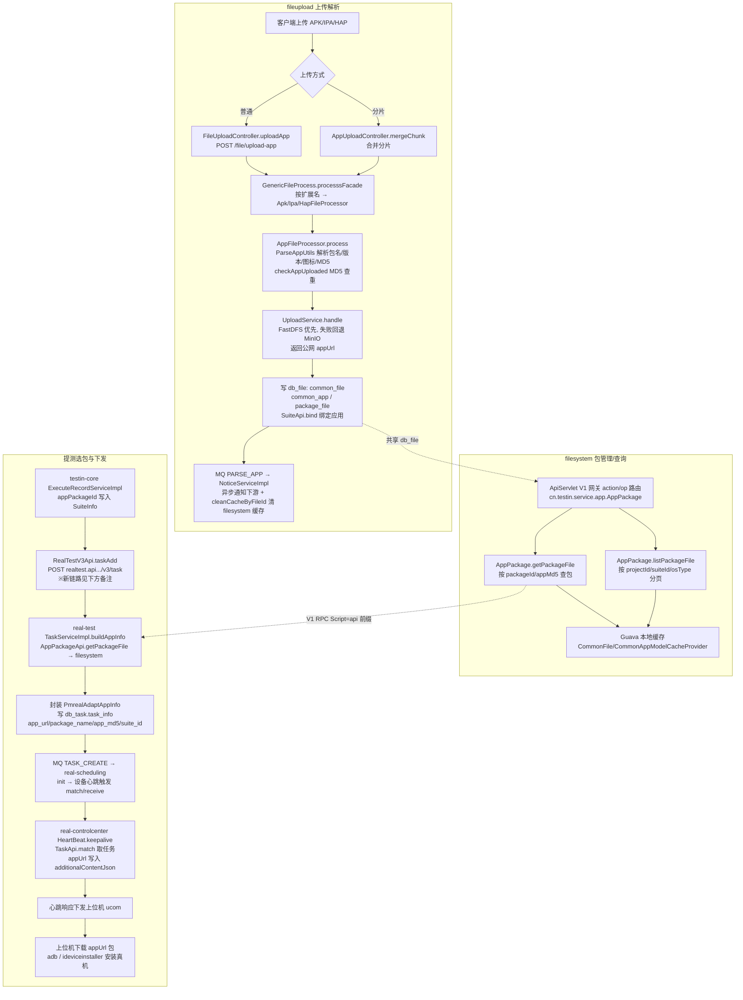

# 端到端-App 包上传与使用

> 跨模块链路：文件管理服务 上传解析 → 脚本服务 包管理/查询 → 提测选包（平台基础功能服务 / app处理服务 / 任务管理服务）→ 下发 appUrl → 上位机下载安装真机
> 代码已核实（2026-08-11，分支 syy.release.z7.8.1.0）

## 关键结论

- **包不是以文件流下发**：全链路只传递 `appUrl`（文件存储公网 URL，如 `http://fileupload.pro.testin.cn/group1/...`），最终由**上位机（ucom）自行下载**并调用 adb / ideviceinstaller 安装到真机。
- 上传有两条入口（普通 `/file/upload-app`、分片合并 `mergeChunk`），殊途同归进 `GenericFileProcess.processsFacade()` 按扩展名分发到 Apk/Ipa/Hap 处理器。
- 存储优先 **FastDFS，失败回退 MinIO**；脚本服务 侧用 Guava 本地缓存（`CommonFileModelCacheProvider` / `CommonAppModelCacheProvider`），文件管理服务 上传后经 `FileApi.cleanCacheByFileId` 清缓存。

## 完整流程图

> **备注**：测试计划新链路走 任务管理服务（`RealTaskV3Api.executeTask`，不经 任务调度服务，见 [端到端-测试计划执行](端到端-测试计划执行.md)）；旧链路（app处理服务 `taskAdd` → 任务调度服务 心跳匹配）如上图。两条链路包传递方式一致：**只传 appUrl，上位机下载安装**。

## 调用链明细

### 1. 上传与解析（文件管理服务）

| # | 环节 | 代码 |
|---|---|---|
| 1 | 普通上传入口 | `FileUploadController.uploadApp()` POST `/file/upload-app` |
| 2 | 分片上传入口 | `AppUploadController.mergeChunk()` 合并后同入 processsFacade |
| 3 | 类型分发 | `GenericFileProcess.processsFacade()` → `ApkFileProcessor` / `IpaFileProcessor` / `HapFileProcessor` |
| 4 | 解析+查重 | `AppFileProcessor.process()`：`ParseAppUtils.parseApp()` → `checkAppUploaded()` MD5 查重 |
| 5 | 存储 | `UploadService.handle()` FastDFS 优先、MinIO 兜底 → 公网 URL |
| 6 | 持久化 | `commonFileService.saveMasterFile()` 写 `common_file`；`PersistenceAppPackageService.persistence()` 写 `common_app`（唯一键 packageName+platformId+osType）、`package_file`；`SuiteApi.bind()` |
| 7 | 异步通知 | `MqInfoNotice(PARSE_APP)` 写 `db_mq.mq_info`，`NoticeServiceImpl` 消费 |

### 2. 包查询（脚本服务）

| 接口 | 说明 |
|---|---|
| `AppPackage.getPackageFile` → `AppService.getPackageFile()` | 按 packageId/appMd5 查 `package_file` + `common_file` |
| `AppPackage.listPackageFile` | 按 projectId/suiteId/packageId/osType 分页 |
| `AppPackage.getPackageFileByAppMd5` | 直接返回 appUrl |
| 缓存 | `CommonFileModelCacheProvider` / `CommonAppModelCacheProvider`（Guava）；文件管理服务 经 `FileApi.cleanCacheByFileId()` 清缓存 |

### 3. 提测选包与下发

| # | 源 | 调用 | 目标 |
|---|---|---|---|
| 1 | 平台基础功能服务 `ExecuteRecordServiceImpl` | `content.getSuiteInfo().setAppPackageId(...)` | 写入任务内容 |
| 2 | 平台基础功能服务 | HTTP POST `http://realtest.api.pro.testin.cn:8080/v3/task`（`RealTestV3Api.taskAdd`） | app处理服务（新链路为 任务管理服务，见备注） |
| 3 | app处理服务 `TaskServiceImpl.buildAppInfo()` | V1 RPC（`service.api.properties` Script 前缀）op=`AppPackage.getPackageFile` / `listPackageFile` | 脚本服务 |
| 4 | app处理服务 | 封装 `PmrealAdaptAppInfo` 写 `db_task.task_info` + MQ `TASK_CREATE` | 任务调度服务 |
| 5 | 任务调度服务 | `init()` → `DeviceDispatchThread` / `DeviceHandlerThread` → `prematch()`/`exec()` → `match()` 空闲设备入 Redis `device:queue:match` → `receive()` 组装 `DbTaskInfo.toJson()`（含 appUrl/packageName/appMd5） | — |
| 6 | 设备控制中心 `HeartBeat.keepalive()` | `TaskApi.match()` `action=scheduling, op=Task.match` | 任务调度服务 |
| 7 | 设备控制中心 | appUrl 写入 `additionalContentJson` 随心跳响应返回 | 上位机 |
| 8 | 上位机 | 下载 appUrl → adb / ideviceinstaller | 真机安装 |

## 涉及存储

| 存储 | 表/Key | 说明 |
|---|---|---|
| db_file | `common_file` / `common_app` / `package_file` | 文件元数据 URL / 应用包信息 / 绑定关系 |
| db_mq | `mq_info` | PARSE_APP / TASK_CREATE 通知 |
| db_task | `task_info` | 子任务：`app_url`、`package_name`、`app_md5`、`suite_id` |
| 脚本服务 本地 | Guava 缓存 ×2 | common_file / common_app |
| 设备控制中心 Redis | `:device:taskinfo`、`:task:match:` | 设备任务关系、匹配信息 |
| 任务调度服务 Redis | `device:queue:match` | 空闲设备匹配队列 |

## 关联文档

- [文件管理服务 APP 上传与解析](../文件管理服务/04-复杂功能细节/核心链路-APP上传与解析.md)
- [文件管理服务 分片上传](../文件管理服务/04-复杂功能细节/核心链路-分片上传.md)
- [real 设备匹配与下发](../设备控制中心（real-controlcenter）/04-复杂功能细节/核心链路-设备匹配与下发.md)
- [设备控制中心 长连接](../设备控制中心（real-controlcenter）/04-复杂功能细节/核心链路-上位机长连接.md)
- [端到端-测试计划执行](端到端-测试计划执行.md)
