# 端到端-定时任务

> 跨模块链路：四种定时形态（任务管理服务 模板 Cron / 平台基础功能服务 计划 Cron / app处理服务 Quartz / web/pc处理服务 Quartz）→ 调度触发 → 执行 → 回收通知
> 代码已核实（2026-08-11，分支 syy.release.z7.8.1.0）

## 关键结论

- **四种定时形态分两条调度体系**：
  - **新链路（不经 任务调度服务）**：任务管理服务 任务模板 Cron、平台基础功能服务 计划 Cron —— 最终都进入 任务管理服务 自主执行管道（Redis 队列 + 主动扫描锁设备）。
  - **旧链路（经 任务调度服务）**：app处理服务 内部 Quartz、web/pc处理服务 模板 Quartz —— 都经 `ApiUtil.doPress(action=scheduling, op=Task.init)` 进 任务调度服务 统一下发。
- 平台基础功能服务 的计划定时执行**委托给 任务管理服务**：`QuartzPlanInfoExecuteJob` 触发后与手动执行共用同一条 `RealTaskV3Api.executeTask` 链路（见 [端到端-测试计划执行](端到端-测试计划执行.md)）。

## 四种形态对比

| 形态 | Cron 存储 | 触发器 | 执行体 | 经 任务调度服务 |
|---|---|---|---|---|
| 任务管理服务 任务模板 | `task_template.template_type=2` + `cron_expression` | `TaskTemplateExecuteJob` | 任务管理服务 自主管道 | ❌ |
| 平台基础功能服务 计划定时 | `db_plan.plan_info_scheduled.scheduled_cron` | `QuartzPlanInfoExecuteJob` | 委托 任务管理服务 | ❌ |
| app处理服务 内部 Quartz | `real.quartz_job` / `quartz_job_info` | `QuartzJob` | 任务调度服务 | ✅ |
| web/pc处理服务 模板 Quartz | `db_common.quartz_job` | `McPcQuartzJob` | 任务调度服务 | ✅ |

## 完整流程图

```mermaid
flowchart TD
    subgraph 新链路[新链路：不经 real-scheduling]
        A1[real-task TaskTemplateExecuteJob<br/>cron: task_template] --> A3[TaskExecuteRecordServiceImpl.executeTask<br/>写 task_execute_record]
        A2[testin-core QuartzPlanInfoExecuteJob<br/>cron: plan_info_scheduled] --> A4[PlanInfoServiceImpl.executePlanInfo<br/>快照 execute_record 树]
        A4 --> A5["ExecuteTaskThread @Scheduled 30s"]
        A5 --> A3
        A3 --> A6[LPUSH task_execute_record_init_queue<br/>→ TaskInitThread → init]
        A6 --> A7[TaskStartExecuteThread 20s 扫描<br/>锁设备 → real-controlcenter 下发]
        A7 --> A8[真机执行 → 结果回传 real-task]
        A8 --> A9[PlanServiceApi.callbackTaskPlan<br/>HTTP 回调 testin-core 汇总通知]
    end

    subgraph 旧链路[旧链路：经 real-scheduling]
        B1[real-test QuartzJob<br/>cron: real.quartz_job] --> B2[QuartzJobExecuteServiceImpl.execute<br/>→ taskService.taskAdd/addNew]
        B3[real-web McPcQuartzJob<br/>cron: db_common.quartz_job] --> B4[McPcQuartz.execute → McPcTaskApi.add<br/>→ TaskServiceImpl.create<br/>写 Mongo PmTaskDetail_XX]
        B4 --> B5[MQ TASK_ASSEMBLY / PUSH_PORTAL<br/>NoticeServiceImpl.handleTaskAssembly]
        B2 --> B6[MQ TASKINIT<br/>NoticeServiceImpl.handle]
        B5 --> B7[TaskApi.init<br/>action=scheduling, op=Task.init]
        B6 --> B7
        B7 --> B8[real-scheduling Task.init<br/>设备心跳触发 Task.match]
        B8 --> B9[real-controlcenter 下发真机]
    end
```

## 调用链明细

### 1. 任务管理服务 任务模板 Cron（不经 任务调度服务）

| # | 源 | 目标 | 代码 |
|---|---|---|---|
| 1 | `TaskTemplateExecuteJob.execute()`（Cron 触发） | `TaskExecuteRecordServiceImpl.executeTask()` | schedule/task/TaskTemplateExecuteJob.java |
| 2 | executeTask | 写 `task_execute_record` 族表 + LPUSH `task_execute_record_init_queue` | service/impl/task/TaskExecuteRecordServiceImpl.java |
| 3 | `TaskInitThread.run()` BRPOPLPUSH | `TaskHandlerServiceImpl.init()` | schedule/task/TaskInitThread.java |
| 4 | init/execute → 锁设备下发 | 设备控制中心（同测试计划链路 #9-10） | — |
| 5 | 结果回调 | `PlanServiceApi.syncPostV3(realLogFileUrl, TASK_PLAN_EXECUTE_RECORD_TASK_CALL_BACK)` → 平台基础功能服务 | api/plan/PlanServiceApi.java |

### 2. 平台基础功能服务 计划 Cron（委托 任务管理服务）

| # | 源 | 目标 | 代码 |
|---|---|---|---|
| 1 | `QuartzPlanInfoExecuteJob.executeInternal()`（Cron: `plan_info_scheduled.scheduled_cron`） | `PlanInfoServiceImpl.executePlanInfo()` | schedule/plan/QuartzPlanInfoExecuteJob.java |
| 2 | executePlanInfo | 快照写 `execute_record` / `execute_record_task` | — |
| 3 | `ExecuteTaskThread` @Scheduled 30s | `ExecuteRecordTaskServiceImpl.executeTask()` | schedule/plan/ExecuteTaskThread.java |
| 4 | executeTask | HTTP `RealTaskV3Api.executeTask` → 任务管理服务 `/v3/real_task/task_execute_records/execute` | api/realtask/RealTaskV3Api.java |

### 3. app处理服务 内部 Quartz（经 任务调度服务）

| # | 源 | 目标 | 代码 |
|---|---|---|---|
| 1 | `QuartzJob.execute()`（cron: `real.quartz_job` / `quartz_job_info`） | `QuartzJobExecuteServiceImpl.execute()` | app处理服务 quartz/QuartzJob.java |
| 2 | execute | `taskService.taskAdd` / `addNew` | business/impl/QuartzJobExecuteServiceImpl.java |
| 3 | MQ `TASKINIT` | `NoticeServiceImpl.handle()` | business/impl/NoticeServiceImpl.java |
| 4 | `TaskApi.init()` | `ApiUtil.doPress(realSchedulingPrefixName, action=scheduling, op=Task.init)` → 任务调度服务 `Task.init()` | api/scheduling/TaskApi.java；任务调度服务 service/cross/Task.java |

### 4. web/pc处理服务 模板 Quartz（经 任务调度服务）

| # | 源 | 目标 | 代码 |
|---|---|---|---|
| 1 | `McPcQuartzJob.execute()`（cron: `db_common.quartz_job`） | `McPcQuartz.execute()` → `McPcTaskApi.add()` | realweb/quartz/job/McPcQuartzJob.java |
| 2 | `TaskServiceImpl.create()` | 写 Mongo `PmTaskDetail_XX` + MQ `TASK_ASSEMBLY`/`PUSH_PORTAL` | realweb/business/impl/TaskServiceImpl.java |
| 3 | `NoticeServiceImpl.handleTaskAssembly()` | `TaskApi.init()` → 任务调度服务 | — |

## 涉及表

- **任务管理服务**：`task_template`（cron_expression）、`task_execute_record` 族
- **平台基础功能服务 / db_plan**：`plan_info_scheduled`、`execute_record` 族
- **real / app处理服务**：`quartz_job`、`quartz_job_info`（见 [quartz_job_info](../数据库管理/db_quartz/quartz_job_info.md)）
- **web/pc处理服务**：`db_common.quartz_job`、Mongo `PmTaskDetail_XX`、`mq_info_notice`

## 关联文档

- [端到端-测试计划执行](端到端-测试计划执行.md)（新链路执行段与回调段完全相同）
- [任务管理服务 定时任务模板执行](../任务管理服务/04-复杂功能细节/核心链路-定时任务模板执行.md)
- [平台基础功能服务 定时执行](../平台基础功能服务/04-复杂功能细节/核心链路-定时执行.md)
- [real 定时任务](../任务调度服务（real-scheduling）/04-复杂功能细节/核心链路-定时任务.md)
- [real 定时任务调度](../任务调度服务（real-scheduling）/04-复杂功能细节/核心链路-定时任务调度.md)
- [web/pc处理服务 定时任务执行](../web-pc处理服务/04-复杂功能细节/核心链路-定时任务执行.md)
