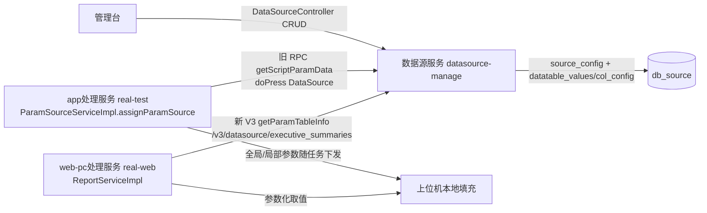

# 端到端-数据源完整链路

> 跨模块链路：数据源（datasource-manage）配置/取值 → 执行服务（app处理服务 / web-pc处理服务）取参数化数据 → 随任务下发给上位机本地填充
> 代码已核实（2026-08-14，分支 syy.release.z7.8.1.0）

## 关键结论

- 数据源服务（datasource-manage）提供：数据源树/条件查询 CRUD（`DataSourceController` `/datasource` 的 `getDataSourceTree`/`getDataSourceConfig`）、参数取值 `getScriptParamDataNew`、报告执行摘要 `executive_summaries`、标签、批量移动。
- **消费方向**：执行服务在执行时调数据源服务取参数化数据 → 分割全局/局部参数 → **随任务下发给上位机本地填充**，非设备实时拉取。

## 新旧两套 API 并存（V3 逐步迁移中）

| 套 | 入口 | 调用方 |
|---|---|---|
| 旧（V1 RPC） | `service/source/SourceConfigCtrl`；real-test `ParameterSourceApi.listScriptParamDataByScriptNo` → `DataTableCtrl.getScriptParamData`（`ApiUtil.doPress("DataSource")`） | `ParamSourceServiceImpl.assignParamSource`（real-test 用旧） |
| 新（V3 REST） | `DataSourceParamApiV3.listScriptParamDataByScriptNoNew`（`/v3/datasource/getScriptParamDataNew`）、`getParamTableInfo`（`/v3/datasource/executive_summaries`） | `ReportServiceImpl` 用新 `getParamTableInfo`；`NoticeServiceImpl` 新旧混用 |

## 完整流程图

## 调用链明细

| # | 源 | 调用方式 | 目标 | 代码位置 |
|---|---|---|---|---|
| 1 | 管理台 | HTTP `/datasource` | 数据源服务 `DataSourceController`（CRUD/取值） | datasource-manage |
| 2 | app处理服务 `ParamSourceServiceImpl.assignParamSource` | 旧 RPC | `ParameterSourceApi.listScriptParamDataByScriptNo` → `DataTableCtrl.getScriptParamData` | real-test |
| 3 | 数据源服务 `DataTableCtrl.getScriptParamData` | MySQL | 读 `datatable_values`/`datatable_col_config` | datasource-manage |
| 4 | app处理服务 | 本地 | 分割全局/局部参数，随任务下发 | real-test |
| 5 | web-pc处理服务 `ReportServiceImpl` | 新 V3 REST | `DataSourceParamApiV3.getParamTableInfo` | real-web |
| 6 | `NoticeServiceImpl` | 新旧混用 | 数据源取值 | real-test/real-web |

## 待纠正项

- 新旧接口并存且**均在用**，文档应标注「V3 逐步迁移中」。
- 连接测试入口未在 `DataSourceController` 直接暴露，需另行确认。

## 涉及表

- **db_source**：`source_config`（数据源主表）、`datatable_values`、`datatable_col_config`。

## 关联文档

- [数据源 数据读取](../数据源/04-复杂功能细节/核心链路-数据读取.md)
- [数据源 脚本变量填充](../数据源/04-复杂功能细节/核心链路-脚本变量填充.md)
- [数据源 双入口路由](../数据源/04-复杂功能细节/横切-双入口路由机制.md)
- [数据源 三套表族](../数据源/04-复杂功能细节/横切-三套数据源表族.md)
- [app处理服务 ParamSource](../app处理服务（real-test）/07-开放接口文档/测试资源/ParamSource.md)
- [端到端-脚本全生命周期](端到端-脚本全生命周期.md)
