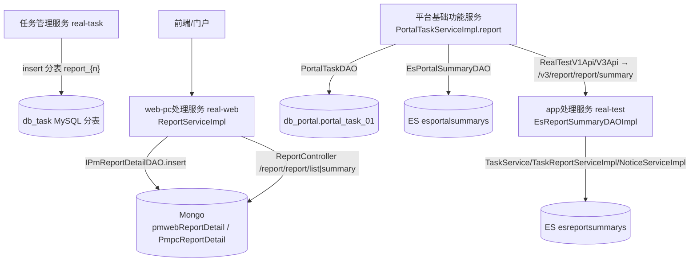

# 端到端-测试报告生成与展示

> 跨模块链路：执行结果汇总（real-task 分表）→ 报告详情（web-pc处理服务 写 Mongo）→ 报告摘要（app处理服务 写 ES）→ 门户摘要（平台基础功能服务 写 ES+MySQL）→ 展示（web-pc处理服务 / app处理服务 读）
> 代码已核实（2026-08-14，分支 syy.release.z7.8.1.0）

## 关键结论

测试报告横跨 **MySQL 分表 / Mongo / Elasticsearch / db_portal** 四类存储，按「谁写、写什么」分工：

| 存储 | 索引/集合/表 | 写入方 | 内容 |
|---|---|---|---|
| MySQL 分表 | `task_execute_record_report_{n}` + detail/case | 任务管理服务 `TaskExecuteRecordReportServiceImpl.insert` | 用例类执行报告（按 `executeRecordId % task.report.table.size` 分表） |
| Mongo | `pmwebReportDetail` / `PmpcReportDetail` | web-pc处理服务 `ReportServiceImpl` → `IPmReportDetailDAO.insert` | Web/PC 报告详情 JSON |
| ES | `esreportsummarys` | app处理服务 `EsReportSummaryDAOImpl`（`@Document(indexName="esreportsummarys")`） | 报告摘要 |
| ES | `esportalsummarys` | 平台基础功能服务 `EsPortalSummaryDAO`（`ES_INDEX="esportalsummarys"`） | 门户摘要 |
| MySQL | `db_portal.portal_task_01` | 平台基础功能服务 `PortalTaskServiceImpl.report` → `PortalTaskDAO`（`@TableName("db_portal.portal_task_01")`） | 门户/大屏摘要 |

- **展示**：web-pc处理服务 `ReportController`（`/report/report/list|summary`）→ `ReportService.reportList/reportSummary` 读 Mongo + `IReportService`；平台基础功能服务 `RealTestV1Api/V3Api` 远程调 app处理服务 `/v3/report/report/summary`。

## 完整流程图

## 调用链明细

| # | 源 | 调用方式 | 目标 | 代码位置 |
|---|---|---|---|---|
| 1 | 任务管理服务 `TaskExecuteRecordReportServiceImpl.insert` | MySQL 分表 | `task_execute_record_report_{n}` 族 | real-task service/impl/task |
| 2 | web-pc处理服务 `ReportServiceImpl` | Mongo | `IPmReportDetailDAO.insert` 集合 `pmwebReportDetail`/`PmpcReportDetail` | real-web dao/impl |
| 3 | app处理服务 `EsReportSummaryDAOImpl` | ES | 索引 `esreportsummarys` | real-test dao/impl/elasticsearch |
| 4 | 平台基础功能服务 `PortalTaskServiceImpl.report` | MySQL | `PortalTaskDAO.insertPojo/update` 表 `db_portal.portal_task_01` | testin-core |
| 5 | 平台基础功能服务 `EsPortalSummaryDAO.insert/update` | ES | 索引 `esportalsummarys` | testin-core |
| 6 | web-pc处理服务 `ReportController` | HTTP | `ReportService.reportList/reportSummary` 读 Mongo | real-web |
| 7 | 平台基础功能服务 `RealTestV1Api/V3Api` | HTTP `/v3/report/report/summary` | app处理服务 报告摘要 | testin-core |

## 待纠正项

- ES 索引名为 `esreportsummarys`（报告摘要，app处理服务 写）与 `esportalsummarys`（门户摘要，平台基础功能服务 写），**不是 `report_summary`**。
- `portal_task_01` 属 **`db_portal` 库**（非 db_plan）。
- 任务管理服务（real-task）的报告是 MySQL 分表，**不用 Mongo**。

## 涉及表 / 存储

- **db_task**：`task_execute_record_report_{n}`、`_detail`、`_case`（分表）。
- **Mongo**：`pmwebReportDetail`、`PmpcReportDetail`。
- **ES**：`esreportsummarys`、`esportalsummarys`。
- **db_portal**：`portal_task_01`。

## 关联文档

- [app处理服务 结果回收与报告](../app处理服务（real-test）/04-复杂功能细节/核心链路-结果回收与报告.md)
- [web-pc处理服务 报告生成](../web-pc处理服务/04-复杂功能细节/核心链路-报告生成.md)
- [平台基础功能服务 设备执行报告](../平台基础功能服务/01-产品功能/设备执行报告.md)
- [端到端-测试计划执行](端到端-测试计划执行.md)
- [横切-消息通知拓扑](横切-消息通知拓扑.md)
