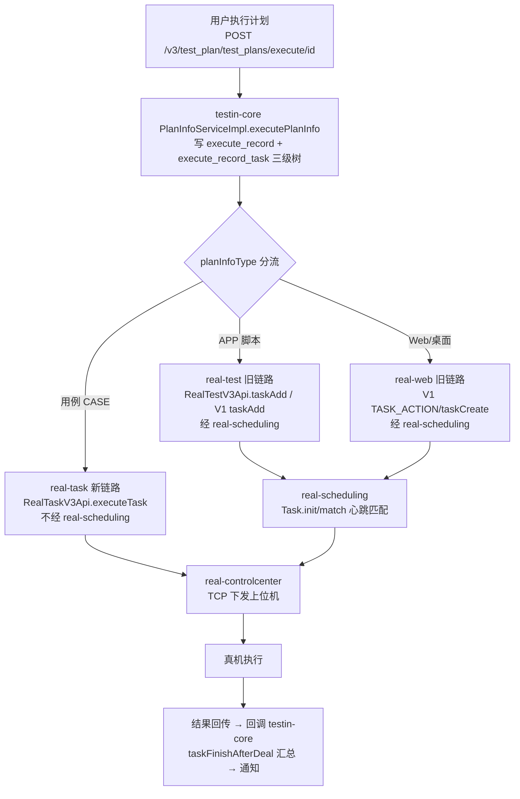
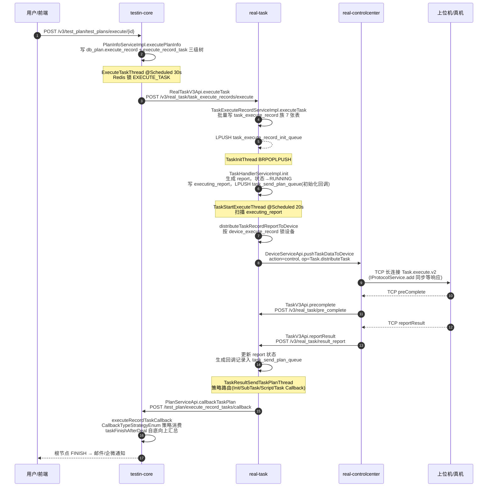
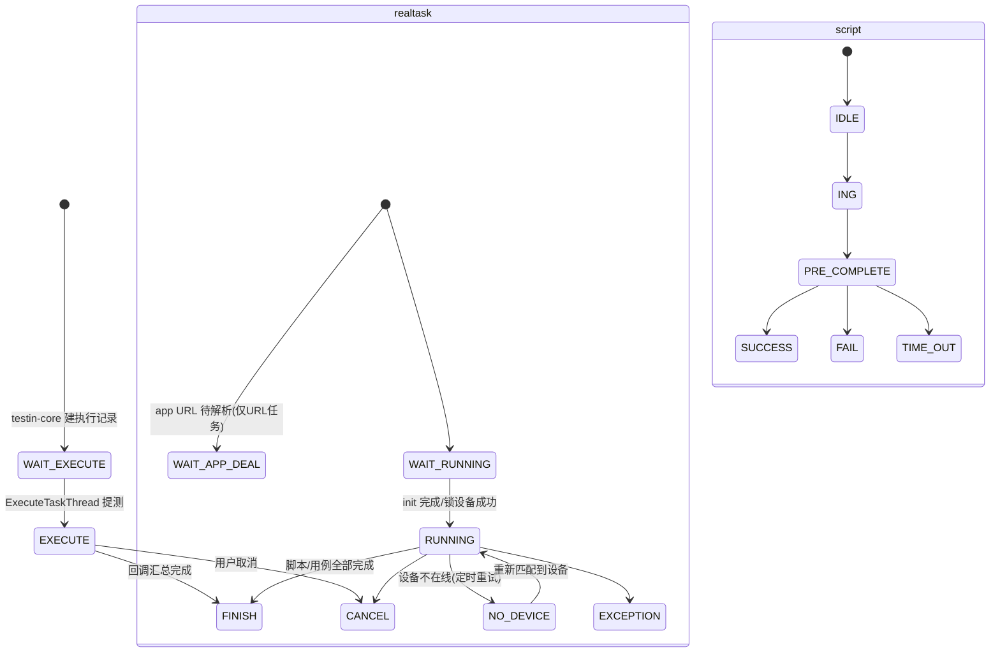

# 端到端-测试计划执行

> 跨模块链路：平台基础功能服务 →（按计划类型分流：任务管理服务 / app处理服务 / web/pc处理服务）→ 设备控制中心 → 真机 → 结果回传 → 回调汇总通知
> 代码已核实（2026-08-11，分支 syy.release.z7.8.1.0）

## 关键结论

- **平台基础功能服务 提测按计划类型 `planInfoType` 分三条出口**（分流点：`ExecuteRecordTaskServiceImpl.sendTaskExecuteRequest`  与 `preTestSingleTask`）：

| 计划类型 | 出口 | 经 任务调度服务 |
|---|---|---|
| **用例（CASE）** | `RealTaskV3Api.executeTask` → **任务管理服务** 新链路 | ❌ 不经 |
| **APP 脚本任务** | `RealTestV3Api.taskAdd`（content 含 `executeType` 的新接口）或 V1 RPC `APP_ACTION/taskAdd` → **app处理服务** | ✅ 经（心跳匹配） |
| **Web / 桌面（PC）** | V1 RPC `TASK_ACTION/taskCreate` → **web/pc处理服务** | ✅ 经 |

- **两段式提测**：`PreTestTaskThread` 先调 `preTestSingleTask` 预建任务（拿到 taskId，状态 `WAIT_EXECUTE_PRE_TEST`），`ExecuteTaskThread`（@Scheduled 30s + Redis 锁 `EXECUTE_TASK`）再触发真正执行。
- **任务管理服务 链路（用例类）**：主动扫描锁设备直推 设备控制中心，**不经 任务调度服务**；**app处理服务 / web/pc处理服务 链路**则经 任务调度服务，靠设备心跳触发 `Task.match`。
- 任务调度服务 是 real 仓内的旧调度子模块，只服务 app处理服务 / web/pc处理服务 旧入口（维护 `task_info / task_sub_info`）。

## 完整流程图

### 分流总览

### 用例（CASE）链路时序图（任务管理服务 新链路）

## 调用链明细

| # | 源 | 调用方式 | 目标 | 代码位置 |
|---|---|---|---|---|
| 1 | 平台基础功能服务 `PlanInfoController.execute` | 本地 | `PlanInfoServiceImpl.executePlanInfo` | controller/plan/PlanInfoController.java |
| 2 | 平台基础功能服务 `ExecuteTaskThread` | @Scheduled 30s + Redis 锁 | `ExecuteRecordTaskServiceImpl.executeTask` | schedule/plan/ExecuteTaskThread.java |
| 3 | 平台基础功能服务 `ExecuteRecordTaskServiceImpl.executeTask` | HTTP POST `{realTask}/v3/real_task/task_execute_records/execute` | 任务管理服务 `TaskExecuteRecordController.executeTask` | api/realtask/RealTaskV3Api.java |
| 4 | 任务管理服务 `executeTask` | 本地事务 | 写 task_execute_record 族 7 表 | service/impl/task/TaskExecuteRecordServiceImpl.java |
| 5 | 任务管理服务 `executeTask` | Redis LPUSH `task_execute_record_init_queue` | `TaskInitThread` | 同上:452 |
| 6 | 任务管理服务 `TaskInitThread` | BRPOPLPUSH | `TaskHandlerServiceImpl.init` | schedule/task/TaskInitThread.java |
| 7 | 任务管理服务 `init` | 线程池 | `TaskHandlerServiceImpl.execute` | TaskHandlerServiceImpl.java |
| 8 | 任务管理服务 `TaskStartExecuteThread` | @Scheduled 20s 扫描 | `execute` → `distributeTaskRecordReportToDevice` | schedule/task/TaskStartExecuteThread.java |
| 9 | 任务管理服务 `DeviceServiceApi.pushTaskDataToDevice` | HTTP `action=control, op=Task.distributeTask` | 设备控制中心 `Task.distributeTask` | api/device/DeviceServiceApi.java |
| 10 | 设备控制中心 `Task.distributeTask` | TCP `Task.execute.v2`（同步等响应） | 上位机 | 设备控制中心 service/control/Task.java |
| 11 | 上位机 | TCP `preComplete` | 设备控制中心 `TaskInfoServiceImpl.precomplete` | trans/controller/req/script/Task.java |
| 12 | 设备控制中心 `precomplete` | HTTP POST `{realTask}/v3/real_task/pre_complete` | 任务管理服务 `TaskExecuteRecordController.preComplete` | business/impl/TaskInfoServiceImpl.java |
| 13 | 上位机 | TCP `reportResult` | 设备控制中心 `TaskInfoServiceImpl.reportResult` | trans/controller/req/script/Task.java |
| 14 | 设备控制中心 `reportResult` | HTTP POST `{realTask}/v3/real_task/result_report` | 任务管理服务 `TaskExecuteRecordController.resultReport` | business/impl/TaskInfoServiceImpl.java |
| 15 | 任务管理服务 `TaskResultSendTaskPlanThread` | BRPOPLPUSH `task_send_plan_queue` | `taskResultSendTaskPlan` → 4 种回调策略 | schedule/task/TaskResultSendTaskPlanThread.java |
| 16 | 任务管理服务 回调策略 | HTTP POST `{testinCore}/test_plan/execute_record_tasks/callback` | 平台基础功能服务 `ExecuteRecordTaskController.executeRecordTaskCallback` | api/plan/PlanServiceApi.java |
| 17 | 平台基础功能服务 `executeRecordTaskCallback` | `CallbackTypeStrategyEnum` 策略路由 | `taskFinishAfterDeal` 汇总 + 通知 | business/impl/plan/ExecuteRecordTaskServiceImpl.java |

## APP / Web 旧链路调用链（经 任务调度服务）

| # | 源 | 调用方式 | 目标 | 代码位置 |
|---|---|---|---|---|
| A1 | 平台基础功能服务 `PreTestTaskThread` | 本地 | `ExecuteRecordTaskServiceImpl.preTestSingleTask` | schedule/plan/PreTestTaskThread.java |
| A2 | `preTestSingleTask` 按 planInfoType 分流 | APP 且 content 含 `executeType`：HTTP `RealTestV3Api.taskAdd`；否则 V1 RPC `APP_ACTION/taskAdd` | **app处理服务** 建任务 | ExecuteRecordTaskServiceImpl.java / 2623 |
| A3 | 同上分流 | Web/桌面：V1 RPC `TASK_ACTION/taskCreate`（realWebPrefixName） | **web/pc处理服务** 建任务 | ExecuteRecordTaskServiceImpl.java |
| A4 | 平台基础功能服务 `sendTaskExecuteRequest` | V1 RPC `TASK_EXECUTE`（realTest / realWeb 前缀） | 通知 app处理服务 / web/pc处理服务 立即执行 | ExecuteRecordTaskServiceImpl.java |
| A5 | app处理服务 / web/pc处理服务 | MQ + `TaskApi.init`（`action=scheduling, op=Task.init`） | **任务调度服务** `Task.init` | app处理服务 api/scheduling/TaskApi.java |
| A6 | 任务调度服务 | 设备心跳触发 `Task.match` → `receive` | 设备控制中心 下发 | 见 [端到端-定时任务](端到端-定时任务.md) 旧链路 |
| A7 | 设备控制中心 | TCP 长连接 | 上位机/真机 | — |
| A8 | 结果回传 | TCP → 设备控制中心 → real-scheduling/real-test → 回调 平台基础功能服务 | 同回调汇总逻辑 | — |

## 任务状态机

回调类型共 7 种（任务管理服务 策略化生产 / 平台基础功能服务 策略化消费）：`INIT_TASK_CALLBACK`、`SEND_SUB_TASK_CALLBACK`、`SCRIPT_CALLBACK`、`CASE_CALLBACK`、`TASK_CALLBACK`、`UPDATE_SCRIPT_STATUS_CALLBACK`、`UPDATE_ERROR_CAUSE_TYPE_CALLBACK`。

## 涉及表

- **平台基础功能服务 / db_plan**：`execute_record`、`execute_record_task`、`execute_record_task_case`、`execute_record_task_script`、`execute_record_task_device`
- **任务管理服务 / db_task**：`task_execute_record`、`task_execute_record_detail`、`task_execute_record_script`、`task_execute_record_case`、`task_execute_record_device`、`task_execute_record_notice`、`task_execute_record_time_period`、`task_execute_record_report(_case)`、`task_execute_record_device_execute_record`、`task_execute_record_executing_report`、`task_execute_record_send_task_plan`
- **旧 任务调度服务 链路（db_task）**：`task_info`、`task_sub_info`、`task_info_extra`、`task_result`、`task_exec_relation`

## 关联文档

- [平台基础功能服务 测试计划执行](../平台基础功能服务/04-复杂功能细节/核心链路-测试计划执行.md)
- [平台基础功能服务 任务提交](../平台基础功能服务/04-复杂功能细节/核心链路-任务提交.md)
- [平台基础功能服务 回调处理](../平台基础功能服务/04-复杂功能细节/核心链路-回调处理.md)
- [任务管理服务 任务执行](../任务管理服务/04-复杂功能细节/核心链路-任务执行.md)
- [任务管理服务 任务提测](../任务管理服务/04-复杂功能细节/核心链路-任务提测.md)
- [任务管理服务 回调处理](../任务管理服务/04-复杂功能细节/核心链路-回调处理.md)
- [real 设备匹配与下发](../设备控制中心（real-controlcenter）/04-复杂功能细节/核心链路-设备匹配与下发.md)
- [设备控制中心 长连接](../设备控制中心（real-controlcenter）/04-复杂功能细节/核心链路-上位机长连接.md)
