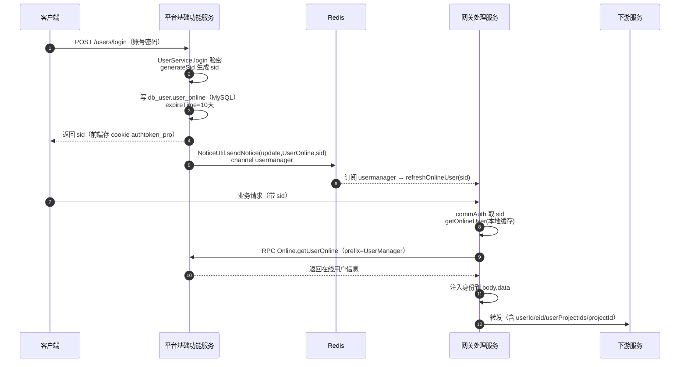

# 端到端-用户登录与会话身份

> 跨模块链路：客户端 → 平台基础功能服务 登录（生成 sid）→ 网关处理服务 解析 sid 注入身份 → 下游服务消费身份
> 代码已核实（2026-08-14，分支 syy.release.z7.8.1.0）

## 关键结论

- 登录由 **平台基础功能服务（testin-core）** 负责：`UserController.login`（POST `/users/login`）→ `UserService.login`，验密后 `DbUserOnline.generateSid` 生成 sid，**写入 `db_user.user_online`（MySQL，非 Redis）**，默认 channel=`normal`、expireTime=864000000ms（10 天），返回 sid 给前端。
- 登录/登出后 testin-core 调 `NoticeUtil.sendNotice("update"/"delete", "UserOnline", sid)`，经 Redis pub/sub `usermanager` 广播，网关订阅后 `refreshOnlineUser` 刷新本地在线用户缓存。
- 网关拿到 sid 后：V1/V3 `commAuth` 从 header 或 cookie `authtoken_pro` 取 sid → `UserServiceImpl.getOnlineUser`（本地缓存）→ `OnlineApi.getUserOnline`（RPC prefix=`UserManager`，op=`Online.getUserOnline`）→ testin-core `Online.getUserOnline` → `iuseronlinedao.getBySid`。
- 身份注入到**转发体 body 的 `data` 字段**（非 header）：

| 版本 | 注入方法 | 注入字段 |
|---|---|---|
| V1 | `ApiUtil.commAuth` | userid / username / userip / eid / userprojectids / projectid / onlineUserInfo |
| V3 | `ApiV3ProxyServlet.addBaseInfoToBody` | userId / userName / userIp / eid / userProjectIds / projectId |

- 下游（real-task / real-test / real-web 等）从转发体 `data` 字段读取身份。

## 完整流程图

## 调用链明细

| # | 源 | 调用方式 | 目标 | 代码位置 |
|---|---|---|---|---|
| 1 | 客户端 | HTTP POST `/users/login` | 平台基础功能服务 `UserController.login` | testin-core |
| 2 | `UserService.login` | 本地 | `DbUserOnline.generateSid` 生成 sid | testin-core |
| 3 | `iuseronlinedao.insert` | MySQL | 写 `db_user.user_online` | testin-core |
| 4 | `NoticeUtil.sendNotice` | Redis pub/sub `usermanager` | 网关订阅 | testin-core |
| 5 | `commAuth` | header/cookie `authtoken_pro` 取 sid | `UserServiceImpl.getOnlineUser` | proxy-openapi |
| 6 | `OnlineApi.getUserOnline` | RPC `Online.getUserOnline`（prefix=UserManager） | testin-core `Online.getUserOnline` | proxy-openapi |
| 7 | `ApiUtil.commAuth` / `ApiV3ProxyServlet.addBaseInfoToBody` | 注入 body.data | 下游服务读取身份 | proxy-openapi |

## 涉及表 / Redis

- **db_user**：`user_online`（sid、channel、expireTime 等）。
- **Redis channel**：`usermanager`（在线状态失效广播）。

## 关联文档

- [平台基础功能服务 用户登录](../平台基础功能服务/04-复杂功能细节/核心链路-用户登录.md)
- [平台基础功能服务 service-Login](../平台基础功能服务/07-开放接口文档/用户与认证/service-Login.md)
- [平台基础功能服务 service-Online](../平台基础功能服务/07-开放接口文档/用户与认证/service-Online.md)
- [端到端-网关认证与鉴权](端到端-网关认证与鉴权.md)
- [端到端-网关配置变更与缓存失效](端到端-网关配置变更与缓存失效.md)
