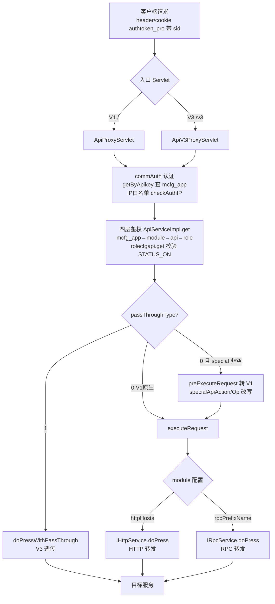

# 端到端-网关认证与鉴权

> 跨模块链路：客户端 →（网关处理服务 认证+四层鉴权）→（V1 原生 / V3 透传 / V3→V1 转换）→ 目标服务（real-cfg / testin-core / 各业务服务）
> 代码已核实（2026-08-14，分支 syy.release.z7.8.1.0）

## 关键结论

- 网关处理服务（proxy-openapi）是唯一对外入口，三套 Servlet 并存：`ApiProxyServlet`（`/*`，V1 原生）、`ApiV2ProxyServlet`（`/v2/*`、`/openapi/v2/*`）、`ApiV3ProxyServlet`（`/v3/*`、`/openapi/v3/*`），另有 `LocalCacheServlet`（`/localcache/*`）暴露本地缓存。
- **认证**：V1 `ApiUtil.commAuth` / V3 `ApiV3Util.commAuth` → `IAppService.getByApikey` 查 `mcfg_app`（校验 status / roles / bindEid / appConfig / ips）；IP 白名单 `IpUtil.checkAuthIP(app.getIps(), ip)`；sid → `IUserService.getOnlineUser`。
- **四层鉴权**逐层：`McfgApp`(`mcfg_app`) → `McfgModule`(`mcfg_module`) → `McfgApi`(`mcfg_api`) → `McfgRole`(`mcfg_role`)，关联表 `mcfg_role_api` + 视图 `view_role_api`。鉴权入口 `ApiServiceImpl.get(roles, moduleId, action, op)`：先 `rolecfgapi.get(roleId)` 校验角色 `STATUS_ON`，再经 `ApiCfgApi.list`（op=`ApiCfg.listByRole`，RPC prefix=`realcfg`）拉该角色 API 集。
- **三种转发模式**（按 `pass_through_type` + `special_api_action/op` 判定）：

| 模式 | pass_through_type | special_api | 代码路径 |
|---|---|---|---|
| V1 原生 | 0 | 任意 | `ApiProxyServlet.executeRequest` → httpHosts 走 `IHttpService.doPress`，否则 `IRpcService.doPress(module.rpcPrefixName)` |
| V3 透传 | **1** | NULL | `ApiV3ProxyServlet.getResponseResult` → `doPressWithPassThrough` 原样透传 |
| V3→V1 转换 | 0 | **非空** | `preExecuteRequest` 组装 `{action,op,mkey,sid,apikey,data}`，用 `specialApiAction/Op` 改写 action/op 转 V1 执行 |

- **⚠️ 入站 MD5 验签未启用**：`SigUtil.getSig`（对排序请求体+secretKey 做 MD5）定义但全仓无调用方；`commAuth` 解析了 `checkSig` 标志却从未用于校验（死变量）；`ApiV3Util.checkAppConfigInfo` 里 timestamp 校验整段被注释，仅 IP 白名单生效。

## 完整流程图

## 调用链明细

| # | 源 | 调用方式 | 目标 | 代码位置 |
|---|---|---|---|---|
| 1 | 客户端 | HTTP header/cookie `authtoken_pro` | 网关入口 Servlet | proxy-openapi `startup.Boot` 注册 |
| 2 | `ApiUtil.commAuth` / `ApiV3Util.commAuth` | 本地 | `IAppService.getByApikey` 查 `mcfg_app` | proxy-openapi 认证工具类 |
| 3 | 认证 | 本地 | `IpUtil.checkAuthIP` IP 白名单 | proxy-openapi |
| 4 | 认证 | sid 解析 | `UserServiceImpl.getOnlineUser`（本地缓存） | proxy-openapi |
| 5 | 鉴权 | 本地 | `ApiServiceImpl.get(roles,moduleId,action,op)` | proxy-openapi |
| 6 | 鉴权 | RPC `ApiCfg.listByRole`（prefix=realcfg） | 平台配置 `ApiCfg.listByRole` | proxy-openapi `ApiCfgApi` |
| 7 | `ApiProxyServlet.executeRequest` | httpHosts / rpcPrefixName | 目标服务 | proxy-openapi |
| 8 | `ApiV3ProxyServlet.getResponseResult` | passThroughType==1 | `doPressWithPassThrough` 透传 | proxy-openapi |
| 9 | `ApiV3ProxyServlet.preExecuteRequest` | specialApiAction/Op | 转 V1 `executeRequest` | proxy-openapi |

## 涉及表 / 缓存

- **db_mcfg（平台配置 real-cfg 库）**：`mcfg_app`（apiKey/secretKey/ips/roles/bindEid/appConfig）、`mcfg_module`（mkey/rpcPrefixName/httpHosts）、`mcfg_api`（action/op/pass_through_type/special_api_action/special_api_op）、`mcfg_role`、`mcfg_role_api`、视图 `view_role_api`。
- 网关本地缓存：`AbstractGenericServiceImpl.localcache`（cache-aside 懒加载，首次请求才 RPC real-cfg）。

## 关联文档

- [网关 四层鉴权模型](../网关处理服务/04-复杂功能细节/横切-四层鉴权模型.md)
- [网关 多版本入口](../网关处理服务/04-复杂功能细节/横切-多版本入口（V1-V2-V3）.md)
- [网关 V1 请求代理](../网关处理服务/04-复杂功能细节/核心链路-V1请求代理全流程.md)
- [网关 V3 转 V1](../网关处理服务/04-复杂功能细节/核心链路-V3转V1.md)
- [网关 V3 透传](../网关处理服务/04-复杂功能细节/核心链路-V3透传.md)
- [端到端-网关配置变更与缓存失效](端到端-网关配置变更与缓存失效.md)
- [端到端-用户登录与会话身份](端到端-用户登录与会话身份.md)
