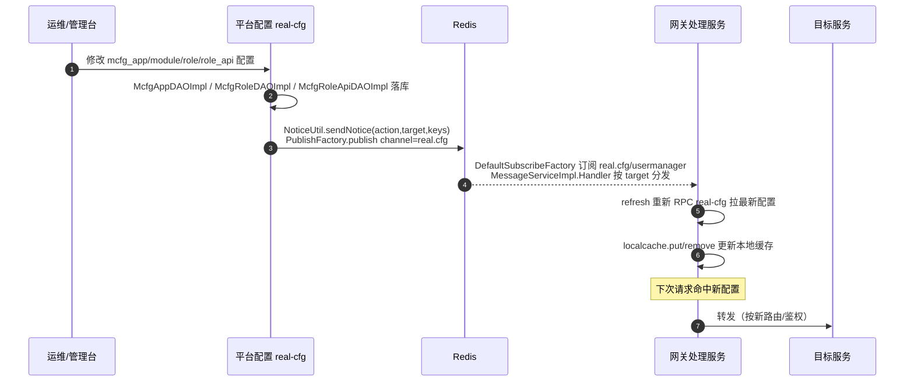

# 端到端-网关配置变更与缓存失效

> 跨模块链路：平台配置（real-cfg）配置变更 → Redis pub/sub `real.cfg` → 网关处理服务 订阅失效本地缓存 → 下次请求重新 RPC 拉取
> 代码已核实（2026-08-14，分支 syy.release.z7.8.1.0）

## 关键结论

- 网关处理服务**不直连 db_mcfg**，API 路由/应用/模块/角色配置走 **cache-aside 懒加载**：首次请求才 RPC real-cfg，之后命中本地缓存 `AbstractGenericServiceImpl.localcache`（LocalCache 统一包装），**无启动预加载**。
- 配置变更时，平台配置（real-cfg）通过 **Redis pub/sub** 广播失效通知，网关订阅后按 target 精准刷新对应缓存。

## 完整流程图

## 发布/订阅两端明细

### 发布端（平台配置 real-cfg）

| 变更对象 | DAO | 通知 target |
|---|---|---|
| 应用 | `McfgAppDAOImpl` | `McfgApp` |
| 角色 | `McfgRoleDAOImpl` | `McfgRole` |
| 角色-API | `McfgRoleApiDAOImpl` | `McfgRoleApi` |

- 统一走 `NoticeUtil.sendNotice(action, target, keys)` → `PublishFactory.publish`，channel=`real.cfg`（配置在 `real-cfg/src/main/resources/cfg/spring/Spring-MQ.xml`）。

### 订阅端（网关处理服务 proxy-openapi）

- `Spring-MQ.xml` 里 `DefaultSubscribeFactory` 订阅 channels=[`real.cfg`, `usermanager`]；`Boot.main` 启动 `SubscribeFactory.subscribe()` + `MessageDispatchThread`。
- `MessageServiceImpl.Handler` 按 target 分发刷新：

| target | 刷新方法 | 缓存 key |
|---|---|---|
| `McfgApp` | `AppServiceImpl.refresh(apikey)` | `IAppService.getByApikey.` |
| `McfgModule` | `ModuleServiceImpl.refresh(mkey)` | 模块缓存 |
| `McfgRoleApi` / `McfgRole` | `ApiServiceImpl.refresh(roleId)` | `IApiService.roleapi.{id}` / `roleapi.v3.{id}` |
| `UserOnline` | `UserServiceImpl.refreshOnlineUser(sid)` | 在线用户缓存 |

- refresh 动作：重新 RPC real-cfg 拉最新配置 → `localcache.put/remove`。

## 待纠正 / 存疑点

- 网关缓存是**懒加载**（首次请求才 RPC），非启动预载。
- 通知消息含 `action` 字段，但 `Handler` 仅按 `target` 分发，未使用 `action`（即同一 target 的增删改都触发整体 refresh）。

## 涉及表 / Redis

- **db_mcfg**：`mcfg_app` / `mcfg_module` / `mcfg_api` / `mcfg_role` / `mcfg_role_api`。
- **Redis channel**：`real.cfg`（配置变更）、`usermanager`（用户在线状态）。

## 关联文档

- [网关 缓存与配置热更新](../网关处理服务/04-复杂功能细节/横切-缓存与配置热更新.md)
- [平台配置 配置广播](../平台配置（real-cfg）/04-复杂功能细节/配置广播与设备云清理.md)
- [端到端-网关认证与鉴权](端到端-网关认证与鉴权.md)
- [横切-消息通知拓扑](横切-消息通知拓扑.md)
