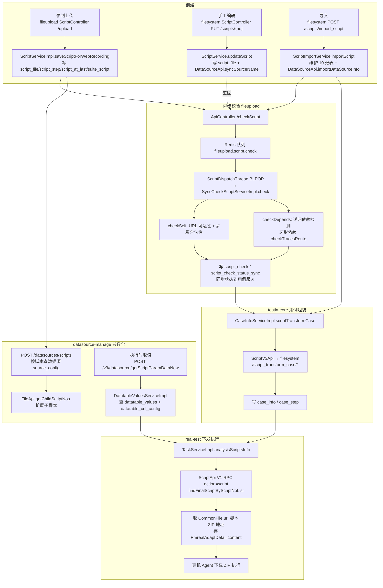

# 端到端-脚本全生命周期

> 跨模块链路：录制上传/编辑/导入（文件管理服务、脚本服务）→ 异步校验（文件管理服务）→ 变量参数化（数据源）→ 用例组装（平台基础功能服务）→ 下发执行（app处理服务）
> 代码已核实（2026-08-11，分支 syy.release.z7.8.1.0）

## 关键结论

- **双模块分工**：文件管理服务（filecloud）负责录制上传与校验引擎；脚本服务（filemanagement）负责 V3 管理台（CRUD、目录、导入导出、转用例）。两者**共享同一套表**（`script_file`/`script_step`/`script_check` 等）。
- `/api/checkScript` 在 **文件管理服务**（`ApiController.checkScript`）；脚本服务 的重检通过 V1 RPC 调 文件管理服务。
- 用例组装走 脚本服务 **V3 REST**（`/script_transform_case/*`）；执行下发走 **V1 RPC**（`action=script`）取脚本 ZIP 的 `CommonFile.url`，真机 Agent 直接下载。

## 完整流程图

## 调用链明细（按阶段）

### 1. 创建（三个来源）

| 来源 | 入口 | 处理 | 写表 |
|---|---|---|---|
| 录制上传 | 文件管理服务 `ScriptController.scriptUpload` POST `/upload` | `ScriptServiceImpl.saveScriptForWebRecording`（ScriptServiceImpl.java） | `common_file`、`script_file`、`script_at_last`、`suite_script`、`script_step`（含 childScriptNo 识别） |
| 手工编辑 | 脚本服务 `ScriptController` PUT `/scripts/{scriptNo}` / POST `/scripts/create_empty` | `ScriptService.updateScript` / `creatEmptyScript`；同步数据源名称 `DataSourceApi.syncSourceName` | `script_file`、`script_dir_child`、`script_at_last`、`suite_script` |
| 导入 | 脚本服务 POST `/scripts/import_script`（`pre_import_script` 预检） | `ScriptImportService.importScript`（ScriptImportService.java） | 依次维护 `script_file`/`common_file` → `script_relation` → `script_recover_info` → `script_at_last` → `script_check` → `script_dir(_child)` → `suite_script` → `script_tag` → `script_step_fast_search` + 数据源导入 |

### 2. 校验（文件管理服务 异步引擎）

| # | 环节 | 代码 |
|---|---|---|
| 1 | 入口：文件管理服务 `ApiController.checkScript` `/checkScript`；脚本服务 重检经 `serviceRemoteV1Api` V1 RPC | ApiController.java |
| 2 | 入队 Redis `fileupload.script.check`（+delay 延迟队列） | ScriptServiceImpl.java |
| 3 | 消费：`ScriptDispatchThread` BLPOP → `SyncValidatorWorker` → `SyncCheckScriptServiceImpl.check` | SyncCheckScriptServiceImpl.java |
| 4 | `checkSelf`：`SyncCheckScriptUrlTask` + `SyncCheckScriptStepTask`；`checkDepends`：`SyncCheckDependScriptTask` 递归 + 环形检测 `checkTracesRoute` | 同上 |
| 5 | 写 `script_check`、`script_check_status_sync`，`CaseService.syncScriptNoStatusToCase()` 同步用例状态 | — |

### 3. 变量参数化（数据源）

| # | 调用 | 说明 |
|---|---|---|
| 1 | `DataSourceController.getDataSourceByScriptCondition` POST `/datasources/scripts` → `SourceConfigServiceImpl` | scriptNos 为空时先 POST 脚本服务 `/v3/script/script_nos_by_condition` 查编号 |
| 2 | `FileApi.getChildScriptNos` | 扩展子脚本 |
| 3 | 执行时取值：平台基础功能服务 `DataSourceV3Api.listScriptParamDataByScriptNoNew` → POST `/v3/datasource/getScriptParamDataNew` → `DatatableValuesServiceImpl` | 查 `datatable_values` + `datatable_col_config` 注入执行上下文 |

### 4. 用例组装（平台基础功能服务 → 脚本服务 V3 REST）

| 平台基础功能服务 调用 | 脚本服务 端点 |
|---|---|
| `ScriptV3Api.scriptTransformCaseScriptNos` | POST `/script_transform_case/script_no_list` |
| `ScriptV3Api.scriptTransformCaseSteps` | POST `/script_transform_case/script_steps` |
| `ScriptV3Api.scriptTransformCaseDirs` | POST `/script_transform_case/dirs` |

入口 `CaseInfoServiceImpl.scriptTransformCase`（CaseInfoServiceImpl.java），结果写 平台基础功能服务 `case_info`、`case_step`。

### 5. 下发执行（app处理服务 → 文件管理服务 V1 RPC）

| # | 调用 | 说明 |
|---|---|---|
| 1 | app处理服务 `TaskServiceImpl.analysisScriptsInfo`（TaskServiceImpl.java） | 任务解析脚本 |
| 2 | `ScriptApi.listLastestScriptByScriptNoList` / `listByScriptids` | V1 RPC `action=script`，op=`Script.findFinalScriptByScriptNoList` / `Script.findScriptByScriptIdList` |
| 3 | 返回 `ScriptFile.fileinfo.url`（`CommonFile.url`） | 组装 `PmrealAdaptScript` 存 `PmrealAdaptDetail.content`，随任务下发 |
| 4 | 真机 Agent 从 scriptUrl 下载 ZIP 执行 | — |

## 涉及表

- **共享脚本库（db_file 等）**：`script_file`、`script_step`、`script_check`、`script_check_status_sync`、`script_relation`、`script_at_last`、`script_dir(_child)`、`suite_script`、`script_tag`、`script_recover_info`、`script_step_fast_search`、`common_file`
- **数据源**：`source_config`、`datatable_config`、`datatable_col_config`、`datatable_values`
- **平台基础功能服务**：`case_info`、`case_step`
- **real（旧链路）**：`pmreal_adapt_detail`

## 关联文档

- [文件管理服务 脚本录制上传](../文件管理服务/04-复杂功能细节/核心链路-脚本录制上传.md)
- [文件管理服务 脚本校验链路](../文件管理服务/04-复杂功能细节/横切-脚本校验链路.md)
- [脚本服务 脚本校验](../脚本服务/04-复杂功能细节/核心链路-脚本校验.md)
- [脚本服务 脚本解析与导入](../脚本服务/04-复杂功能细节/核心链路-脚本解析与导入.md)
- [脚本服务 脚本导出](../脚本服务/04-复杂功能细节/核心链路-脚本导出.md)
- [数据源 脚本变量填充](../数据源/04-复杂功能细节/核心链路-脚本变量填充.md)
