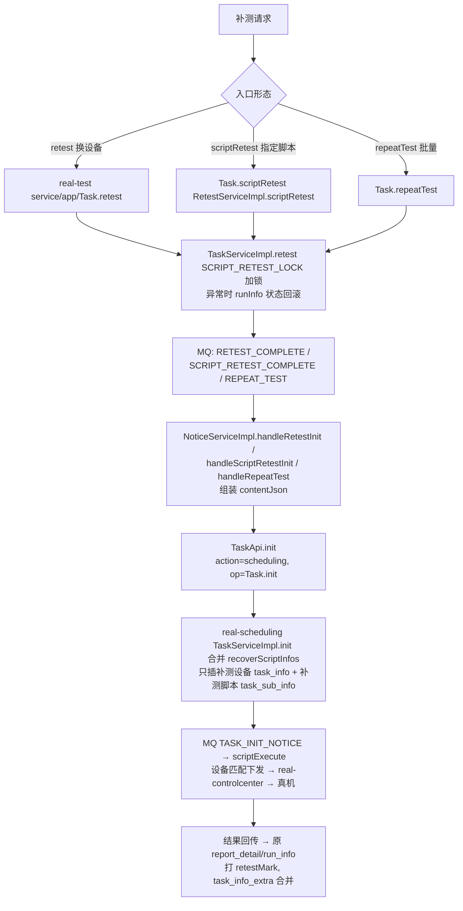
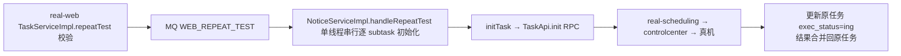

# 端到端-补测

> 补测：**执行侧（app处理服务 / web/pc处理服务）**逻辑——对漏跑/失败的脚本进行补充执行，报告打补测标记（`retestMark` / `EsReportSummary.是否为补测`），结果**合并进原任务**而非新建计划节点。
> 与重测的区别：重测是 平台基础功能服务 编排层新建 RESET_TASK_PLAN 节点的完整重跑，见 [端到端-重测](端到端-重测.md)。
> 代码已核实（2026-08-11，分支 syy.release.z7.8.1.0）

## 关键结论

- 补测发生在 **app处理服务（APP）/ web/pc处理服务（Web·桌面）** 内部，经 任务调度服务 下发（旧链路）。
- 三种形态：`retest`（换设备补跑）、`scriptRetest`（指定子任务/脚本补跑）、`repeatTest`（批量补测）。
- 任务调度服务 `TaskServiceImpl.init` 合并 `recoverScriptInfos`，**只插入补测设备的 `task_info` 与补测脚本的 `task_sub_info`**——这是"补"的核心：不重整任务，只补缺。
- 原 `report_detail/run_info` 保留并打 `retestMark`；`task_info_extra` 合并补测结果。

## 完整流程图

### APP 补测/复测（app处理服务）

### Web/桌面批量补测（web/pc处理服务 repeatTest）

## 调用链明细

| # | 源 | 调用方式 | 目标 | 代码位置 |
|---|---|---|---|---|
| 1 | app处理服务 `Task.retest` / `scriptRetest` / `repeatTest` | 本地 | `TaskServiceImpl.retest` / `RetestServiceImpl.scriptRetest` | app处理服务 service/app/Task.java/1179/1702；business/impl/TaskServiceImpl.java；RetestServiceImpl.java |
| 2 | 上述 Service | MQ `RETEST_COMPLETE` / `SCRIPT_RETEST_COMPLETE` / `REPEAT_TEST`（写 mq_info_notice） | `NoticeServiceImpl.handleRetestInit` / `handleScriptRetestInit` / `handleRepeatTest` | — |
| 3 | NoticeServiceImpl | V1 RPC `action=scheduling, op=Task.init` | 任务调度服务 `TaskServiceImpl.init` | app处理服务 api/scheduling/TaskApi.java |
| 4 | 任务调度服务 `init` | 本地事务 | 合并 `recoverScriptInfos`，只插补测设备/脚本的 `task_info`/`task_sub_info` | 任务调度服务 business/impl/TaskServiceImpl.java |
| 5 | 任务调度服务 | MQ `TASK_INIT_NOTICE` → scriptExecute | 设备匹配 → 设备控制中心 → 真机 | — |
| 6 | web/pc处理服务 `TaskServiceImpl.repeatTest` | MQ `WEB_REPEAT_TEST` | `NoticeServiceImpl.handleRepeatTest` → `TaskApi.init` | realweb business/impl/TaskServiceImpl.java；NoticeServiceImpl.java |

## 三种形态差异

| 形态 | 作用范围 | 设备 | 并发 |
|---|---|---|---|
| `retest` | 重跑全部脚本 | 换设备 | — |
| `scriptRetest` | 按 `subsubtasks` 指定脚本 | 换脚本/设备 | — |
| `repeatTest` | 批量补测 | 两者都支持 | APP：4 线程并行预处理 + 4 异步通知；Web：单线程串行 |

## 补测 vs 重测

| 维度 | 补测（本文） | 重测 |
|---|---|---|
| 发起层 | 执行侧 app处理服务 / web/pc处理服务 | 平台基础功能服务 编排层 |
| 记录模型 | 合并进原任务（recoverScriptInfos / retestMark） | 新建 RESET_TASK_PLAN 节点 |
| 调度 | 经 任务调度服务 旧链路 | CASE 走 任务管理服务 新链路 |
| 结果 | 原 report 保留打补测标记 | 独立结果，聚合节点累计 |

## 涉及表

- **app处理服务**：`preal_user_adapt`、`pmreal_adapt_detail`、`pmreal_adapt_result`、`pmreal_task_run_info`、`pmreal_data_run_info`、`pmreal_script_summary`、`pmreal_retest_summary`、`pmreal_report_detail`、`mq_info_notice`
- **任务调度服务 / db_task**：`task_info_extra`、`task_info`、`task_sub_info`、`task_release_time_periods`
- **web/pc处理服务**：`pm_task_detail`、`pm_script_run_info`、`pm_device_run_info`、`pm_report_detail`、`mq_info_notice`

## 关联文档

- [端到端-重测](端到端-重测.md)
- [real 补测复测](../app处理服务（real-test）/04-复杂功能细节/核心链路-补测复测.md)
- [端到端-测试计划执行](端到端-测试计划执行.md)
