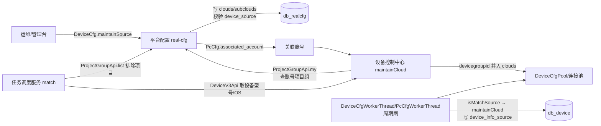

# 端到端-设备归属

> 跨模块链路：平台配置（real-cfg）维护设备云（clouds）+ 项目组（project_group）→ 设备控制中心 关联账号项目组并入设备云 → 轮询刷入 db_device 供执行侧匹配使用
> 代码已核实（2026-08-14，分支 syy.release.z7.8.1.0）

## 关键结论

- **归属 = 设备云（clouds）**。绑定由平台配置（real-cfg）负责：`DeviceCfg.maintainSource`（op=DeviceCfg.maintainSource）→ 写 `realcfg_device_cfg.clouds/subclouds`（db_realcfg），并校验 `realcfg_device_source`。
- **账号 → 项目组**：设备控制中心 `DeviceServiceImpl.maintainCloud` 调 `UserInfoServiceImpl.myProjectGroupList`（→`ProjectGroupApi.my`，op=ProjectGroup.my），把 `realcfg_pc_cfg.associated_account` 关联账号的项目组 `devicegroupid` 并入设备云 clouds。
- **同步**：`DeviceCfgWorkerThread` / `PcCfgWorkerThread` 周期刷 `DeviceCfgPool` / `PcCfgPool` → `DeviceWorkerThread` 对 isMatchSource 的设备调 `maintainCloud` → 写 `db_device.device_info_source`（clean/batchInsert）并更新连接池。
- 归属变更**通过轮询缓存下发**，无主动下发上位机。

## ⚠️ 方向陷阱（勿写反）

- 任务调度服务（real-scheduling）调平台配置查项目组：`AbstractTaskMatchServiceImpl.excludeProjects` → `ProjectGroupServiceImpl.list` → `ProjectGroupApi.list`（action=cfg，op=ProjectGroup.list）→ real-cfg `realcfg_project_group`。
- 但 `cn.testin.api.realcfg.device.DeviceV3Api`（包名带 realcfg）的 `getDeviceDetailInfo/getDeviceInfo` 实际用 `controlCenterPrefixName` 拼 `/v3/ControlCenter/device/list|device_list`，调的是**设备控制中心**（非 real-cfg）；`TaskServiceImpl.match` 用它取设备型号/OS 全局参数。设备本体来自心跳入队。
- 即：`scheduling → real-cfg(ProjectGroup.list)` 与 `scheduling → real-controlcenter(DeviceV3Api)` 是两条独立方向。

## 完整流程图

## 调用链明细

| # | 源 | 调用方式 | 目标 | 代码位置 |
|---|---|---|---|---|
| 1 | 管理台 | RPC `DeviceCfg.maintainSource` | 平台配置 `DeviceCfg.maintainSource` | real-cfg service/cfg/DeviceCfg.java |
| 2 | `maintainSource` | MySQL | 写 `realcfg_device_cfg.clouds/subclouds` + 校验 `realcfg_device_source` | real-cfg |
| 3 | `DeviceServiceImpl.maintainCloud` | RPC `ProjectGroup.my` | `UserInfoServiceImpl.myProjectGroupList` | real-controlcenter |
| 4 | `DeviceCfgWorkerThread` / `PcCfgWorkerThread` | 定时 | 刷 `DeviceCfgPool`/`PcCfgPool` | real-controlcenter schedule |
| 5 | `DeviceWorkerThread` | 定时 | isMatchSource → `maintainCloud` 写 `device_info_source` | real-controlcenter schedule |
| 6 | `AbstractTaskMatchServiceImpl.excludeProjects` | RPC `ProjectGroup.list`（action=cfg） | real-cfg `realcfg_project_group` | real-scheduling |
| 7 | `DeviceV3Api.getDeviceDetailInfo/getDeviceInfo` | HTTP `/v3/ControlCenter/device/*` | 设备控制中心（非 real-cfg） | real-scheduling api/realcfg/device |

## 涉及表

- **db_realcfg**：`realcfg_device_cfg`（clouds/subclouds）、`realcfg_device_source`、`realcfg_pc_cfg`（associated_account）、`realcfg_project_group`（eid/projectid/type/devicegroupid/expiretime）。
- **db_device**：`device_info_source`。

## 关联文档

- [平台配置 DeviceCfg](../平台配置（real-cfg）/07-开放接口文档/设备与网络配置/DeviceCfg.md)
- [平台配置 DeviceSource](../平台配置（real-cfg）/07-开放接口文档/设备与网络配置/DeviceSource.md)
- [平台配置 ProjectGroup](../平台配置（real-cfg）/07-开放接口文档/项目与平台配置/ProjectGroup.md)
- [端到端-设备注册与上线](端到端-设备注册与上线.md)
- [端到端-设备签到签退](端到端-设备签到签退.md)
