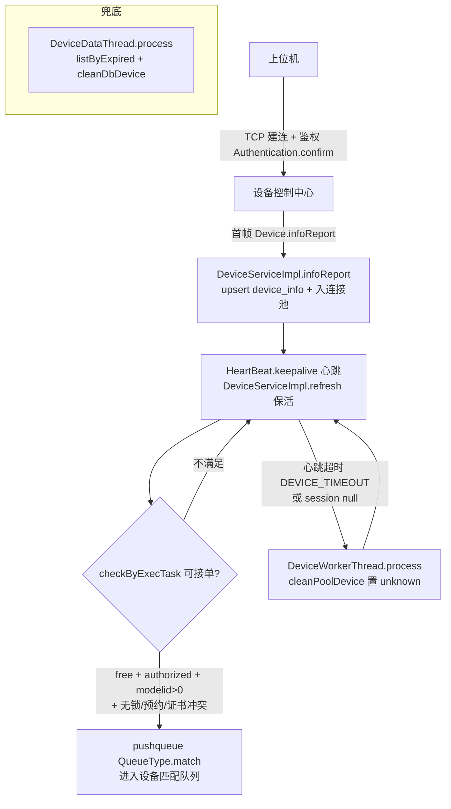

# 端到端-设备注册与上线

> 跨模块链路：上位机 TCP 建连 → 设备控制中心 首帧注册 + 心跳保活 → 状态流转（free/runScript/disconnect/unknown/disabled）→ 满足条件入匹配队列可接单
> 代码已核实（2026-08-14，分支 syy.release.z7.8.1.0）

## 关键结论

- 设备注册由 **设备控制中心（real-controlcenter）在上位机首次 TCP 上报时完成**，非平台基础功能服务：上位机建连鉴权后首帧上报 `Device.infoReport` → `DeviceServiceImpl.infoReport` 首次连接 upsert 入 `device_info`，并 `DevicePoolUtil.getDevicePool().put` 入连接池（锁 `DeviceLockKeys.DeviceReport`）。无 DB 记录即视为首次注册（deviceid/serial/型号）。
- 心跳 `HeartBeat.keepalive` 每帧对每个 device 调 `DeviceServiceImpl.refresh`（更新机型/云匹配 flag 并 `removeUcomDevice` 去重多上位机）。

## 设备状态机（DeviceConfig.DeviceStatus）

| 状态值 | 名称 | 含义 |
|---|---|---|
| 0 | free | 空闲可用 |
| 1 | runScript | 执行中 |
| 2 | disconnect | 已断连 |
| 9 | unknown | 未知/掉线 |
| 10 | disabled | 禁用 |

## 完整流程图

## 调用链明细

| # | 源 | 调用方式 | 目标 | 代码位置 |
|---|---|---|---|---|
| 1 | 上位机 | TCP 建连 + 鉴权 | 设备控制中心 `Authentication.confirm` | real-controlcenter trans/controller/req/sso |
| 2 | 上位机 | TCP 首帧上报 | `Device.infoReport` | trans/controller/req/script/Device.java |
| 3 | `DeviceServiceImpl.infoReport` | 本地 | upsert `device_info` + 入 `DevicePoolUtil` 连接池 | business/impl/DeviceServiceImpl.java |
| 4 | `HeartBeat.keepalive` | TCP 心跳 | `DeviceServiceImpl.refresh` 保活/去重 | trans/controller/req/script/HeartBeat.java |
| 5 | `DeviceServiceImpl.checkByExecTask` | 本地 | `itaskinfoservice.pushqueue(QueueType.match)` 入匹配队列 | HeartBeat.keepalive |
| 6 | `DeviceWorkerThread.process` | 定时扫描 | 超时/session 空 → `cleanPoolDevice` 置 unknown | schedule/device/DeviceWorkerThread.java |
| 7 | `DeviceDataThread.process` | 定时扫描 | `listByExpired` + `cleanDbDevice` DB 兜底 | schedule/device/DeviceDataThread.java |

## 可接单判定条件（checkByExecTask）

`free`（空闲）且 `licences=authorized`（授权）且 `modelid>0` 且 `lockinfo==null`（无锁）且无预约冲突且 iOS 有证书且无 `lockDeviceTaskId`。

## 涉及表

- **db_device**：`device_info`（设备主表）、`device_info_refresh`（保活刷新表）。

## 关联文档

- [设备控制中心 上位机长连接](../设备控制中心（real-controlcenter）/04-复杂功能细节/核心链路-上位机长连接.md)
- [设备控制中心 设备锁与心跳](../设备控制中心（real-controlcenter）/03-实现逻辑/设备锁与心跳实现.md)
- [设备控制中心 设备匹配与下发](../设备控制中心（real-controlcenter）/04-复杂功能细节/核心链路-设备匹配与下发.md)
- [端到端-设备签到签退](端到端-设备签到签退.md)
- [端到端-设备归属](端到端-设备归属.md)
