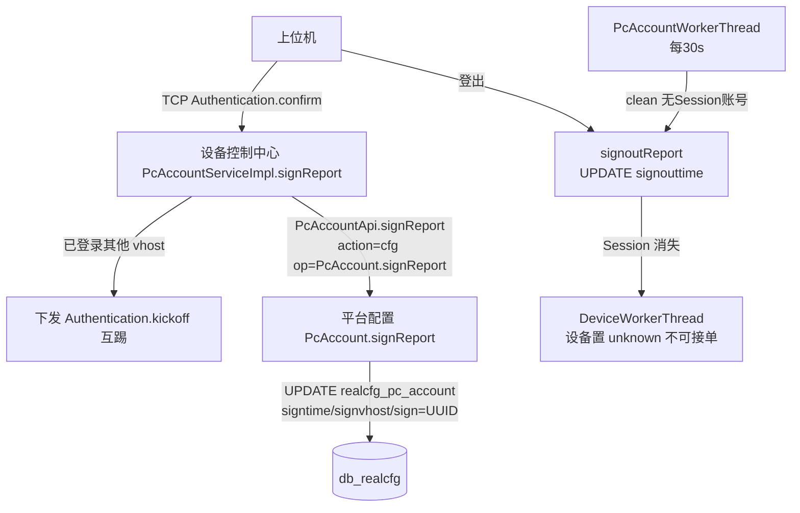

# 端到端-设备签到签退

> 跨模块链路：上位机 TCP 鉴权签到 → 设备控制中心 → 平台配置（real-cfg）记录账号签到（PcAccount）；签退则账号 Session 消失 → 设备置 unknown 不可接单
> 代码已核实（2026-08-14，分支 syy.release.z7.8.1.0）

## 关键结论

- **签到/签退是「上位机账号（ucomid）」维度，由上位机 TCP 触发**，非用户在平台侧操作。与设备维度（`device_sign`）是两套，需区分。
- **签到**：上位机 TCP 鉴权 `Authentication.confirm` → `PcAccountServiceImpl.signReport`（若已登录其他 vhost 先下发 `Authentication.kickoff` 互踢）→ `PcAccountApi.signReport`（action=cfg, op=PcAccount.signReport）→ 平台配置 `PcAccount.signReport` → `RealcfgPcAccountDAOImpl.signReport`：UPDATE `realcfg_pc_account` SET signtime、signvhost、sign=UUID。
- **签退**：`PcAccountWorkerThread.run`（StartRunner 每 30s）→ `PcAccountServiceImpl.clean`：对无 Session 账号调 signoutReport；登出路径 `Authentication` 亦调 → UPDATE signouttime。
- **在线判定**：`RealcfgPcAccount.getOnline()`：signouttime 为空 或 < signtime 即在线。
- **设备维度**另有 HTTP `/UcomDeivce/device/signReport`（`DeviceController` → `DeviceService.signReport`）写 `device_sign`。

## 完整流程图

## 调用链明细

| # | 源 | 调用方式 | 目标 | 代码位置 |
|---|---|---|---|---|
| 1 | 上位机 | TCP `Authentication.confirm` | 设备控制中心 `PcAccountServiceImpl.signReport` | trans/controller/req/sso/Authentication.java |
| 2 | `signReport` | 互踢 | 已登录其他 vhost 下发 `Authentication.kickoff` | PcAccountServiceImpl.java |
| 3 | `PcAccountApi.signReport` | RPC `PcAccount.signReport`（action=cfg） | 平台配置 `PcAccount.signReport` | api/real/cfg/PcAccountApi.java |
| 4 | `RealcfgPcAccountDAOImpl.signReport` | MySQL | UPDATE `realcfg_pc_account`（signtime/signvhost/sign） | real-cfg dao |
| 5 | `PcAccountWorkerThread.run` | 定时 30s | `PcAccountServiceImpl.clean` 无 Session 账号签退 | PcAccountWorkerThread.java |
| 6 | `signoutReport` | MySQL | UPDATE `realcfg_pc_account` signouttime | real-cfg |
| 7 | `DeviceController` → `DeviceService.signReport` | HTTP `/UcomDeivce/device/signReport` | 写 `device_sign`（设备维度） | real-controlcenter mvc/controller |

## 涉及表

- **db_realcfg**：`realcfg_pc_account`（signtime / signvhost / sign / signouttime）。
- **db_device**：`device_sign`（设备维度签到）。

## 关联文档

- [平台配置 PcAccount](../平台配置（real-cfg）/07-开放接口文档/用户与权限/PcAccount.md)
- [设备控制中心 Authentication](../设备控制中心（real-controlcenter）/07-开放接口文档/长连接/Authentication.md)
- [端到端-设备注册与上线](端到端-设备注册与上线.md)
- [端到端-设备归属](端到端-设备归属.md)
