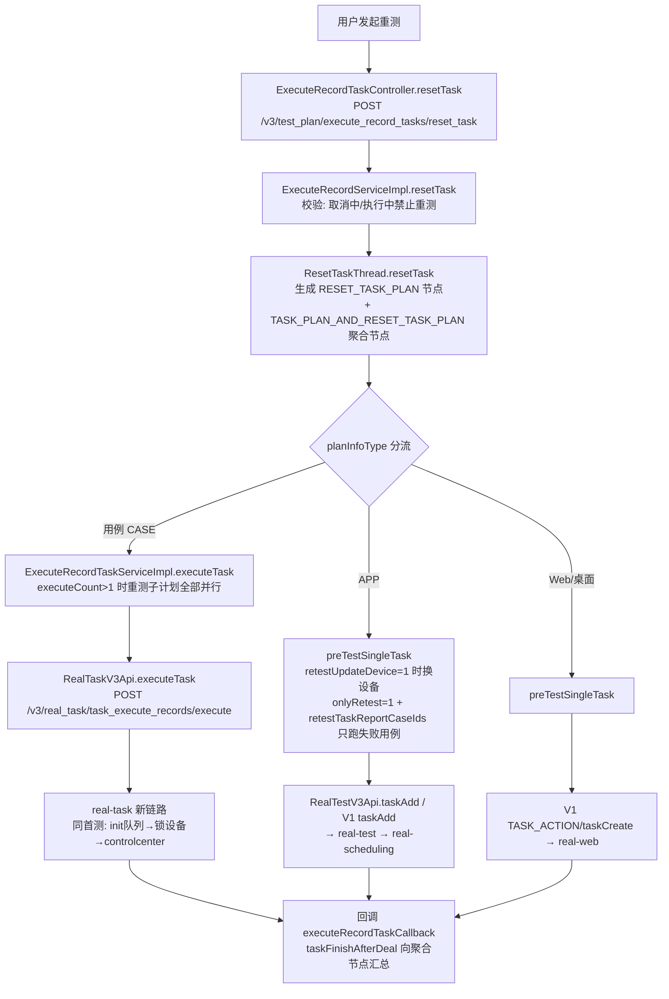
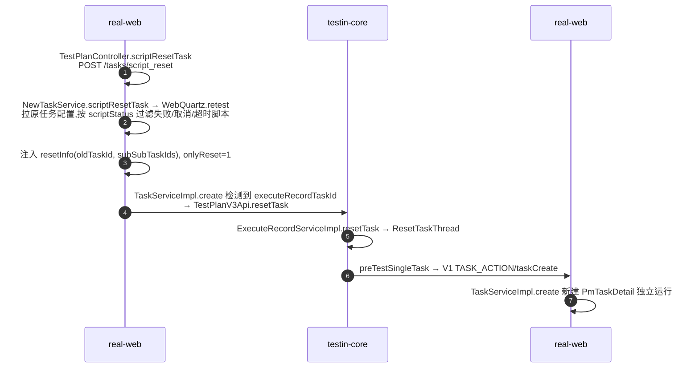

# 端到端-重测

> 重测（retest/reset）：**平台基础功能服务 计划编排层**逻辑——用户对已完成任务按配置重新执行，执行记录树上生成 `RESET_TASK_PLAN` 重测节点。
> 与补测的区别：补测是执行侧对漏跑脚本的补充执行，见 [端到端-补测](端到端-补测.md)。
> 代码已核实（2026-08-11，分支 syy.release.z7.8.1.0）

## 关键结论

- 入口：`ExecuteRecordTaskController.resetTask`（POST `/v3/test_plan/execute_record_tasks/reset_task`）与「根据配置批量重测」`batchReset`。
- 重测在执行记录树上新建 `RESET_TASK_PLAN(3)` 节点 + `TASK_PLAN_AND_RESET_TASK_PLAN(4)` 聚合节点，**不覆盖首测结果**，累计统计 success/fail。
- 发起前校验：取消中/执行中的任务禁止重测（`ExecuteRecordServiceImpl.resetTask`）。
- 与首测一样按计划类型分流（三出口），CASE 走 任务管理服务 新链路，Web 脚本重测会**绕回 平台基础功能服务** 再出发。

## 完整流程图

### Web 单脚本重测的特殊环路

## 调用链明细

| # | 源 | 调用方式 | 目标 | 代码位置 |
|---|---|---|---|---|
| 1 | 平台基础功能服务 `ExecuteRecordTaskController.resetTask` | 本地 | `ExecuteRecordServiceImpl.resetTask`（校验禁止对取消中/执行中重测） | controller/plan/ExecuteRecordTaskController.java；ExecuteRecordServiceImpl.java |
| 2 | `ExecuteRecordServiceImpl.resetTask` | 线程池 | `ResetTaskThread.resetTask` 生成重测节点 | schedule/plan/ResetTaskThread.java |
| 3 | `ResetTaskThread` | 线程池 | `executeRecordTaskService.executeTask` | 同上 |
| 4 | `ExecuteRecordTaskServiceImpl.executeTask` | CASE：HTTP `RealTaskV3Api.executeTask` | 任务管理服务（同首测新链路） | ExecuteRecordTaskServiceImpl.java |
| 5 | 同上 | APP/Web：`preTestSingleTask` → app处理服务 / web/pc处理服务 | 同首测旧链路 | ExecuteRecordTaskServiceImpl.java |
| 6 | web/pc处理服务 `TestPlanController.scriptResetTask` | 本地 → `WebQuartz.retest` 构造 dataJson | `taskService.create` | TestPlanController.java；NewTaskService.java |
| 7 | web/pc处理服务 `TaskServiceImpl.create`（检测到 executeRecordTaskId） | HTTP `TestPlanV3Api.resetTask` | 回到 平台基础功能服务 resetTask（步骤 1） | realweb/business/impl/TaskServiceImpl.java |
| 8 | 手动停止 | `stopTask` 置 CANCEL_ING → `CancelTaskThread`：CASE 走 HTTP `/v3/real_task/cancel`；APP/Web 走 V1 `Task.cancel` | 任务管理服务 / app处理服务 / web/pc处理服务 | ExecuteRecordTaskServiceImpl.java；CancelTaskThread.java |

## 重测 vs 首测差异

| 维度 | 首测 | 重测 |
|---|---|---|
| 记录树节点 | TASK_PLAN 任务节点 | 新增 RESET_TASK_PLAN(3) + 聚合节点(4) |
| 设备 | 计划/模板配置设备 | `retestUpdateDevice=1` 可替换，否则沿用 |
| 范围 | 全部用例/脚本 | `onlyRetest=1` + `retestTaskReportCaseIds` 只跑失败用例 |
| 并发 | 按 executeOrder 串/并行 | 重测子计划 executeCount>1 全部并行 |
| 结果 | 新建 report | 原结果保留，累计汇总到聚合节点 |

## 涉及表

- **平台基础功能服务 / db_plan**：`execute_record`、`execute_record_task`（RESET_TASK_PLAN 节点）、`execute_record_task_case`、`execute_record_task_device`、`execute_record_task_script(_detail)`、`plan_device`
- **任务管理服务 / db_task**：`task_execute_record` 族（同首测，重测是新的执行记录）

## 关联文档

- [端到端-测试计划执行](端到端-测试计划执行.md)（分流与执行段相同）
- [端到端-补测](端到端-补测.md)（执行侧补充执行，不同逻辑）
- [平台基础功能服务 任务重测](../平台基础功能服务/04-复杂功能细节/核心链路-任务重测.md)
- [任务管理服务 任务重测](../任务管理服务/04-复杂功能细节/核心链路-任务重测.md)
